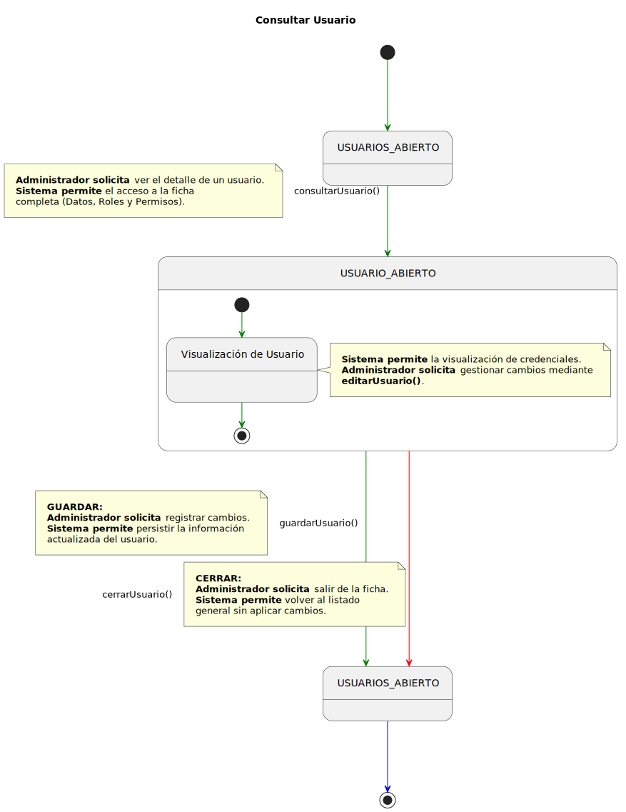
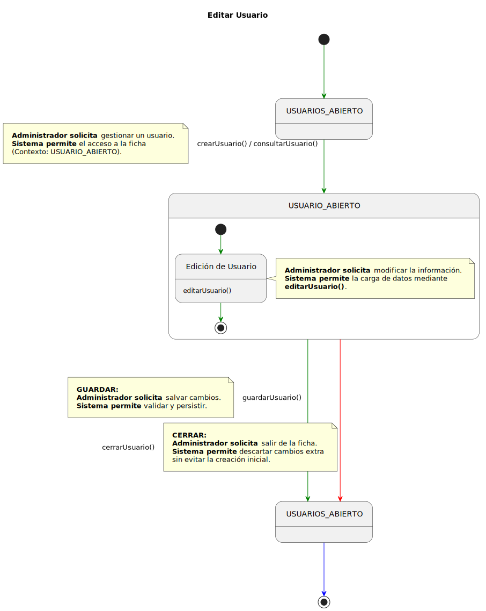

# Detallado Casos de Uso Administrador

> **Alcance**: el Administrador opera **cuentas de personal** (profesor, director, secretaria, administrador). El alta individual de alumnos es responsabilidad de Secretaría — ver [`crearAlumno`](../Secretaria/README.md#DetalladoCrearAlumno). Por tanto, en `crearUsuario` el campo `tipo` no admite el valor `alumno`.

## Usuarios

### Consultar Usuario

  

   

### Crear Usuario

  

   

### Editar Usuario

  

   