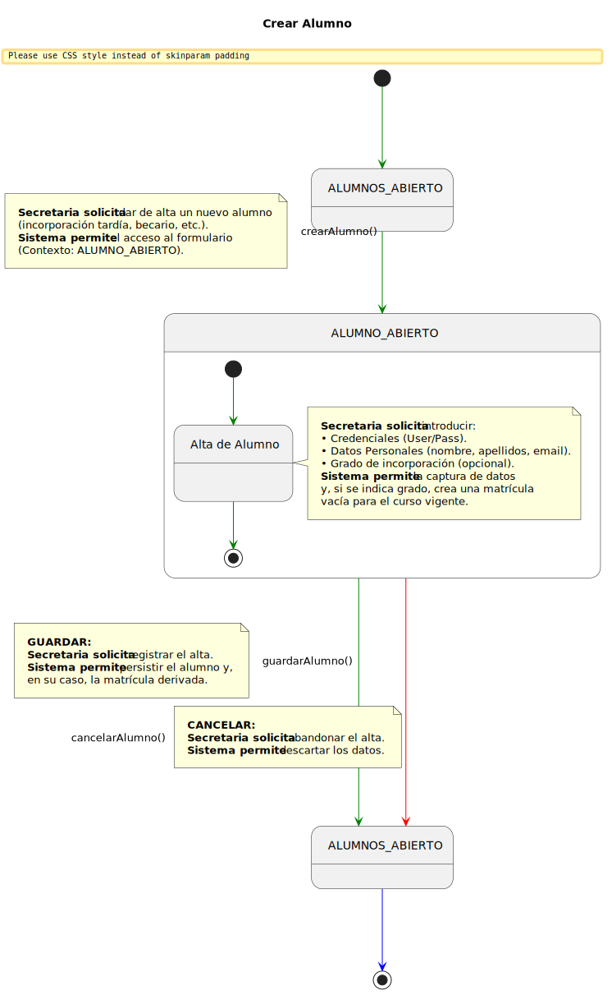
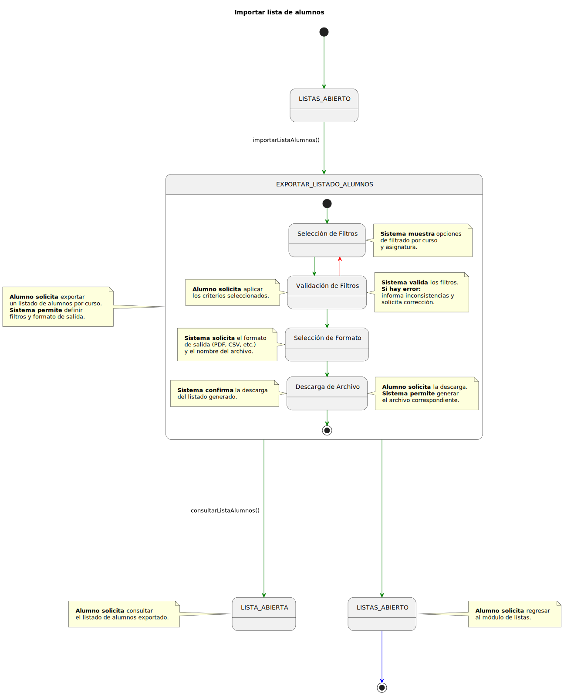
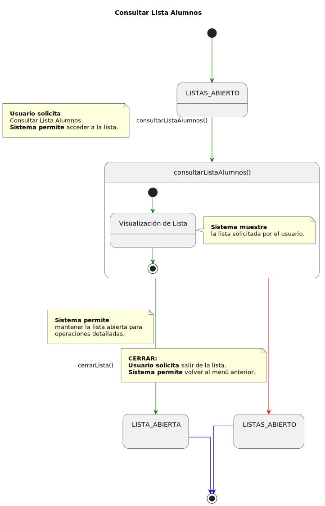
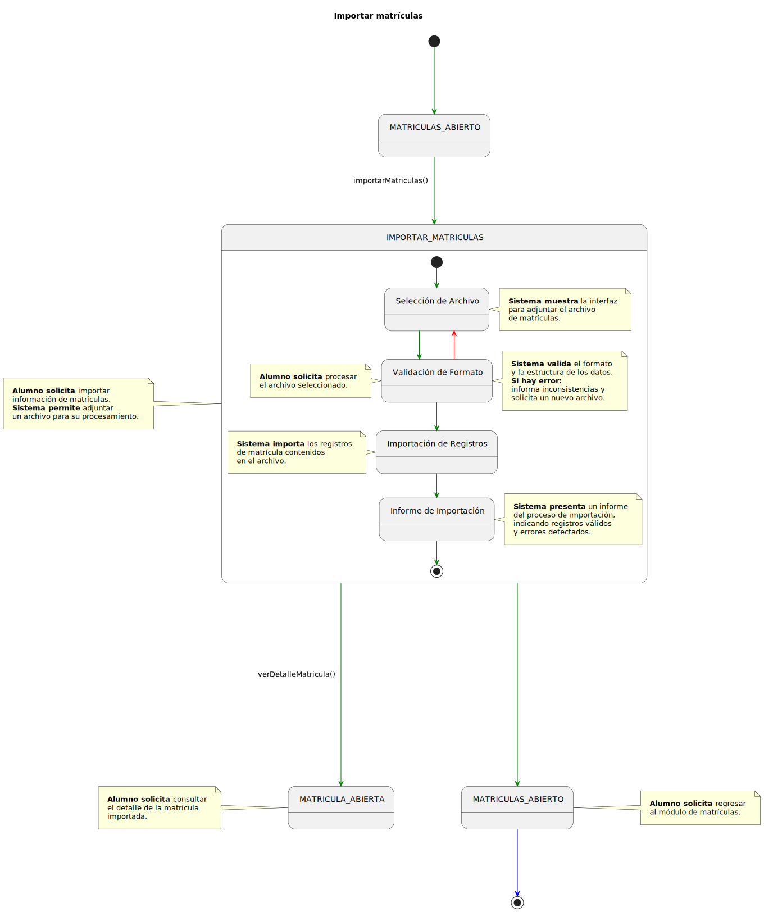
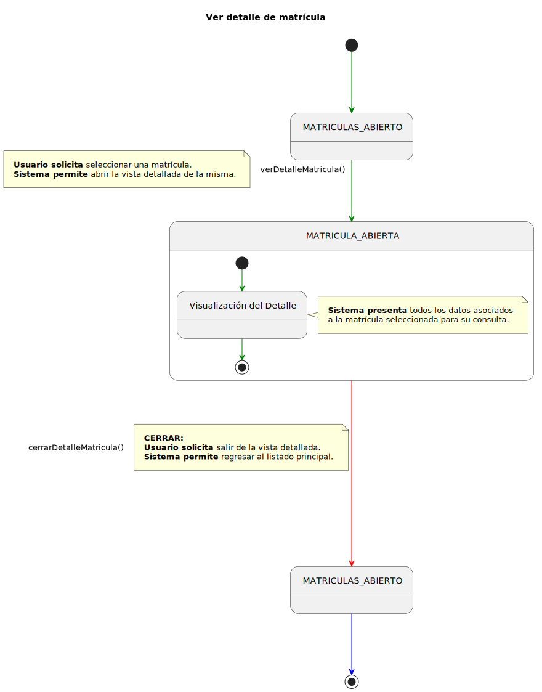
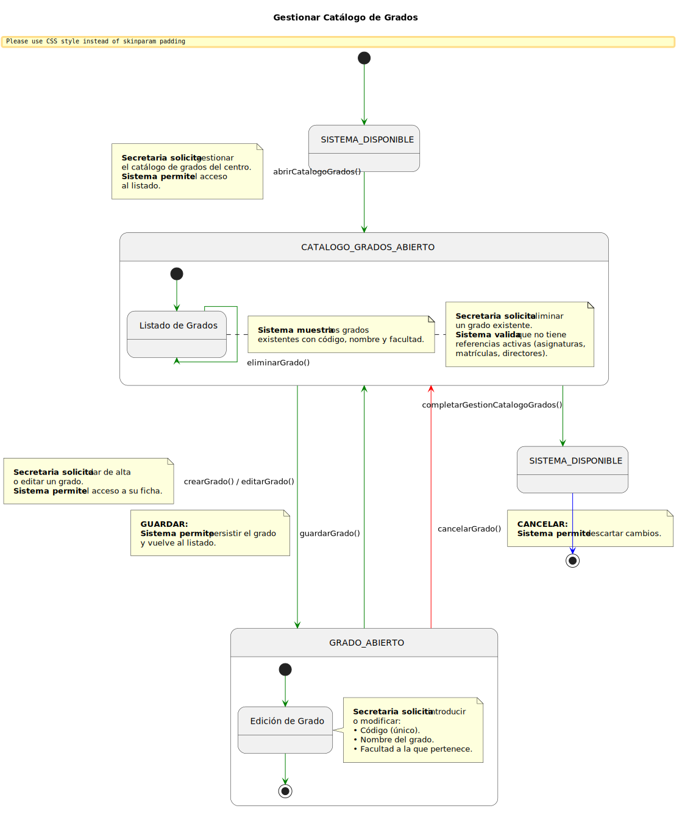
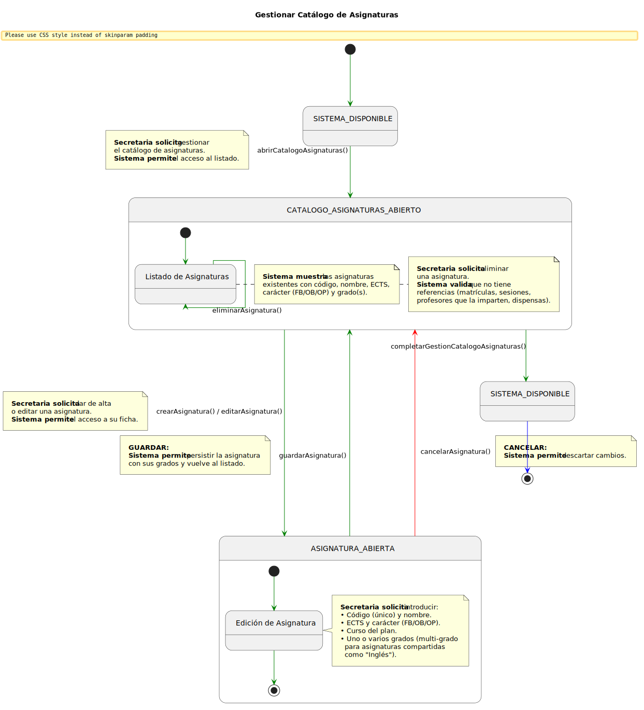
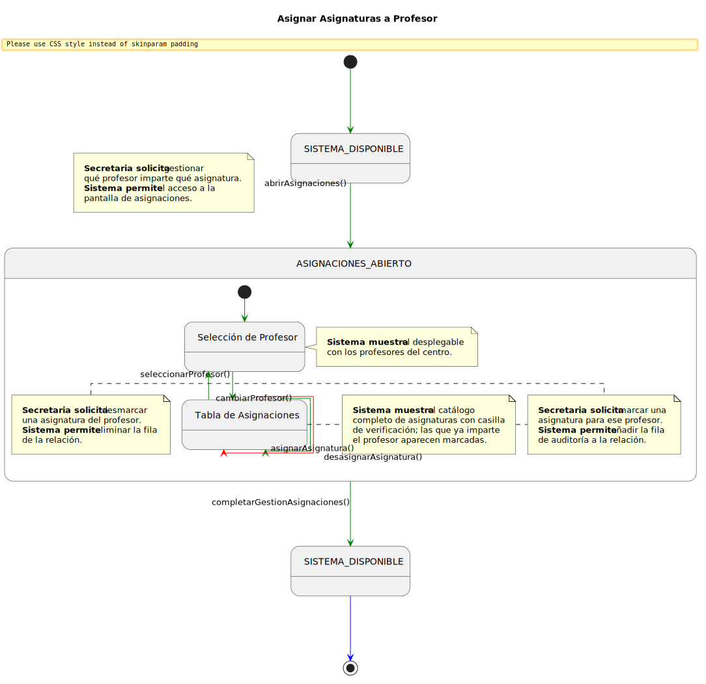
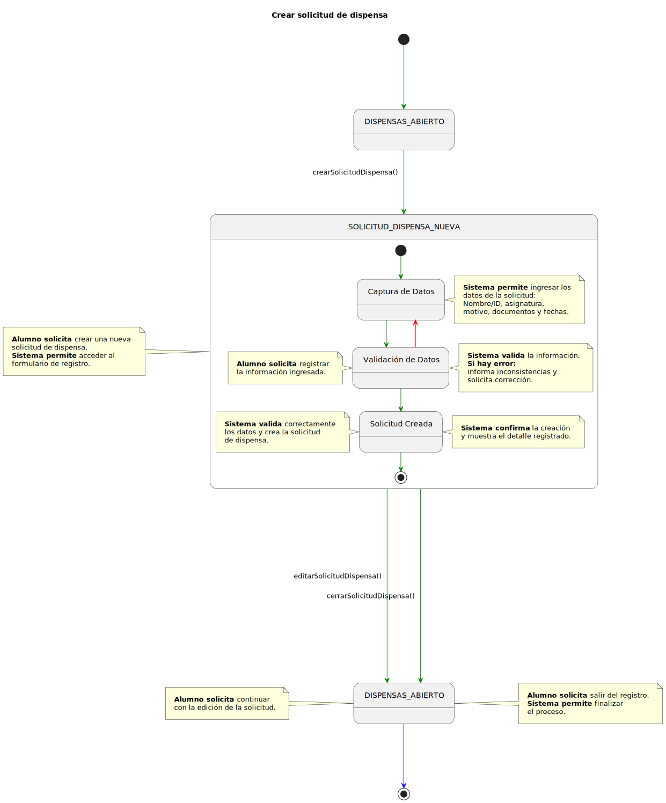
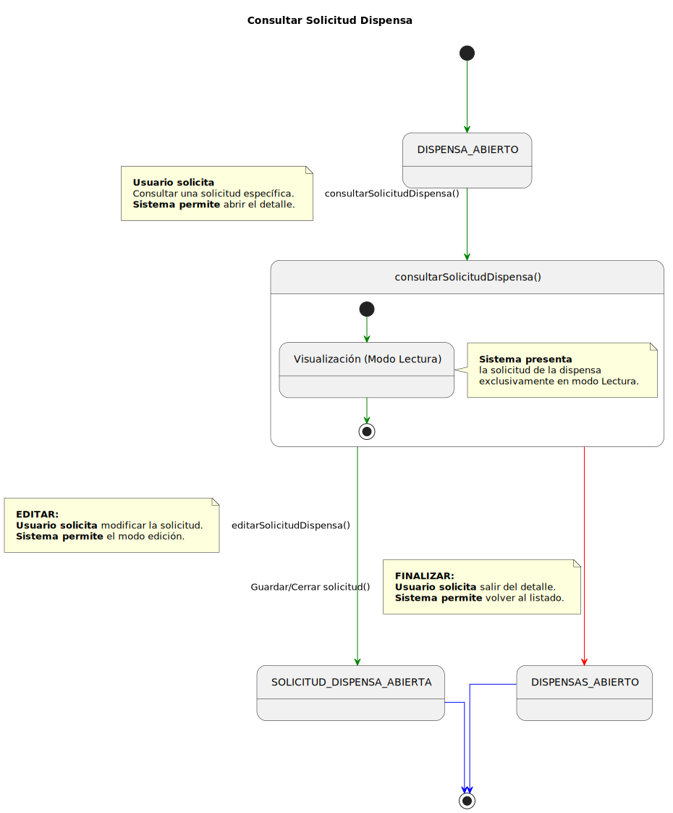

# Detallado Casos de Uso Secretaría

## Alumnos

### Crear Alumno

  

   

### Importar Listas de Alumnos

  

   

### Consultar Lista de Alumnos

  

   

## Matrículas

### Importar Matrículas

  

   

### Consultar Detalle de Matrícula

  

   

## Catálogos

### Gestionar Catálogo de Grados

  

   

### Gestionar Catálogo de Asignaturas

  

   

### Asignar Asignaturas a Profesor

  

   

## Dispensas

### Crear Solicitud de Dispensa

  

   

### Consultar Solicitud de Dispensa

  

   

### Editar Solicitud de Dispensa

  

   

### Exportar Dispensas

  

   
