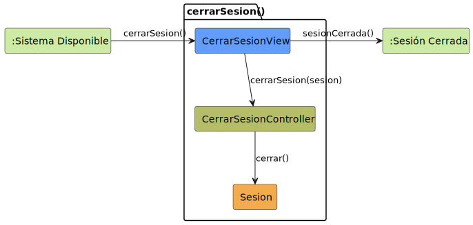

# CGU > cerrarSesion > Análisis

> | [🏠️](/README.md) | [Análisis](/RUP/01-analisis/README.md) | [Detalle](/RUP/00-requisitos/CasosDeUso/DetalladoCasosDeUso/Usuario/) | **Análisis** | Diseño | Desarrollo |
> |-|-|-|-|-|-|

## información del artefacto

- **Proyecto**: Centro de Gestión Universitaria (CGU)
- **Fase RUP**: Inception
- **Disciplina**: Análisis
- **Caso de uso**: `cerrarSesion()`
- **Actor**: Usuario (cualquier subtipo autenticado)
- **Versión**: 1.0
- **Fecha**: 2026-05-25

## propósito

Análisis del caso de uso `cerrarSesion()` mediante diagrama de colaboración MVC, identificando clases de análisis y sus interacciones conceptuales para finalizar la sesión activa y devolver el sistema al estado no autenticado.

### rol metodológico del caso de uso

`cerrarSesion()` es el **caso de uso de finalización** del sistema CGU:

- **Terminador de sesión**: invalida la `Sesion` activa creada por `iniciarSesion()`.
- **Retorno al estado inicial**: el sistema vuelve a `SESION_CERRADA`.
- **Sin transformación del actor**: el `Usuario` autenticado pierde su sesión y debe reautenticarse para volver a operar.

## diagrama de colaboración

||
|-|
|**Disciplina**: Análisis RUP **Enfoque**: Diagramas de colaboración MVC|

## clases de análisis identificadas

### clases model (naranja #F2AC4E)

| Clase | Responsabilidad | Trazabilidad |
|-|-|-|
| **Sesion** | Estado de autenticación activa. Se autoinvalida cuando se invoca su método `cerrar()` | Reutilizada del análisis de [`iniciarSesion()`](../iniciarSesion/README.md) |

### clases view (azul #629EF9)

| Clase | Responsabilidad | Derivación |
|-|-|-|
| **CerrarSesionView** | Captura la acción de logout del usuario y delega al controlador | Elemento de UI presente en el contexto `SISTEMA_DISPONIBLE` (botón / menú "Cerrar sesión") |

### clases controller (verde #b5bd68)

| Clase | Responsabilidad | Caso de uso |
|-|-|-|
| **CerrarSesionController** | Coordina el cierre: ordena a `Sesion` que se invalide | cerrarSesion() |

### colaboraciones (verde claro #CDEBA5)

| Colaboración | Propósito | Invocación |
|-|-|-|
| **:Sistema Disponible** | Estado de origen del caso de uso | El usuario inicia la acción de cierre desde este contexto |
| **:Sesión Cerrada** | Estado destino tras la invalidación | Transición final del caso de uso |

## mensajes de colaboración

### flujo principal

| # | Origen | Destino | Mensaje | Intención |
|-|-|-|-|-|
| 1 | **:Sistema Disponible** | **CerrarSesionView** | `cerrarSesion()` | El usuario invoca el logout desde el contexto autenticado |
| 2 | **CerrarSesionView** | **CerrarSesionController** | `cerrarSesion(sesion)` | Delegar el proceso de cierre |
| 3 | **CerrarSesionController** | **Sesion** | `cerrar()` | Invalidar la sesión activa |
| 4 | **CerrarSesionView** | **:Sesión Cerrada** | `sesionCerrada()` | Transición al estado no autenticado |

No hay flujo alternativo: el detallado no modela confirmación ni cierre automático por inactividad (decisión explícita — ver [conversation-log](/conversation-log.md)).

## enlaces de dependencia

- **CerrarSesionView** conoce a **CerrarSesionController** (delegación)
- **CerrarSesionView** conoce a **:Sesión Cerrada** (transición de estado)
- **CerrarSesionController** conoce a **Sesion** (invalidación)

## diferencias con `iniciarSesion()`

| Aspecto | iniciarSesion() | cerrarSesion() |
|-|-|-|
| **Origen** | Actor externo (`Usuario` no autenticado) | Colaboración (`:Sistema Disponible`) |
| **Validación** | Sí (`UsuarioRepository.validarCredenciales`) | No |
| **Choice point** | Sí (credenciales válidas / no válidas) | No |
| **Polimorfismo** | Crítico (devuelve subtipo concreto) | Irrelevante (la sesión se cierra igual independientemente del tipo) |
| **Crea / destruye** | Crea `Sesion` | Invalida `Sesion` |
| **Repositorio** | Sí (`UsuarioRepository`) | No (`Sesion` gestiona su propio ciclo de vida) |

La asimetría es real: `iniciarSesion()` es complejo porque tiene que resolver _quién_ es el usuario; `cerrarSesion()` solo tiene que terminar lo que ya está activo.

## trazabilidad con artefactos previos

### con especificación detallada

- **Transición `SISTEMA_DISPONIBLE → SESION_CERRADA`** → **flujo principal del análisis**
- **Sin estados internos** → **vista mínima**, sin diálogo de confirmación

### con actores

- **Cualquier subtipo de `Usuario`** puede invocar el caso de uso — la jerarquía no afecta al cierre

### con modelo del dominio

- **Sin trazabilidad directa**: `Sesion` sigue siendo un concepto emergente del análisis (heredado de `iniciarSesion()`)

## principios de análisis aplicados

### patrón mvc

- **Un controlador por caso de uso**: CerrarSesionController
- **Vista derivada del contexto autenticado**: CerrarSesionView vive dentro de `SISTEMA_DISPONIBLE`
- **Reutilización de entidades**: `Sesion` se reutiliza del análisis previo

### diagramas de colaboración

- **Foco en enlaces**: dependencias conceptuales, no secuencia temporal
- **Mensajes de intención**: qué se quiere lograr, no cómo implementar

### análisis puro

- **Sin tecnología**: ningún mensaje presupone implementación (no se decide cómo se invalida la sesión: borrado de objeto, marca de estado, expulsión de token, …)
- **Sin overengineering**: no se añade `SesionRepository` porque `Sesion` se autogestiona — consistente con `iniciarSesion()`

## características del análisis

### responsabilidades identificadas

- **CerrarSesionView**: capturar la acción de logout
- **CerrarSesionController**: orquestar el cierre
- **Sesion**: invalidarse a sí misma

### relaciones conceptuales

- **Delegación**: vista delega lógica al controlador
- **Invalidación**: controlador ordena a la sesión que termine
- **Transición**: vista coordina el paso a `SESION_CERRADA`

## conexión con disciplinas rup

### desde requisitos

- **Detallado**: transición única → flujo principal del análisis
- **Diagrama de contexto**: `SISTEMA_DISPONIBLE → SESION_CERRADA` → colaboraciones origen y destino

### hacia diseño

- Mecanismo concreto de invalidación de `Sesion` (borrado de objeto en memoria, expiración de token, eliminación de fila en BD)
- Notificación a otras vistas activas (¿hay que cerrar diálogos abiertos antes de transitar?)
- Persistencia de log de cierre (¿auditoría?)

**Código fuente:** [colaboracion.puml](colaboracion.puml)

## referencias

- [Análisis `iniciarSesion()`](../iniciarSesion/README.md) — entidad `Sesion` y patrón base
- [Detallado `cerrarSesion()`](/RUP/00-requisitos/CasosDeUso/DetalladoCasosDeUso/Usuario/cerrarSesion.puml)
- [Actores.puml](/RUP/00-requisitos/CasosDeUso/Actores/Actores.puml)
- [Diagrama de contexto](/RUP/00-requisitos/CasosDeUso/DiagramaDeContexto/DiagramaDeContexto.puml)
- [conversation-log.md](/conversation-log.md)
