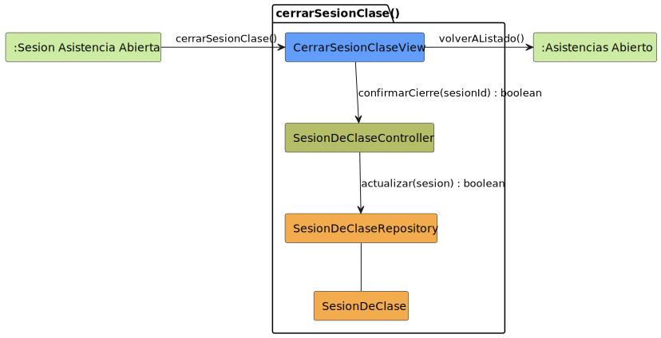

# CGU > cerrarSesionClase > Análisis

> | [🏠️](/README.md) | [Análisis](/RUP/01-analisis/README.md) | [Detalle](/RUP/00-requisitos/CasosDeUso/DetalladoCasosDeUso/Profesor/) | **Análisis** | Diseño | Desarrollo |
> |-|-|-|-|-|-|

## información del artefacto

- **Proyecto**: Centro de Gestión Universitaria (CGU)
- **Fase RUP**: Inception
- **Disciplina**: Análisis
- **Caso de uso**: `cerrarSesionClase()`
- **Actor**: Profesor
- **Versión**: 1.0
- **Fecha**: 2026-05-28

## propósito

Análisis del caso de uso `cerrarSesionClase()` mediante diagrama de colaboración MVC. El Profesor finaliza una sesión de clase activa: el sistema registra la hora de finalización, marca la sesión como concluida y vuelve al listado de asistencias.

Es el **cierre del ciclo de vida operativo** de una `SesionDeClase`: empieza en [[crearSesionClase]] (transición a estado activo) y termina aquí (transición de vuelta al listado). Estructuralmente paralelo al [[cerrarSesion]] del Usuario respecto al [[iniciarSesion]], pero a nivel de "sesión de clase" en lugar de "sesión de sistema".

## diagrama de colaboración

<div align=center>

||
|-|
|**Disciplina**: Análisis RUP<br>**Enfoque**: Diagramas de colaboración MVC|

</div>

## clases de análisis identificadas

### clases model (naranja #F2AC4E)

| Clase | Responsabilidad | Trazabilidad |
|-|-|-|
| **SesionDeClase** | Entidad de dominio; gana `horaFin` y/o flag `cerrada` | Reutilizada de [[crearSesionClase]] |
| **SesionDeClaseRepository** | Persiste el cierre | Reutilizado; mismo método `actualizar` que en [[editarSesionClase]] |

### clases view (azul #629EF9)

| Clase | Responsabilidad | Derivación |
|-|-|-|
| **CerrarSesionClaseView** | Modal de confirmación "Finalizar Sesión" con hora de finalización propuesta | [Prototipo SALT `cerrarSesionClase.png`](/RUP/00-requisitos/CasosDeUso/Prototipos/Profesor/cerrarSesionClase.png) |

### clases controller (verde #b5bd68)

| Clase | Responsabilidad | Casos de uso |
|-|-|-|
| **SesionDeClaseController** | Aplicar el cierre: resolver `horaFin = ahora`, marcar sesión cerrada, orquestar persistencia | Compartido con todo el bloque sesión |

### colaboraciones (verde claro #CDEBA5)

| Colaboración | Propósito | Invocación |
|-|-|-|
| **:Sesion Asistencia Abierta** | Estado de origen — la sesión activa que se va a cerrar | Punto de entrada |
| **:Asistencias Abierto** | Estado de destino — vuelta al listado tras cierre exitoso | Mensaje 4 `volverAListado()` |

## mensajes de colaboración

### flujo principal

| # | Origen | Destino | Mensaje | Intención |
|-|-|-|-|-|
| 1 | **:Sesion Asistencia Abierta** | **CerrarSesionClaseView** | `cerrarSesionClase()` | Abrir modal de confirmación con hora de finalización propuesta |
| 2 | **CerrarSesionClaseView** | **SesionDeClaseController** | `confirmarCierre(sesionId) : boolean` | Solicitar el cierre tras confirmación del Profesor |
| 3 | **SesionDeClaseController** | **SesionDeClaseRepository** | `actualizar(sesion) : boolean` | Persistir el cierre (con `horaFin` poblado por el Controller) |
| 4 | **CerrarSesionClaseView** | **:Asistencias Abierto** | `volverAListado()` | Transición al estado de listado tras cierre exitoso |

### flujo alternativo — cancelar el cierre

El prototipo muestra explícitamente un botón "Cancelar" en el modal. Si el Profesor cancela, no se invocan los mensajes 2-4 y la `CerrarSesionClaseView` se cierra dejando al sistema en `:Sesion Asistencia Abierta`. Mismo patrón que el flujo "salir sin guardar" de los editar.

## side effect implícito — `horaFin` resuelta por el Controller

El detallado dice **"Sistema presenta la hora de finalización"**. Esto sugiere que la hora no es input del Profesor sino que la determina el sistema (= momento del confirmar). El prototipo coincide: el modal muestra "Hora de finalización:" como información, no como campo editable.

Decisión de modelado: **el `SesionDeClaseController` resuelve `horaFin = ahora`** justo antes del `actualizar()`, análogamente a cómo el Director resolvía `fechaResolucion` y `responsable` en [[editarSolicitudDispensaDirector]]. Implícito, no mensaje aparte.

**Decisión abierta para 02-diseño**: ¿la hora de finalización podría ser editable en algún caso (p.ej. corregir un cierre olvidado)? Si sí, este CU no sería suficiente y haría falta un CU adicional o una rama editable. Por ahora se asume "automática y no negociable" como dice el detallado.

## sin verificación de propiedad explícita

Solo el Profesor titular de una sesión activa puede cerrarla — por construcción, **el `:Sesion Asistencia Abierta` ya garantiza que `Sesion.usuario` es el titular** (no se llega a ese estado de otra forma). No hay regla a aplicar en el Controller.

Es análogo a [[cerrarSesion]] del Usuario donde tampoco hace falta validar nada: si tienes la sesión, puedes cerrarla.

## paralelismo conceptual con `cerrarSesion()` del Usuario

| Característica | [[cerrarSesion]] (Usuario) | `cerrarSesionClase` (Profesor) |
|-|-|-|
| Mensajes | 4 | 4 |
| Origen | `:Sistema Disponible` | `:Sesion Asistencia Abierta` |
| Destino | `:Sesión Cerrada` | `:Asistencias Abierto` |
| Entidad cerrada | `Sesion` (del sistema) | `SesionDeClase` (de aula) |
| Side effect | (ninguno) | Registrar `horaFin` |
| Confirmación | No requerida (botón directo) | Sí — modal "Finalizar Sesión" |

Misma estructura, niveles distintos. Es una validación del patrón "cerrar = transición a estado terminal con efectos de cierre persistidos" del proyecto.

## cierre del ciclo de vida operativo de una `SesionDeClase`

Con este CU, el ciclo de vida activo de una sesión queda completo en el análisis:

```
crear        → SESION_ASISTENCIA_ABIERTA (estado activo)
    ├─ editar       (modificaciones in-situ)
    ├─ registrarTomaAsistencia (operación principal, pendiente)
    └─ cerrar       → ASISTENCIAS_ABIERTO (estado final)
```

`SesionDeClase` ya no se modificará en otros CUs del bloque tras el cierre. `exportarHistorialAsistencias` será read-only sobre sesiones cerradas (pendiente).

## enlaces de dependencia

- **CerrarSesionClaseView** conoce a **SesionDeClaseController** (delegación)
- **CerrarSesionClaseView** conoce a **:Asistencias Abierto** (transición destino)
- **SesionDeClaseController** conoce a **SesionDeClaseRepository** (escritura)
- **SesionDeClaseController** conoce a **SesionDeClase** (manipulación entidad)
- **SesionDeClaseRepository** conoce a **SesionDeClase** (gestión)

## trazabilidad con artefactos previos

### con especificación detallada

- **`SESION_ACTUAL_INICIAL` (= `SESION_ASISTENCIA_ABIERTA`)** → colaboración `:Sesion Asistencia Abierta` (origen)
- **Transición `cerrarSesionClase()`** → mensaje 1
- **Estado `PROCESO_CIERRE_COMP` (`FINALIZANDO_SESION`)** → `CerrarSesionClaseView` + mensajes 2-3
- **Nota "Sistema presenta la hora de finalización y visualiza la sesión como concluida"** → side effect del `horaFin` resuelto en el Controller (no mensaje aparte)
- **Transición a `ASISTENCIAS_FINAL` (= `ASISTENCIAS_ABIERTO`)** → mensaje 4 `volverAListado()`

### con wireframe (prototipo SALT)

- **`cerrarSesionClase.png`** → modal "Finalizar Sesión" con texto "Se guardará la sesión en curso. ¿Desea continuar?", campo "Hora de finalización:" (informativo) y botones "Cancelar" / "Sí, continuar" → `CerrarSesionClaseView`

### con actores

- **`Profesor --> AsistenciasCerrarSesion`** → invocación del CU

### con modelo del dominio

- **Sin trazabilidad directa** (deuda heredada de [[crearSesionClase]]; al promover `SesionDeClase` al modelo del dominio, los campos `horaFin` y `cerrada`/`estado` deberán reflejarse).

## principios de análisis aplicados

### patrón mvc

- **Controller compartido por entidad**: `SesionDeClaseController`
- **Vista específica modal**: `CerrarSesionClaseView` con confirmación

### diagramas de colaboración

- **4 mensajes** con dos colaboraciones (origen y destino) — patrón idéntico al [[cerrarSesion]] del Usuario
- **Side effect (`horaFin`) en prosa, no como mensaje**: misma decisión que con la notificación del Director en [[editarSolicitudDispensaDirector]] y la resolución de propietario en [[crearSolicitudDispensa]] — los efectos automáticos del Controller no se modelan como mensajes aparte

### análisis puro

- **Sin reglas de transición de estado**: ¿una sesión cerrada puede reabrirse? ¿se puede editar asistencia ya tomada tras el cierre? — deuda
- **Sin política de cierre forzado**: ¿el sistema cierra automáticamente sesiones olvidadas tras X tiempo? — fuera de scope (mismo razonamiento que la eliminación de `sesionInactiva()` para el login)

## características del análisis

### responsabilidades identificadas

- **CerrarSesionClaseView**: presentar modal de confirmación con hora propuesta, recoger confirmación, transitar al listado
- **SesionDeClaseController**: resolver `horaFin`, marcar la sesión como cerrada, orquestar persistencia
- **SesionDeClaseRepository**: persistir
- **SesionDeClase**: representar la entidad ahora cerrada

### relaciones conceptuales

- **Delegación**: vista → controlador
- **Cierre = persistir cambio de estado**: similar al editar, pero el "cambio" es semánticamente terminal
- **Hora automática**: el Controller añade `horaFin` antes de persistir

## conexión con disciplinas rup

### desde requisitos

- **Detallado**: `PROCESO_CIERRE_COMP` → modal de confirmación
- **Prototipo SALT**: modal "Finalizar Sesión" con confirmación → `CerrarSesionClaseView`
- **Actores**: `Profesor --> cerrarSesionClase()` en package "Asistencias"

### hacia diseño

- **Política de reapertura**: ¿una sesión cerrada puede reabrirse para corregir asistencia tomada por error? Tres caminos: prohibido, ventana de tiempo limitada, libre con auditoría
- **Edición post-cierre**: ¿algún campo es editable tras el cierre? (probablemente no — la sesión es ya "histórica")
- **Cierre forzado / automático**: política de timeout (rechazado para el login del Usuario; ¿aplica a la sesión de clase?)
- **Atomicidad**: el `actualizar()` con `horaFin` debería ser una transacción si involucra otros agregados (p.ej. estadísticas de asistencia)
- **Reflejar `horaFin` y `cerrada` en el modelo del dominio** al promover `SesionDeClase`

**Código fuente:** [colaboracion.puml](colaboracion.puml)

## referencias

- [Detallado `cerrarSesionClase()`](/RUP/00-requisitos/CasosDeUso/DetalladoCasosDeUso/Profesor/cerrarSesionClase.puml)
- [Prototipo SALT `cerrarSesionClase.png`](/RUP/00-requisitos/CasosDeUso/Prototipos/Profesor/cerrarSesionClase.png)
- [Caso de uso del Profesor](/RUP/00-requisitos/CasosDeUso/CasoDeUso/Profesor/Profesor.puml)
- [Análisis `crearSesionClase()`](/RUP/01-analisis/casos-uso/crearSesionClase/README.md)
- [Análisis `editarSesionClase()`](/RUP/01-analisis/casos-uso/editarSesionClase/README.md)
- [Análisis `cerrarSesion()` (Usuario)](/RUP/01-analisis/casos-uso/cerrarSesion/README.md)
- [conversation-log.md](/conversation-log.md)
