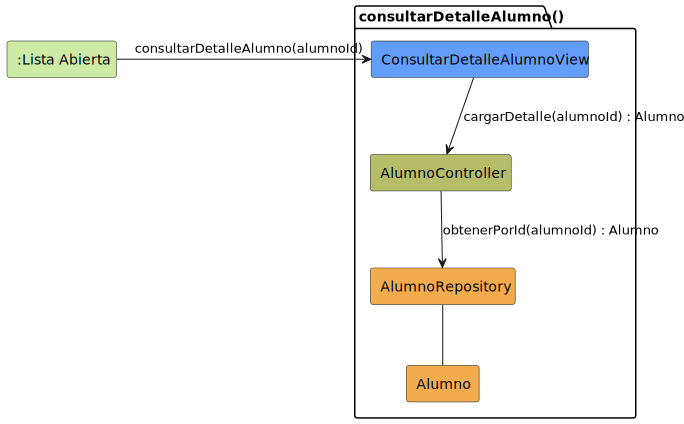

# CGU > consultarDetalleAlumno > Análisis

> | [🏠️](/README.md) | [Análisis](/RUP/01-analisis/README.md) | [Detalle](/RUP/00-requisitos/CasosDeUso/DetalladoCasosDeUso/Profesor/) | **Análisis** | Diseño | Desarrollo |
> |-|-|-|-|-|-|

## información del artefacto

- **Proyecto**: Centro de Gestión Universitaria (CGU)
- **Fase RUP**: Inception
- **Disciplina**: Análisis
- **Caso de uso**: `consultarDetalleAlumno()`
- **Actor**: Profesor
- **Versión**: 1.0
- **Fecha**: 2026-05-28

## propósito

Análisis del caso de uso `consultarDetalleAlumno()` mediante diagrama de colaboración MVC. El Profesor consulta la **ficha completa** de un alumno desde el listado: datos personales (nombre, documento, correo, teléfono), datos académicos (grado, curso, carnet), información adicional (descripción, dirección, ocupación, foto) y resumen de asistencias del alumno en las asignaturas que el Profesor imparte.

Es el CU homólogo a [[consultarSolicitudDispensa]] del Profesor sobre `SolicitudDispensa`, pero ahora sobre `Alumno`: **read-only puro, vista enriquecida, filtrado por contexto docente**.

## diagrama de colaboración

||
|-|
|**Disciplina**: Análisis RUP **Enfoque**: Diagramas de colaboración MVC|

## clases de análisis identificadas

### clases model (naranja #F2AC4E)

| Clase | Responsabilidad | Trazabilidad |
|-|-|-|
| **Alumno** | Entidad de dominio; en este CU se muestra la ficha completa | Reutilizada de [[consultarListaAlumnos]] |
| **AlumnoRepository** | Recupera al alumno por id, con su agregado de asistencias | Reutilizado; estrena `obtenerPorId(alumnoId)` |

### clases view (azul #629EF9)

| Clase | Responsabilidad | Derivación |
|-|-|-|
| **ConsultarDetalleAlumnoView** | Ficha completa con secciones colapsables (datos básicos siempre visibles, "Información Adicional" y "Asistencias" expandibles) | [Prototipos SALT `consultarDetalleAlumno2.png`](/RUP/00-requisitos/CasosDeUso/Prototipos/Profesor/consultarDetalleAlumno2.png) (asistencias expandidas) y [`consultarDetalleAlumno3.png`](/RUP/00-requisitos/CasosDeUso/Prototipos/Profesor/consultarDetalleAlumno3.png) (información adicional expandida) |

### clases controller (verde #b5bd68)

| Clase | Responsabilidad | Casos de uso |
|-|-|-|
| **AlumnoController** | Orquestación del acceso a `Alumno` | Compartido con [[consultarListaAlumnos]] (patrón "Controller por entidad") |

### colaboraciones (verde claro #CDEBA5)

| Colaboración | Propósito | Invocación |
|-|-|-|
| **:Lista Abierta** | Estado de origen — el Profesor está en la lista de alumnos (= `ALUMNOS_ABIERTO` del detallado; ver nota de discrepancia) | Punto de entrada |

## mensajes de colaboración

### flujo principal

| # | Origen | Destino | Mensaje | Intención |
|-|-|-|-|-|
| 1 | **:Lista Abierta** | **ConsultarDetalleAlumnoView** | `consultarDetalleAlumno(alumnoId)` | Abrir la ficha del alumno seleccionado |
| 2 | **ConsultarDetalleAlumnoView** | **AlumnoController** | `cargarDetalle(alumnoId) : Alumno` | Recuperar la instancia con su agregado de asistencias |
| 3 | **AlumnoController** | **AlumnoRepository** | `obtenerPorId(alumnoId) : Alumno` | Consulta |

### flujo alternativo — cerrar la ficha

El detallado contempla `cerrarDetalleAlumno()` para volver a `:Lista Abierta`. El prototipo lo refleja con el botón "Volver". En el análisis equivale a que la vista se cierre. Sin clase adicional.

## discrepancia nominal con `consultarListaAlumnos`

El detallado de [[consultarListaAlumnos]] arranca de `LISTAS_ABIERTO` y termina en `LISTA_ABIERTA`; este detallado arranca de `ALUMNOS_ABIERTO`. **El análisis los trata como el mismo estado** (la lista de alumnos visible y operable):

- En `:Lista Abierta` el Profesor ya tiene cargada una asignatura concreta y ve sus alumnos.
- Desde ahí, hace click en uno → este CU.

Comparado con el wireframe (`consultarDetalleAlumno1.png` muestra la misma pantalla que `consultarListaAlumnos.png` con un menú contextual "Consultar alumno"), la unificación es evidente. El prototipo no distingue entre LISTA_ABIERTA y ALUMNOS_ABIERTO.

**Deuda para 02-diseño**: reconciliar los nombres en los detallados del SDR (probablemente unificar a un único `LISTA_ABIERTA` o `ALUMNOS_ABIERTO` — preferencia editorial).

## la ficha incluye asistencias — modelado como agregado, no como mensaje aparte

La ficha del prototipo (`consultarDetalleAlumno2.png`) muestra una sección "Asistencias" con tabla de Asignatura/Fecha/Asistencia/Dispensa. Dos opciones de modelado:

| Opción | Descripción |
|-|-|
| **A. Mensaje aparte** | Mensaje 4 al Controller → mensaje 5 a un `AsistenciaRepository` para cargar asistencias bajo demanda al expandir la sección |
| **B. Agregado del Alumno** | El `Alumno` retornado incluye la colección `asistencias` poblada; la sección colapsable es decoración UI |

**Decisión adoptada: opción B** (agregado). Razones:
- El detallado dice "Sistema muestra la ficha completa del alumno: ... Resumen de asistencias y faltas". Es **parte de la ficha**, no operación separada.
- A nivel análisis, hablar de "lazy loading de secciones" es contaminación de implementación.
- El filtro de asistencias por asignaturas del Profesor es responsabilidad del Controller (no del Repository), igual que en [[consultarSolicitudDispensaProfesor]].

**Implicación**: el `obtenerPorId` retorna un `Alumno` con su lista de asistencias completa. El Controller las filtra antes de devolver al View para mostrar solo las de asignaturas que el Profesor imparte. Si el volumen lo hace inviable en diseño, se separará entonces.

`Asistencia` aparece referenciada pero **no se modela formalmente como entidad propia aquí**. Su modelo completo emergerá en [[registrarTomaAsistencia]] (donde se crea). Aquí es un dato de la ficha.

## ambigüedad en el prototipo — asistencias mostradas

El prototipo `consultarDetalleAlumno2.png` muestra asistencias de **dos asignaturas distintas** ("Programación I" e "Ingeniería del Software I"). Si el Profesor solo imparte una de ellas, debería ver únicamente las de esa asignatura. **El prototipo no aplica el filtro** — probablemente está simplificado y muestra el dataset completo del alumno.

**Decisión de análisis**: aplicamos el filtro (consistencia con [[consultarSolicitudDispensaProfesor]]). El Controller restringe las asistencias mostradas a las de asignaturas del Profesor. Documentado como ambigüedad del wireframe.

**Deuda para 02-diseño**: confirmar regla con el cliente — ¿filtro estricto por asignaturas impartidas, o el Profesor ve todas las asistencias del alumno como contexto?

## sin destino — read-only puro

Igual que [[consultarListaAlumnos]] y [[consultarSolicitudDispensaProfesor]]: el Profesor no edita alumnos ni asistencias desde aquí. No hay `<<include>>` saliente.

## paralelismo con `consultarSolicitudDispensa` del Profesor

| Característica | [[consultarSolicitudDispensaProfesor]] | `consultarDetalleAlumno` |
|-|-|-|
| Mensajes | 3 | 3 |
| Operación | Read-only puro | Read-only puro |
| `<<include>>` saliente | No | No |
| Vista | Enriquecida (datos del alumno solicitante) | Enriquecida (datos del alumno + asistencias del Profesor) |
| Verificación | "Profesor competente" (asignaturas intersectan) | "Profesor competente" (al menos una asignatura del alumno coincide con sus impartidas) |
| Filtro de subdatos | (no aplica) | Asistencias filtradas por asignaturas del Profesor |

Cada CU del Profesor refuerza el patrón: **acceso filtrado por contexto docente, sin operaciones de modificación**.

## enlaces de dependencia

- **ConsultarDetalleAlumnoView** conoce a **AlumnoController** (delegación)
- **AlumnoController** conoce a **AlumnoRepository** (lectura)
- **AlumnoController** conoce a **Alumno** (manipulación entidad)
- **AlumnoController** conoce a **Sesion** (verificación "Profesor competente"; no dibujada)
- **AlumnoRepository** conoce a **Alumno** (gestión)

## trazabilidad con artefactos previos

### con especificación detallada

- **`ALUMNOS_ABIERTO_INICIAL`** → colaboración `:Lista Abierta` (origen) — ver discrepancia nominal arriba
- **Transición `consultarDetalleAlumno()`** → mensaje 1
- **Estado `ALUMNO_ABIERTO_COMP` con sub-estado `VisualizacionFicha`** → `ConsultarDetalleAlumnoView` + mensajes 2-3
- **Nota "Sistema muestra la ficha completa del alumno: Datos personales y Foto, Resumen de asistencias y faltas"** → contenido enriquecido de la vista
- **Transición `cerrarDetalleAlumno()`** → flujo alternativo

### con wireframe (prototipo SALT)

- **`consultarDetalleAlumno1.png`** → estado origen (`:Lista Abierta`) con menú contextual "Consultar alumno"
- **`consultarDetalleAlumno2.png`** → ficha con "Asistencias" expandidas; revela columnas Asignatura/Fecha/Asistencia/Dispensa
- **`consultarDetalleAlumno3.png`** → ficha con "Información Adicional" expandida; revela Descripción, País, Ciudad, Código Postal, Ocupación, Estado, Foto de perfil

### con actores

- **`Profesor --> consultarDetalleAlumno`** en package "Alumnos" → invocación del CU

### con modelo del dominio

- **Sin trazabilidad directa** (deuda heredada).
- **Atributos emergentes del prototipo**: nombre, documento, correo, teléfono, grado, curso, nº carnet, descripción, país, ciudad, código postal, ocupación, estado, foto de perfil. Material para enriquecer el modelo del dominio en 02-diseño.

## principios de análisis aplicados

### patrón mvc

- **Controller por entidad**: `AlumnoController` compartido con [[consultarListaAlumnos]]
- **Vista enriquecida con secciones**: las secciones colapsables son decoración UI, no separación de CUs

### diagramas de colaboración

- **3 mensajes**: CU mínimo
- **Sin destino**: read-only puro
- **Filtro de asistencias en prosa**: regla "Profesor competente" se documenta, no se modela

### análisis puro

- **Sin lazy loading**: las secciones colapsables son UI; el agregado se carga completo
- **Sin política de privacidad**: ¿el Profesor ve datos sensibles del alumno (teléfono, dirección)? Deuda

## características del análisis

### responsabilidades identificadas

- **ConsultarDetalleAlumnoView**: presentar la ficha enriquecida con secciones colapsables
- **AlumnoController**: cargar la ficha, aplicar verificación "Profesor competente", filtrar asistencias por asignaturas del Profesor
- **AlumnoRepository**: recuperar la instancia con su agregado
- **Alumno**: representar la entidad consultada (incluyendo asistencias agregadas)

### relaciones conceptuales

- **Delegación**: vista → controlador
- **Agregado**: `Alumno` contiene asistencias como colección
- **Filtrado por contexto**: las asistencias visibles dependen del Profesor logueado

## conexión con disciplinas rup

### desde requisitos

- **Detallado**: `ALUMNO_ABIERTO_COMP` → vista enriquecida; `VisualizacionFicha` con datos completos
- **Prototipo SALT**: tres pantallas (lista + ficha + ficha expandida) confirman secciones colapsables
- **Actores**: `Profesor --> consultarDetalleAlumno()` en package "Alumnos"

### hacia diseño

- **Reconciliar nombres de estados `LISTA_ABIERTA` vs `ALUMNOS_ABIERTO`** en los detallados del SDR
- **Modelar `Alumno` en el modelo del dominio** con todos los atributos del prototipo
- **Modelar `Asistencia` como entidad** (su modelado formal se difiere a [[registrarTomaAsistencia]])
- **Política de privacidad**: ¿qué datos personales del alumno son visibles al Profesor?
- **Filtro de asistencias por contexto del Profesor**: estricto vs total (ambigüedad del prototipo)
- **Lazy loading de la sección Asistencias**: si el volumen lo justifica
- **Mismo polimorfismo del Controller** que en el bloque dispensas — `AlumnoController` posiblemente con métodos específicos por rol (Profesor vs Secretaria, que también consulta alumnos)

**Código fuente:** [colaboracion.puml](colaboracion.puml)

## referencias

- [Detallado `consultarDetalleAlumno()`](/RUP/00-requisitos/CasosDeUso/DetalladoCasosDeUso/Profesor/consultarDetalleAlumno.puml)
- [Prototipo SALT `consultarDetalleAlumno1.png`](/RUP/00-requisitos/CasosDeUso/Prototipos/Profesor/consultarDetalleAlumno1.png)
- [Prototipo SALT `consultarDetalleAlumno2.png`](/RUP/00-requisitos/CasosDeUso/Prototipos/Profesor/consultarDetalleAlumno2.png)
- [Prototipo SALT `consultarDetalleAlumno3.png`](/RUP/00-requisitos/CasosDeUso/Prototipos/Profesor/consultarDetalleAlumno3.png)
- [Caso de uso del Profesor](/RUP/00-requisitos/CasosDeUso/CasoDeUso/Profesor/Profesor.puml)
- [Análisis `consultarListaAlumnos()`](/RUP/01-analisis/casos-uso/consultarListaAlumnos/README.md)
- [Análisis `consultarSolicitudDispensa()` (Profesor)](/RUP/01-analisis/casos-uso/consultarSolicitudDispensaProfesor/README.md)
- [conversation-log.md](/conversation-log.md)
