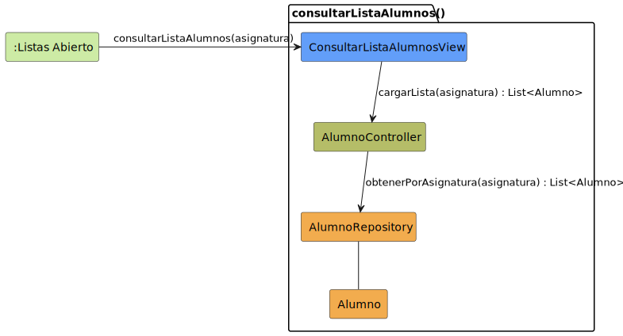

# CGU > consultarListaAlumnos > Análisis

> | [🏠️](/README.md) | [Análisis](/RUP/01-analisis/README.md) | [Detalle](/RUP/00-requisitos/CasosDeUso/DetalladoCasosDeUso/Profesor/) | **Análisis** | Diseño | Desarrollo |
> |-|-|-|-|-|-|

## información del artefacto

- **Proyecto**: Centro de Gestión Universitaria (CGU)
- **Fase RUP**: Inception
- **Disciplina**: Análisis
- **Caso de uso**: `consultarListaAlumnos()`
- **Actor**: Profesor
- **Versión**: 1.0
- **Fecha**: 2026-05-28

## propósito

Análisis del caso de uso `consultarListaAlumnos()` mediante diagrama de colaboración MVC. El Profesor consulta el listado de alumnos matriculados en **una de sus asignaturas**. El prototipo presenta el listado con un selector de pestañas, una pestaña por asignatura impartida.

Es la apertura del flujo "lista → detalle" del Profesor sobre alumnos, paralelo al "lista → detalle" del Director sobre dispensas pero **modelado como dos CUs separados** (lista y detalle son CUs distintos en el actor `Profesor.puml`, no un master-detail integrado).

## diagrama de colaboración

||
|-|
|**Disciplina**: Análisis RUP **Enfoque**: Diagramas de colaboración MVC|

## clases de análisis identificadas

### clases model (naranja #F2AC4E)

| Clase | Responsabilidad | Trazabilidad |
|-|-|-|
| **Alumno** | Entidad de dominio (read-only en este CU) | Ya existía como subtipo de `Usuario` en [[iniciarSesion]]; **aquí debuta como entidad con datos propios** (nombre, carnet, grado, curso, estado de matrícula) |
| **AlumnoRepository** | Recupera alumnos por asignatura | **Nuevo**; estrena `obtenerPorAsignatura(asignatura) : List<Alumno>` |

### clases view (azul #629EF9)

| Clase | Responsabilidad | Derivación |
|-|-|-|
| **ConsultarListaAlumnosView** | Listado tabular con pestañas por asignatura: columnas Alumno, Nº Carnet, Grado, Curso, Estado | [Prototipo SALT `consultarListaAlumnos.png`](/RUP/00-requisitos/CasosDeUso/Prototipos/Profesor/consultarListaAlumnos.png) |

### clases controller (verde #b5bd68)

| Clase | Responsabilidad | Casos de uso |
|-|-|-|
| **AlumnoController** | Orquestación del acceso a `Alumno` (lista y detalle) | **Nuevo**; se reutilizará en [[consultarDetalleAlumno]] siguiendo el patrón "Controller por entidad" |

### colaboraciones (verde claro #CDEBA5)

| Colaboración | Propósito | Invocación |
|-|-|-|
| **:Listas Abierto** | Estado de origen — el Profesor en el menú de listas | Punto de entrada |

## mensajes de colaboración

### flujo principal

| # | Origen | Destino | Mensaje | Intención |
|-|-|-|-|-|
| 1 | **:Listas Abierto** | **ConsultarListaAlumnosView** | `consultarListaAlumnos(asignatura)` | Abrir la lista de alumnos de la asignatura seleccionada |
| 2 | **ConsultarListaAlumnosView** | **AlumnoController** | `cargarLista(asignatura) : List<Alumno>` | Recuperar los alumnos de la asignatura |
| 3 | **AlumnoController** | **AlumnoRepository** | `obtenerPorAsignatura(asignatura) : List<Alumno>` | Consulta filtrada |

### flujo alternativo — cerrar la lista

El detallado contempla `cerrarLista()` (transición roja) para volver a `:Listas Abierto`. En el análisis equivale a que la vista se cierre. Sin clase adicional.

## sin destino — read-only puro

No hay `<<include>>` saliente a `consultarDetalleAlumno()`. La transición a detalle (botón "Ver Asistencias" o icono de menú en cada fila del prototipo) se modela como **invocación de un CU distinto** desde el estado `:Lista Abierta`, no como inclusión.

Es coherente con la decisión global del proyecto: los CUs `consultar` con destino a un CU pleno **se invocan**, no se incluyen como sub-actividad (no añaden lógica del CU consumidor a este CU).

## el parámetro `asignatura` y la verificación "Profesor competente"

El CU recibe `asignatura` como parámetro — implica que el Profesor ya ha seleccionado una pestaña (el prototipo muestra varias: Ingeniería de Software I, Programación I, EDA I, etc.). El selector de pestañas en sí **no se modela como CU** — es estado de la UI, equivalente a un filtro.

**Decisión de modelado**: las pestañas representan las asignaturas que el Profesor imparte. Cómo se carga esa lista de pestañas (¿al entrar a `:Listas Abierto`? ¿siempre desde `Sesion.usuario.asignaturasImpartidas`?) es decisión de diseño, no análisis. Lo que sí emerge es:

- La verificación "Profesor competente" reaparece: solo asignaturas del Profesor autenticado son seleccionables.
- El `AlumnoController` debe **validar** que `asignatura ∈ sesion.usuario.asignaturasImpartidas` antes de invocar al Repository. Si la UI ya filtra, la validación es defensa en profundidad; un cliente malicioso podría pedir otra asignatura.

Misma regla que en [[consultarSolicitudDispensaProfesor]]. Esto consolida el patrón:

> **Cualquier CU del Profesor que cargue datos por asignatura debe validar que el Profesor imparte esa asignatura.**

## entidad `Alumno` debuta con datos propios

Hasta ahora `Alumno` aparecía como **subtipo polimórfico de `Usuario`** (en [[iniciarSesion]]) y como propietario en `SolicitudDispensa`. Aquí debuta con **datos propios** visibles en la columna del prototipo: nombre, nº carnet, grado, curso, estado.

**Deuda para 02-diseño**:

- Promover `Alumno` al modelo del dominio con sus atributos académicos (carnet, grado, curso, estado de matrícula). No estaba en el modelo del SDR original.
- Relación `Alumno ↔ Asignatura` (matriculaciones) — no modelada aún; emerge implícita en `obtenerPorAsignatura`.

## reutilización del polimorfismo de `Sesion.usuario`

Este CU no acepta input del actor (`asignatura` viene de la UI pero originalmente del set de asignaturas del Profesor logueado). La regla de visibilidad emana enteramente de `Sesion.usuario` subtipo `Profesor`.

| Operación | Regla aplicada |
|-|-|
| Cargar pestañas | `Sesion.usuario.asignaturasImpartidas` (fuera del análisis estricto, pero implícita) |
| Cargar lista de la asignatura activa | `asignatura ∈ Sesion.usuario.asignaturasImpartidas` (verificación defensiva) |

## enlaces de dependencia

- **ConsultarListaAlumnosView** conoce a **AlumnoController** (delegación)
- **AlumnoController** conoce a **AlumnoRepository** (lectura)
- **AlumnoController** conoce a **Alumno** (manipulación entidad)
- **AlumnoController** conoce a **Sesion** (verificación "Profesor competente"; no dibujada)
- **AlumnoRepository** conoce a **Alumno** (gestión)

## trazabilidad con artefactos previos

### con especificación detallada

- **`LISTAS_ABIERTO_INICIAL`** → colaboración `:Listas Abierto` (origen)
- **Transición `consultarListaAlumnos()`** → mensaje 1
- **Estado `LISTA_ABIERTA` con sub-estado `VisualizacionListado`** → `ConsultarListaAlumnosView` + mensajes 2-3
- **Nota "Sistema muestra la lista de alumnos matriculados: Nombres, Apellidos e Identificadores, Estado de la matrícula"** → columnas del prototipo
- **Transición `cerrarLista()`** → flujo alternativo
- **Discrepancia nominal con [[consultarDetalleAlumno]]**: el detallado de aquí termina en `LISTA_ABIERTA`, el del detalle arranca de `ALUMNOS_ABIERTO`. **Se trata como el mismo estado** (la lista de alumnos visible y operable). El análisis lo nombra `:Lista Abierta`. Deuda para 02-diseño: reconciliar nombres en los dos detallados del SDR.

### con wireframe (prototipo SALT)

- **`consultarListaAlumnos.png`** → `ConsultarListaAlumnosView`. Notable:
  - **Pestañas por asignatura** en la cabecera (selector implícito de filtro)
  - **Tabla con paginación** (1-14 de 332 elementos, 24 páginas) — el listado es grande
  - **Botón "Ver Asistencias"** en la esquina inferior derecha (transición a otro flujo, fuera de scope)
  - **Menú contextual (⋮) por fila** — vía de invocación a [[consultarDetalleAlumno]]

### con actores

- **`Profesor --> consultarListaAlumnos`** en package "Listas" → invocación del CU

### con modelo del dominio

- **Sin trazabilidad directa**: `Alumno` no aparece con atributos académicos en el modelo del SDR. **Deuda**.

## principios de análisis aplicados

### patrón mvc

- **Controller por entidad**: `AlumnoController` (nuevo)
- **Vista específica con selector contextual**: `ConsultarListaAlumnosView` con pestañas
- **Sin polimorfismo en la entidad**: `Alumno` concreta (su subtipo dentro de `Usuario` no aplica aquí — el Profesor consulta alumnos como datos académicos, no como usuarios del sistema)

### diagramas de colaboración

- **3 mensajes**: CU mínimo de listado
- **Sin destino**: read-only puro; el detalle se invoca como CU aparte
- **Verificación de acceso en prosa**: la regla "Profesor competente" se documenta, no se modela

### análisis puro

- **Sin paginación / búsqueda**: el prototipo las muestra pero pertenecen a la presentación
- **Sin filtros internos del listado**: el icono de filtro (⚲) en el prototipo es UI

## características del análisis

### responsabilidades identificadas

- **ConsultarListaAlumnosView**: presentar listado tabular con pestañas
- **AlumnoController**: cargar lista, aplicar verificación "Profesor competente"
- **AlumnoRepository**: recuperar alumnos filtrados por asignatura
- **Alumno**: representar la entidad listada

### relaciones conceptuales

- **Delegación**: vista → controlador
- **Filtrado por contexto del Profesor**: misma política que en [[consultarSolicitudDispensaProfesor]]

## conexión con disciplinas rup

### desde requisitos

- **Detallado**: `LISTA_ABIERTA` → vista; `cerrarLista()` → flujo alternativo
- **Prototipo SALT**: tabla con pestañas → vista con selector de asignatura
- **Actores**: `Profesor --> consultarListaAlumnos()` en package "Listas"

### hacia diseño

- **Reconciliar nombres `LISTA_ABIERTA` vs `ALUMNOS_ABIERTO` en los detallados** (mismo estado, dos nombres)
- **Promover `Alumno` al modelo del dominio** con atributos académicos
- **Modelar relación `Alumno ↔ Asignatura`** (matriculaciones, posiblemente vía entidad `Matricula`)
- **Modelar `Profesor.asignaturasImpartidas`** (deuda heredada de [[consultarSolicitudDispensaProfesor]])
- **Carga del selector de pestañas**: ¿al entrar a `:Listas Abierto` (eager) o on-demand?
- **Política de "estado de matrícula"**: ¿alumnos dados de baja aparecen? (deuda de regla de negocio)

**Código fuente:** [colaboracion.puml](colaboracion.puml)

## referencias

- [Detallado `consultarListaAlumnos()`](/RUP/00-requisitos/CasosDeUso/DetalladoCasosDeUso/Profesor/consultarListaAlumnos.puml)
- [Prototipo SALT `consultarListaAlumnos.png`](/RUP/00-requisitos/CasosDeUso/Prototipos/Profesor/consultarListaAlumnos.png)
- [Caso de uso del Profesor](/RUP/00-requisitos/CasosDeUso/CasoDeUso/Profesor/Profesor.puml)
- [Análisis `consultarDetalleAlumno()`](/RUP/01-analisis/casos-uso/consultarDetalleAlumno/README.md)
- [Análisis `consultarSolicitudDispensa()` (Profesor)](/RUP/01-analisis/casos-uso/consultarSolicitudDispensaProfesor/README.md)
- [conversation-log.md](/conversation-log.md)
