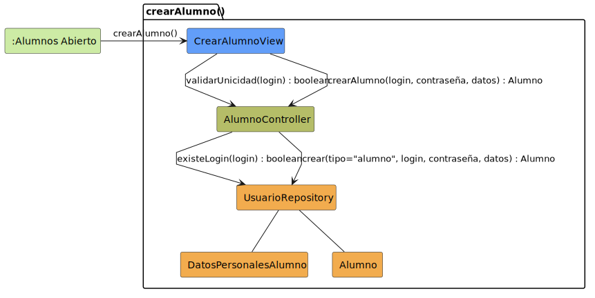

# CGU > crearAlumno > Análisis

> | [🏠️](/README.md) | [Análisis](/RUP/01-analisis/README.md) | Detalle | **Análisis** | Diseño | Desarrollo |
> |-|-|-|-|-|-|

## información del artefacto

- **Proyecto**: Centro de Gestión Universitaria (CGU)
- **Fase RUP**: Construction
- **Disciplina**: Análisis
- **Caso de uso**: `crearAlumno()`
- **Actor**: Secretaria
- **Versión**: 1.0
- **Fecha**: 2026-06-11

## propósito

Análisis del caso de uso `crearAlumno()` mediante diagrama de colaboración MVC. La Secretaria da de alta un nuevo `Alumno` (incorporación a mitad de curso, becario tardío, etc.) capturando login, contraseña y datos personales en un único formulario. A diferencia de [[crearUsuario]] (alta de personal, operada por el Administrador), aquí el `tipo` está fijo en `alumno` y la captura de datos personales no se delega vía `<<include>>` — se hace en la misma vista.

Este CU es la contraparte individual de [[importarListasAlumnos]] (carga masiva). Ambos persisten alumnos, pero por canales distintos: el imports masivo para listas iniciales de curso, este CU para incorporaciones puntuales.

## diagrama de colaboración

<div align=center>

||
|-|
|**Disciplina**: Análisis RUP<br>**Enfoque**: Diagramas de colaboración MVC|

</div>

## clases de análisis identificadas

### clases model (naranja #F2AC4E)

| Clase | Responsabilidad | Trazabilidad |
|-|-|-|
| **Alumno** | Entidad de dominio; subtipo concreto de `Usuario` creado por este CU | Reutilizada de [[consultarListaAlumnos]], [[consultarDetalleAlumno]] e [[importarListasAlumnos]] |
| **DatosPersonalesAlumno** | **Value Object** / DTO sin identidad: agrupa los 4 campos personales del formulario (nombre, apellidos, email, teléfono) antes de existir como entidad | **Nueva** — introducida para resolver smell "Long Parameter List" (ver sección dedicada abajo) |
| **UsuarioRepository** | Verifica unicidad del login y persiste el alta resolviendo polimórficamente el subtipo `alumno` | Reutilizado de [[crearUsuario]]; el método `crear(tipo, …)` se invoca aquí con `tipo="alumno"` fijo |

### clases view (azul #629EF9)

| Clase | Responsabilidad | Derivación |
|-|-|-|
| **CrearAlumnoView** | Formulario único: login, contraseña, nombre, apellidos, email, teléfono opcional | Sin prototipo SALT; deriva del formulario de `editarUsuario` (mismos campos personales) pero con login/contraseña visibles desde el inicio |

### clases controller (verde #b5bd68)

| Clase | Responsabilidad | Casos de uso |
|-|-|-|
| **AlumnoController** | Orquestación de operaciones sobre `Alumno`: listar, consultar detalle, importar lote y ahora alta individual | Compartido con [[consultarListaAlumnos]] (Profesor), [[consultarListaAlumnosSecretaria]], [[consultarDetalleAlumno]] e [[importarListasAlumnos]] |

### colaboraciones (verde claro #CDEBA5)

| Colaboración | Propósito | Invocación |
|-|-|-|
| **:Alumnos Abierto** | Estado de origen — la Secretaria está en el listado de alumnos ([[consultarListaAlumnosSecretaria]]) y pulsa "+ Nuevo alumno" | Punto de entrada del caso de uso |

## mensajes de colaboración

### flujo principal

| # | Origen | Destino | Mensaje | Intención |
|-|-|-|-|-|
| 1 | **:Alumnos Abierto** | **CrearAlumnoView** | `crearAlumno()` | Abrir el formulario de alta |
| 2 | **CrearAlumnoView** | **AlumnoController** | `validarUnicidad(login) : boolean` | Comprobar que el login no está en uso |
| 3 | **AlumnoController** | **UsuarioRepository** | `existeLogin(login) : boolean` | Consulta de unicidad |
| 4 | **CrearAlumnoView** | **AlumnoController** | `crearAlumno(login, contraseña, datos) : Alumno` | Solicitar el alta con credenciales y `datos : DatosPersonalesAlumno` |
| 5 | **AlumnoController** | **UsuarioRepository** | `crear(tipo="alumno", login, contraseña, datos) : Alumno` | Persistir el alta resolviendo polimórficamente el subtipo `alumno` |

Donde `datos : DatosPersonalesAlumno` agrupa (nombre, apellidos, email, teléfono). Ver sección **refactor "Introduce Parameter Object"** abajo.

### flujo alternativo — login en uso

Equivalente a [[crearUsuario]]: si `existeLogin(login)` devuelve `true`, la `CrearAlumnoView` rechaza el envío del mensaje 4 y solicita un login distinto. No se modela como mensaje aparte.

### flujo alternativo — cancelar sin guardar

Cierre del formulario sin llegar al mensaje 4: la vista vuelve a `:Alumnos Abierto` sin invocar al Controller. Sin clase adicional.

## enlaces de dependencia

- **CrearAlumnoView** conoce a **AlumnoController** (delegación)
- **CrearAlumnoView** construye **DatosPersonalesAlumno** desde los inputs del formulario
- **AlumnoController** conoce a **UsuarioRepository** (validación y persistencia polimórfica)
- **AlumnoController** conoce a **Alumno** (manipulación entidad)
- **UsuarioRepository** conoce a **DatosPersonalesAlumno** (lo desempaqueta al instanciar)
- **UsuarioRepository** conoce a **Alumno** (instanciación polimórfica como subtipo de `Usuario`)

## refactor "Introduce Parameter Object" — `DatosPersonalesAlumno`

**Smell detectado en una iteración del análisis.** La firma original era:

```
crearAlumno(login, contraseña, nombre, apellidos, email, teléfono) : Alumno
crear(tipo, login, contraseña, nombre, apellidos, email, teléfono) : Alumno
```

Esto es el **code smell "Long Parameter List"** (Fowler, *Refactoring*): 6–7 parámetros que viajan juntos por dos métodos sugieren una abstracción implícita. La refactorización canónica es **"Introduce Parameter Object"**. El proyecto ya aplicó la misma transformación en [[crearSesionClase]] con `DatosSesionClase`; aquí se reutiliza el patrón.

| Mensaje | Antes (firma plana) | Después (con Parameter Object) |
|-|-|-|
| 4 | `crearAlumno(login, contraseña, nombre, apellidos, email, teléfono) : Alumno` | `crearAlumno(login, contraseña, datos) : Alumno` |
| 5 | `crear(tipo, login, contraseña, nombre, apellidos, email, teléfono) : Alumno` | `crear(tipo, login, contraseña, datos) : Alumno` |

### qué entra (y qué no) en `DatosPersonalesAlumno`

Solo los **4 campos personales**: nombre, apellidos, email, teléfono.

**Las credenciales `login` y `contraseña` quedan fuera del DTO** porque son de naturaleza distinta (autenticación, no identidad personal) y porque mantenerlas separadas conserva la simetría con [[crearUsuario]] (donde el mensaje sigue siendo `crear(tipo, login, contraseña)` y los datos personales se capturan después vía `<<include>> editarUsuario`).

### beneficios

- **Legibilidad**: la firma del mensaje 4 pasa de 6 a 3 parámetros.
- **Extensibilidad**: si el formulario gana campos futuros (DNI, fecha de nacimiento, dirección), la firma no cambia — solo crece `DatosPersonalesAlumno`.
- **Cohesión**: la abstracción "datos personales de un alumno antes de existir como entidad" gana nombre propio.

**Coste:** una clase más en el modelo (`DatosPersonalesAlumno`, value object sin identidad, distinto de la entidad `Alumno`).

### alcance del refactor en el proyecto

[[crearSesionClase]] ya aplicó este refactor con 7 parámetros y dejó registrada la "deuda blanda" de extenderlo a otros CUs con ≥4 parámetros. Este CU consume parte de esa deuda. Tras aplicarlo aquí, los `crear*` del proyecto quedan así:

| CU | Parámetros antes | Refactor |
|-|-|-|
| [[crearSesionClase]] | 7 | `DatosSesionClase` (aplicado) |
| `crearAlumno` (este) | 6 | `DatosPersonalesAlumno` (aplicado) |
| [[crearSolicitudDispensa]] | 4 | sin refactor (marginal) — deuda blanda viva |
| [[crearUsuario]] | 3 | sin smell (porque delega datos personales a `editarUsuario` vía `<<include>>`) |

## decisiones de análisis

### por qué no `<<include>> editarUsuario()` como en `crearUsuario`

[[crearUsuario]] separa el alta básica (login/contraseña/tipo) de la captura de datos personales — la justificación es que el Administrador puede crear cinco tipos distintos y deja el llenado de campos específicos para `editarUsuario`. Para `crearAlumno`, en cambio, el tipo está fijo, los campos son conocidos y son pocos (nombre, apellidos, email, teléfono). Un único formulario es más natural y reduce el número de pantallas que la Secretaria atraviesa en cada alta.

### por qué la persistencia sigue en `UsuarioRepository`, no en `AlumnoRepository`

El alta polimórfica vive en `UsuarioRepository.crear(tipo, …)` desde [[crearUsuario]]. `AlumnoRepository` existe pero su rol son las consultas académicas (matrículas, asistencias, listado por asignatura). Mantener la instanciación de `Alumno` en `UsuarioRepository` evita duplicar el patrón polimórfico y conserva al `UsuarioRepository` como punto único de despacho por subtipo (igual que `existeLogin` se sigue consultando ahí).

### por qué se reutiliza `AlumnoController` y no se crea un `CrearAlumnoController`

Coherente con el patrón "Controller por entidad" establecido por [[crearUsuario]] / [[consultarUsuario]] / [[editarUsuario]] sobre `UsuarioController`. El bloque de Alumno ya consolidó su Controller en torno a `AlumnoController` ([[consultarListaAlumnos]], [[consultarDetalleAlumno]], [[importarListasAlumnos]]); el alta individual se suma como un método más.

### reparto Administrador/Secretaria como principio

El reparto subyacente del sistema queda nítido tras este CU: el **Administrador** opera cuentas de personal (Profesor, DirectorDeGrado, Secretaria, Administrador), la **Secretaria** opera datos académicos (alumnos, matrículas, dispensas, catálogos). El alta individual de alumno encaja en lo académico — la incorporación de un nuevo alumno la conoce y autoriza la Secretaría, no el Administrador. [[crearUsuario]] queda en consecuencia restringido al alta de personal.

## trazabilidad con artefactos previos

### con especificación detallada

- **Sin detallado en el SDR**: la incorporación individual de alumno no estaba modelada (el SDR cubre solo `importarListasAlumnos` para la carga inicial). Este CU es nuevo y emerge del reparto Administrador/Secretaria explícito en el plan post-base.

### sin wireframe (prototipo SALT)

- La `CrearAlumnoView` se deriva del formulario de `editarUsuario` (mismos campos personales) más login y contraseña visibles desde el inicio.

### con actores

- **Bloque "Listas de alumnos" del actor Secretaria**: añade `crearAlumno()` como complemento individual a `importarListasAlumnos()` y `consultarListaAlumnos()`.

### con modelo del dominio

- **Clase `Alumno` del SDR** → entidad creada por este CU.
- **Jerarquía `Usuario → Alumno`** → parámetro `tipo="alumno"` fijo en el mensaje 5.

## principios de análisis aplicados

### patrón mvc

- **Controller por entidad**: `AlumnoController` reutilizado para todas las operaciones sobre `Alumno`.
- **Vista específica por CU**: `CrearAlumnoView` distinta de `ConsultarAlumnoView` y de la vista de importación.
- **Modelo polimórfico**: `crear(tipo="alumno", …)` despacha sobre `UsuarioRepository`.

### diagramas de colaboración

- **Foco en enlaces**: cinco mensajes, mismo esqueleto que [[crearUsuario]].
- **Mensajes de intención**: `validarUnicidad`, `crear`, sin detalles de implementación.

### análisis puro

- **Sin tecnología**: `UsuarioRepository` y `AlumnoController` son conceptos.
- **Sin UI**: `CrearAlumnoView` es interfaz conceptual; las decisiones de campos del formulario quedan para 02-diseño.

## conexión con disciplinas rup

### desde requisitos

- **Reparto Administrador/Secretaria**: el plan post-base lo formaliza; este CU lo materializa para el alta de alumnos.

### hacia diseño

- Endpoint REST: `POST /alumnos` protegido por `require_rol(["secretaria"])`. **No** `POST /usuarios` — la separación de canal refuerza el reparto.
- `POST /usuarios` (Administrador) debe **rechazar** `tipo="alumno"` con 422 y mensaje explícito.
- Política de contraseñas y validación de email/teléfono (compartidas con [[crearUsuario]]).
- Transaccionalidad: única operación atómica al persistir.

**Código fuente:** [colaboracion.puml](colaboracion.puml)

## referencias

- [Análisis `crearUsuario()`](/RUP/01-analisis/casos-uso/crearUsuario/README.md) — patrón espejado, con scope reducido tras este CU
- [Análisis `importarListasAlumnos()`](/RUP/01-analisis/casos-uso/importarListasAlumnos/README.md) — alta masiva, contraparte de este CU individual
- [Análisis `consultarListaAlumnosSecretaria()`](/RUP/01-analisis/casos-uso/consultarListaAlumnosSecretaria/README.md) — listado desde el que se entra al alta
- [conversation-log.md](/conversation-log.md)
