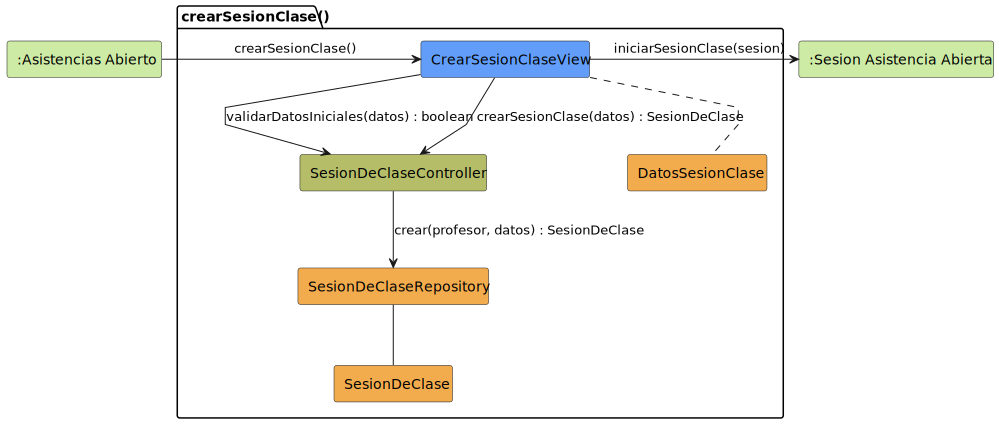

# CGU > crearSesionClase > Análisis

> | [🏠️](/README.md) | [Análisis](/RUP/01-analisis/README.md) | [Detalle](/RUP/00-requisitos/CasosDeUso/DetalladoCasosDeUso/Profesor/) | **Análisis** | Diseño | Desarrollo |
> |-|-|-|-|-|-|

## información del artefacto

- **Proyecto**: Centro de Gestión Universitaria (CGU)
- **Fase RUP**: Inception
- **Disciplina**: Análisis
- **Caso de uso**: `crearSesionClase()`
- **Actor**: Profesor
- **Versión**: 1.0
- **Fecha**: 2026-05-28

## propósito

Análisis del caso de uso `crearSesionClase()` mediante diagrama de colaboración MVC. Apertura del bloque Profesor: el Profesor configura una nueva sesión de clase (asignatura, grupos, aula, fecha, hora, tema) y al confirmarla el sistema pasa a estado `SESION_ASISTENCIA_ABIERTA`, donde podrá pasar lista mediante [[registrarTomaAsistencia]].

> **Notas — revisiones posteriores al análisis inicial.**
>
> **Cardinalidad de grupos.** En la versión inicial `grupo` era cardinal 1 (string libre). Tras detectar que una sesión puede servir a varios grupos simultáneamente (típico de asignaturas transversales como Inglés con varias titulaciones), se actualizó a `grupos: list[str]`. Las menciones a "grupo" singular en las secciones de refactor histórico (Long Parameter List) se preservan tal como fueron escritas — son narrativa pedagógica sobre un problema distinto.
>
> **Asignatura promovida con FK a `Grado`.** Una de las "deudas para 02-diseño" señaladas más abajo era *"decidir si Asignatura, Grupo, Aula son entidades de dominio propias o atributos planos"*. 02-diseño optó por mantenerlos como strings libres (`Asignatura.plan_estudios` y `Asignatura.facultad`), decisión que arrastró sin querer la pérdida del scoping de Director/Secretaria por grado modelado en el SDR. Una revisión posterior revierte la parte de Asignatura: `plan_estudios` y `facultad` desaparecen y se reemplazan por una FK `grado_id` a la entidad `Grado`. Grupo y Aula siguen como strings libres (Grupo solo cambió de cardinalidad; Aula no ha tenido caso que lo justifique). Detalle en [[gestionarCatalogoGrados]].

Es la primera entidad del proyecto cuyo CU de creación **no termina en un listado** sino en un **nuevo estado activo** (la sesión de clase abierta). Esto rompe con el patrón "crear → editar (siempre) → listado" del bloque Administrador y Alumno.

## diagrama de colaboración

||
|-|
|**Disciplina**: Análisis RUP **Enfoque**: Diagramas de colaboración MVC|

## discrepancia en el requisitado — colisión de nombre `iniciarSesion()`

El detallado etiqueta la transición de cierre del CU (de `SESION_NUEVA_COMP` a `SESION_ASISTENCIA_ABIERTA`) como **`iniciarSesion()`**. Este nombre **colisiona con el CU `iniciarSesion()` del actor Usuario** (login) ya analizado en [[iniciarSesion]].

El análisis adopta **`iniciarSesionClase()`** como nombre canónico para esta transición específica del flujo del Profesor, por dos razones:

1. **Evitar ambigüedad**: el lector del análisis no debe tener que inferir cuál `iniciarSesion()` está en juego.
2. **Semántica más precisa**: "iniciar la sesión de clase" describe la acción real (abrir el modo de toma de asistencia) — distinta del login al sistema.

**Deuda para 02-diseño**: renombrar `iniciarSesion()` → `iniciarSesionClase()` en el detallado `crearSesionClase.puml` (línea 41). No es ambiguo en ejecución (son operaciones distintas), pero sí en lectura del modelo.

## clases de análisis identificadas

### clases model (naranja #F2AC4E)

| Clase | Responsabilidad | Trazabilidad |
|-|-|-|
| **SesionDeClase** | Entidad de dominio: representa una clase concreta con su contexto (asignatura, grupos, aula, fecha, hora, tema) y profesor responsable | **Nueva** — primera vez que aparece en el análisis |
| **DatosSesionClase** | **Value Object** / DTO sin identidad: agrupa los 6 campos de configuración de la sesión antes de existir como entidad (asignatura, grupos, aula, fecha, hora, tema) | **Nueva** — introducida para resolver smell "Long Parameter List" (ver sección dedicada abajo) |
| **SesionDeClaseRepository** | Persiste y recupera sesiones de clase | **Nuevo** |

### clases view (azul #629EF9)

| Clase | Responsabilidad | Derivación |
|-|-|-|
| **CrearSesionClaseView** | Formulario modal de creación: fecha, hora (inicio/fin), aula, tema | [Prototipo SALT `crearSesionClase1.png`](/RUP/00-requisitos/CasosDeUso/Prototipos/Profesor/crearSesionClase1.png), [`crearSesionClase2.png`](/RUP/00-requisitos/CasosDeUso/Prototipos/Profesor/crearSesionClase2.png) |

### clases controller (verde #b5bd68)

| Clase | Responsabilidad | Casos de uso |
|-|-|-|
| **SesionDeClaseController** | Orquestación del CRUD y operaciones sobre `SesionDeClase` | **Nuevo**; se reutilizará en [[editarSesionClase]], [[registrarTomaAsistencia]] y [[cerrarSesionClase]] siguiendo el patrón "Controller por entidad" del proyecto |

### colaboraciones (verde claro #CDEBA5)

| Colaboración | Propósito | Invocación |
|-|-|-|
| **:Asistencias Abierto** | Estado de origen (Profesor en el listado de asistencias / sesiones previas) | Punto de entrada |
| **:Sesion Asistencia Abierta** | Estado de destino tras crear con éxito — sesión activa lista para pasar lista | Mensaje 5 `iniciarSesionClase(sesion)` |

## mensajes de colaboración

### flujo principal

| # | Origen | Destino | Mensaje | Intención |
|-|-|-|-|-|
| 1 | **:Asistencias Abierto** | **CrearSesionClaseView** | `crearSesionClase()` | Abrir el formulario modal de creación |
| 2 | **CrearSesionClaseView** | **SesionDeClaseController** | `validarDatosIniciales(datos) : boolean` | Validación previa al persistir |
| 3 | **CrearSesionClaseView** | **SesionDeClaseController** | `crearSesionClase(datos) : SesionDeClase` | Solicitar creación |
| 4 | **SesionDeClaseController** | **SesionDeClaseRepository** | `crear(profesor, datos) : SesionDeClase` | Persistir con el Profesor propietario añadido |
| 5 | **CrearSesionClaseView** | **:Sesion Asistencia Abierta** | `iniciarSesionClase(sesion)` | Transición al estado activo de la sesión |

Donde `datos : DatosSesionClase` agrupa (asignatura, grupo, aula, fecha, hora, tema). Ver sección **refactor "Introduce Parameter Object"** abajo.

### flujo alternativo — cancelar creación

El detallado contempla `cancelarCreacion()` (transición roja) como salida sin persistir. En el análisis equivale a no invocar los mensajes 3-5; sólo se ejecuta el 2 si el usuario ha tocado algún campo y se valida en vivo (o ni siquiera 2 si la validación es al submit). La vista se cierra y el sistema vuelve a `:Asistencias Abierto`.

## refactor "Introduce Parameter Object" — `DatosSesionClase`

Una primera aproximación del análisis hacía viajar los 6 campos de configuración (asignatura, grupo, aula, fecha, hora, tema) como parámetros independientes en cada mensaje, llegando hasta **7 parámetros** en `crear(profesor, asignatura, grupo, aula, fecha, hora, tema)` del Repository.

Esto es el **code smell "Long Parameter List"** (Fowler, *Refactoring*): cuando varios parámetros viajan juntos por múltiples métodos, suelen estar capturando una abstracción implícita. La refactorización canónica es **"Introduce Parameter Object"**: convertir el grupo en una clase de datos.

**Resultado del refactor:**

| Mensaje | Firma anterior | Firma actual |
|-|-|-|
| 2 | `validarDatosIniciales(asignatura, grupo, aula, fecha, hora, tema) : boolean` | `validarDatosIniciales(datos) : boolean` |
| 3 | `crearSesionClase(asignatura, grupo, aula, fecha, hora, tema) : SesionDeClase` | `crearSesionClase(datos) : SesionDeClase` |
| 4 | `crear(profesor, asignatura, grupo, aula, fecha, hora, tema) : SesionDeClase` | `crear(profesor, datos) : SesionDeClase` |

**`DatosSesionClase`** es un *value object* sin identidad (no es la entidad persistible: la entidad es `SesionDeClase`). La `CrearSesionClaseView` lo construye desde los inputs del formulario y lo pasa al Controller; el Controller lo reenvía al Repository sin descomponerlo. El Repository instancia la entidad `SesionDeClase` a partir del value object más el `profesor` propietario.

**Ganancias:**

- **Legibilidad**: las firmas pasan de 6-7 parámetros a 1-2.
- **Extensibilidad**: si la sesión gana campos futuros (p.ej. `modalidad: presencial/online`), la firma no cambia — solo crece `DatosSesionClase`.
- **Cohesión**: la abstracción "lo que define una sesión antes de existir" gana nombre propio en el modelo.
- **Trazabilidad para diseño**: el value object puede emerger como DTO directamente reutilizable en la capa de transporte (form bindings, request bodies).

**Coste:** una clase más en el modelo (`DatosSesionClase`, en naranja como `SesionDeClase` pero conceptualmente distinta).

**Alcance del refactor en el proyecto:** aplicado **solo a `crearSesionClase`** donde el smell es claro (7 parámetros). En [[crearSolicitudDispensa]] (4 parámetros) y [[crearUsuario]] (3 parámetros) el smell es marginal o inexistente; quedan sin refactorizar por ahora. Si en una revisión futura se decide unificar el patrón "todos los `crear` con ≥4 parámetros van con Parameter Object", se aplicaría retroactivamente a `crearSolicitudDispensa` (`DatosSolicitudDispensa`) — registrado como deuda blanda.

## resolución implícita del Profesor propietario

La View envía `DatosSesionClase` al Controller en el mensaje 3, pero el Controller envía **además `profesor`** al Repository en el mensaje 4.

El `profesor` se resuelve desde `Sesion.usuario` (creada en [[iniciarSesion]]), no es input externo de la vista. **No forma parte de `DatosSesionClase`** intencionalmente — separar identidad del propietario de los datos del formulario refuerza que el cliente no puede falsearlo. Razones (idénticas a [[crearSolicitudDispensa]]):

- **Prevención de suplantación**: el cliente no podría editar quién es el profesor titular de la sesión.
- **Aprovecha el polimorfismo de `Sesion.usuario`**: el subtipo concreto en este CU es `Profesor`, resuelto desde el login.

**Decisión de diseño abierta**: ¿qué pasa si `Sesion.usuario` no es `Profesor` (p.ej. un Administrador navegando)? Tres caminos: (a) bloquear el CU desde la View (no mostrar el botón), (b) validar en el Controller (`if !(usuario instanceof Profesor) throw`), (c) excluir por autorización a nivel router. Probablemente la decisión irá alineada con el polimorfismo del Controller que ya emergió en [[consultarSolicitudesDispensas]].

## terminación no-CRUD del CU — asimetría con los crear previos

Este CU rompe el patrón "crear → editar (siempre)" del bloque Administrador y Alumno:

| Característica | [[crearUsuario]] / [[crearSolicitudDispensa]] | `crearSesionClase` |
|-|-|-|
| Salida exitosa | `<<include>>` a `editar` (siempre) | Transición a estado activo nuevo |
| Vista de edición posterior | Sí — formulario extendido en `EditarXView` | No — todos los campos se introducen en `CrearSesionClaseView` |
| Estado tras crear | Vuelta al listado (eventualmente, tras editar) | `SESION_ASISTENCIA_ABIERTA` (nuevo estado activo) |
| Cantidad de campos | Mínimos (tipo+login para Usuario; asignatura+periodo+horario para Dispensa) | Completos (6 campos en una sola vista) |

Razón de la asimetría: el detallado `crearSesionClase.puml` configura **todos los datos** de la sesión en `ConfiguracionDatos` antes de la transición exitosa. No hay un "alta mínima + completar después" como en Usuario/Dispensa. **Editar la sesión** (cambiar fecha/aula/tema) es un CU separado ([[editarSesionClase]]) que se invoca desde el listado, no como continuación del alta.

Esto confirma que el patrón "crear → editar" del proyecto **no es regla universal** sino consecuencia de cómo se diseñó cada formulario en el requisitado. `crearSesionClase` es el primer contraejemplo y probablemente lo será también `importarListasAlumnos` y `importarMatricula` del bloque Secretaria (operaciones de carga masiva sin edición posterior obligatoria).

## sin polimorfismo en la entidad

`SesionDeClase` es entidad concreta sin jerarquía. El método del Repository es `crear(profesor, …)` sin parámetro `tipo`. Igual que `SolicitudDispensa` y a diferencia de `Usuario`. La consistencia confirma que **el polimorfismo de Usuario fue el caso excepcional**, no la regla del proyecto.

## referencias a otras entidades — no modeladas

Los parámetros `asignatura`, `grupo`, `aula` referencian entidades probables del dominio (catálogos académicos). En análisis no se modelan como clases propias porque:

1. **El detallado no las desarrolla**: son contexto, no objetos manipulados por este CU.
2. **YAGNI a nivel análisis**: hasta que un CU las modifique, son strings/ids del lado de los repositories.

**Deuda para 02-diseño**: decidir si `Asignatura`, `Grupo`, `Aula` son entidades de dominio propias o atributos planos. El prototipo sugiere dropdowns (selectores), lo que **probablemente** implica catálogos persistidos.

## enlaces de dependencia

- **CrearSesionClaseView** conoce a **SesionDeClaseController** (delegación)
- **CrearSesionClaseView** construye **DatosSesionClase** (value object con los campos del formulario)
- **CrearSesionClaseView** conoce a **:Sesion Asistencia Abierta** (transición destino)
- **SesionDeClaseController** conoce a **SesionDeClaseRepository** (escritura)
- **SesionDeClaseController** conoce a **SesionDeClase** (manipulación entidad)
- **SesionDeClaseController** conoce a **Sesion** (resolver `profesor` desde `Sesion.usuario`; no dibujada por ser conocida desde [[iniciarSesion]])
- **SesionDeClaseRepository** conoce a **SesionDeClase** (gestión) y **DatosSesionClase** (entrada para instanciar la entidad)

## trazabilidad con artefactos previos

### con especificación detallada

- **`ASISTENCIAS_ABIERTO_INICIAL`** → colaboración `:Asistencias Abierto` (origen)
- **Transición `crearSesionClase()`** → mensaje 1
- **Estado `SESION_NUEVA_COMP` con sub-estado `ConfiguracionDatos`** → `CrearSesionClaseView` + mensajes 2-3 (el usuario rellena, valida, confirma)
- **Nota "Profesor introduce: Asignatura, Grupo y Aula, Fecha, Hora y Tema"** → parámetros del mensaje 3
- **Nota "Sistema muestra el resumen de la nueva clase. Profesor solicita iniciar la sesión"** → confirmación previa al mensaje 5
- **Transición `iniciarSesion()` (verde)** → mensaje 5 `iniciarSesionClase(sesion)` (**renombrado**, ver discrepancia arriba)
- **`SESION_ACTIVA_FINAL = SESION_ASISTENCIA_ABIERTA`** → colaboración destino
- **Transición `cancelarCreacion()` (roja)** → flujo alternativo
- **`ASISTENCIAS_ABIERTO_FINAL`** → vuelta a `:Asistencias Abierto` en caso de cancelación

### con wireframe (prototipo SALT)

- **`crearSesionClase1.png`** → modal de creación con campos Fecha, Hora, Aula, Tema → `CrearSesionClaseView`
- **`crearSesionClase2.png`** → estado tras crear, presumiblemente la pantalla `SESION_ASISTENCIA_ABIERTA` lista para pasar lista (próximo CU)

El prototipo solo muestra **4 campos en el formulario** (Fecha, Hora, Aula, Tema); el detallado nombra 6 (añade Asignatura y Grupo). La diferencia se explica porque en el prototipo **la asignatura es contexto de la página** ("Asistencias - Ingeniería de Software I" en el header) y el grupo no se ve. En el análisis adoptamos los 6 parámetros del detallado para no perder información — la decisión de UI sobre cuáles vienen del contexto vs del formulario pertenece a diseño.

### con actores

- **`Profesor --> AsistenciasCrearSesion`** en `Profesor.puml` → invocación del CU

### con modelo del dominio

- **Sin trazabilidad directa**: `SesionDeClase` no está en el modelo del dominio del SDR. **Deuda urgente para 02-diseño** — entidad central del bloque Profesor.

## principios de análisis aplicados

### patrón mvc

- **Controller por entidad**: `SesionDeClaseController` (nuevo, se reutilizará en los demás CUs de sesión)
- **Vista específica por CU**: `CrearSesionClaseView` (formulario modal)
- **Sin polimorfismo en entidad**: `SesionDeClase` concreta
- **Resolución del propietario desde `Sesion`**: idéntico a [[crearSolicitudDispensa]]

### diagramas de colaboración

- **5 mensajes** con dos colaboraciones (origen y destino activo) — patrón cercano a [[iniciarSesion]] (origen `ActorUsuario`, destino `:Sistema Disponible`) pero con validación previa adicional
- **Sin `<<include>>` saliente**: el CU termina en estado activo, no delega en otro CU
- **Validación antes de persistencia**: mensaje 2 separado del 3 — mismo patrón que [[crearSolicitudDispensa]]

### análisis puro

- **Sin reglas de validación específicas**: el detallado no las enumera (¿solapamiento horario? ¿aula ocupada? ¿asignatura del profesor?) — todas son deuda para diseño
- **Sin gestión de catálogos**: las entidades referenciadas (Asignatura/Grupo/Aula) no se modelan

## características del análisis

### responsabilidades identificadas

- **CrearSesionClaseView**: presentar formulario, construir `DatosSesionClase` con los inputs, disparar validación y creación, transitar al estado activo
- **DatosSesionClase**: agrupar los 6 campos de configuración como unidad conceptual sin identidad
- **SesionDeClaseController**: validar, resolver `profesor` desde Sesion, orquestar persistencia
- **SesionDeClaseRepository**: persistir y recuperar; instanciar `SesionDeClase` a partir de `(profesor, DatosSesionClase)`
- **SesionDeClase**: representar la entidad con su contexto

### relaciones conceptuales

- **Delegación**: vista delega lógica al controlador (idéntico a los demás crear)
- **Persistencia con propietario implícito**: el Profesor se añade en el Controller, no en la vista
- **Transición a estado activo**: el CU no "vuelve atrás", abre un nuevo estado de trabajo

## conexión con disciplinas rup

### desde requisitos

- **Detallado**: estado `SESION_NUEVA_COMP` → `CrearSesionClaseView`; transición `iniciarSesion()` → mensaje 5 renombrado
- **Prototipo SALT**: modal de 4 campos visibles → formulario de la vista
- **Actores**: `Profesor --> crearSesionClase()` en package "Asistencias"

### hacia diseño

- **Renombrar `iniciarSesion()` → `iniciarSesionClase()` en el detallado** (colisión con CU de login)
- **Promover `SesionDeClase` al modelo del dominio** (entidad central del bloque Profesor)
- **Decidir modelado de `Asignatura`, `Grupo`, `Aula`** (entidades vs atributos planos)
- **Materialización de `DatosSesionClase`**: ¿record/struct inmutable, DTO con validación integrada, form-binding del framework? Decidir en diseño.
- **Reglas de validación de creación**: solapamiento horario, aula ocupada, asignatura asignada al profesor
- **Política de unicidad**: ¿puede haber dos sesiones del mismo profesor a la misma hora?
- **Bloqueo del CU por subtipo de `Sesion.usuario`** (solo `Profesor` puede crear sesiones de clase)
- **Deuda blanda — extensión retroactiva del Parameter Object**: revisar [[crearSolicitudDispensa]] (4 parámetros) tras completar todos los análisis; si se quiere uniformar el patrón, introducir `DatosSolicitudDispensa`

**Código fuente:** [colaboracion.puml](colaboracion.puml)

## referencias

- [Detallado `crearSesionClase()`](/RUP/00-requisitos/CasosDeUso/DetalladoCasosDeUso/Profesor/crearSesionClase.puml)
- [Prototipo SALT `crearSesionClase1.png`](/RUP/00-requisitos/CasosDeUso/Prototipos/Profesor/crearSesionClase1.png)
- [Prototipo SALT `crearSesionClase2.png`](/RUP/00-requisitos/CasosDeUso/Prototipos/Profesor/crearSesionClase2.png)
- [Caso de uso del Profesor](/RUP/00-requisitos/CasosDeUso/CasoDeUso/Profesor/Profesor.puml)
- [Análisis `iniciarSesion()`](/RUP/01-analisis/casos-uso/iniciarSesion/README.md)
- [Análisis `crearSolicitudDispensa()`](/RUP/01-analisis/casos-uso/crearSolicitudDispensa/README.md)
- [conversation-log.md](/conversation-log.md)
