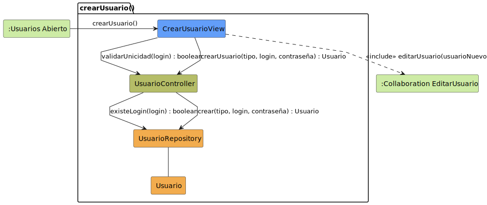

# CGU > crearUsuario > Análisis

> | [🏠️](/README.md) | [Análisis](/RUP/01-analisis/README.md) | [Detalle](/RUP/00-requisitos/CasosDeUso/DetalladoCasosDeUso/Administrador/) | **Análisis** | Diseño | Desarrollo |
> |-|-|-|-|-|-|

## información del artefacto

- **Proyecto**: Centro de Gestión Universitaria (CGU)
- **Fase RUP**: Inception
- **Disciplina**: Análisis
- **Caso de uso**: `crearUsuario()`
- **Actor**: Administrador
- **Versión**: 1.0
- **Fecha**: 2026-05-26

## propósito

Análisis del caso de uso `crearUsuario()` mediante diagrama de colaboración MVC. El Administrador da de alta un nuevo `Usuario` del sistema eligiendo su tipo concreto (Alumno, Profesor, Secretaria, DirectorDeGrado, Administrador); la captura del resto de datos personales se delega a `editarUsuario()` vía `<<include>>`.

## diagrama de colaboración

<div align=center>

||
|-|
|**Disciplina**: Análisis RUP<br>**Enfoque**: Diagramas de colaboración MVC|

</div>

## clases de análisis identificadas

### clases model (naranja #F2AC4E)

| Clase | Responsabilidad | Trazabilidad |
|-|-|-|
| **Usuario** | Clase abstracta; la instancia creada es siempre de un subtipo concreto (polimorfismo) | Reutilizada de [[iniciarSesion]] — superclase de la jerarquía de actores |
| **UsuarioRepository** | Verifica unicidad del login y persiste el alta resolviendo el subtipo concreto | Reutilizado de [[iniciarSesion]]; aquí estrena el método `crear(tipo, …)` |

### clases view (azul #629EF9)

| Clase | Responsabilidad | Derivación |
|-|-|-|
| **CrearUsuarioView** | Formulario inicial de alta: selector de tipo + credenciales mínimas (login, contraseña) | Sin prototipo SALT en el requisitado — derivada del estado `FormularioRegistro` del [detallado](/RUP/00-requisitos/CasosDeUso/DetalladoCasosDeUso/Administrador/crearUsuario.puml) |

### clases controller (verde #b5bd68)

| Clase | Responsabilidad | Casos de uso |
|-|-|-|
| **UsuarioController** | Orquestación del CRUD individual de `Usuario`: validación, alta, carga y modificación | Compartido entre `crearUsuario()`, `consultarUsuario()` y `editarUsuario()` |

### colaboraciones (verde claro #CDEBA5)

| Colaboración | Propósito | Invocación |
|-|-|-|
| **:Usuarios Abierto** | Estado de origen (listado de usuarios desde el que se invoca el alta) | Punto de entrada del caso de uso |
| **:Collaboration EditarUsuario** | Sub-colaboración a la que se delega la carga de datos personales tras crear el registro | Vía `<<include>>` al final del flujo |

## mensajes de colaboración

### flujo principal

| # | Origen | Destino | Mensaje | Intención |
|-|-|-|-|-|
| 1 | **:Usuarios Abierto** | **CrearUsuarioView** | `crearUsuario()` | Abrir el formulario de alta |
| 2 | **CrearUsuarioView** | **UsuarioController** | `validarUnicidad(login) : boolean` | Comprobar que el login no está en uso |
| 3 | **UsuarioController** | **UsuarioRepository** | `existeLogin(login) : boolean` | Consulta de unicidad |
| 4 | **CrearUsuarioView** | **UsuarioController** | `crearUsuario(tipo, login, contraseña) : Usuario` | Solicitar el alta con el subtipo elegido |
| 5 | **UsuarioController** | **UsuarioRepository** | `crear(tipo, login, contraseña) : Usuario` | Persistir el alta resolviendo polimórficamente el subtipo |
| 6 | **CrearUsuarioView** | **:Collaboration EditarUsuario** | `<<include>> editarUsuario(usuarioNuevo)` | Continuar con la carga de datos personales |

### flujo alternativo — login en uso

El choice point implícito es el retorno del mensaje 3. Si `existeLogin(login)` devuelve `true`, la `CrearUsuarioView` rechaza el envío del mensaje 4 y solicita un login distinto. No se modela como mensaje aparte: es el comportamiento por defecto del retorno booleano.

### flujo alternativo — cerrar sin guardar

El detallado contempla `cerrarUsuario()` como salida sin persistir. En el análisis equivale a no llegar al mensaje 4: la `CrearUsuarioView` se cierra y se vuelve a `:Usuarios Abierto` sin invocar al Controller. No requiere clase adicional.

## enlaces de dependencia

- **CrearUsuarioView** conoce a **UsuarioController** (delegación)
- **CrearUsuarioView** conoce a **:Collaboration EditarUsuario** (transición/inclusión)
- **UsuarioController** conoce a **UsuarioRepository** (validación y persistencia)
- **UsuarioController** conoce a **Usuario** (manipulación entidad)
- **UsuarioRepository** conoce a **Usuario** (gestión polimórfica)

## polimorfismo y herencia

El mensaje 5 (`crear(tipo, login, contraseña) : Usuario`) está tipado como `: Usuario`, pero **`UsuarioRepository` instancia el subtipo concreto** según el parámetro `tipo`. Esto es la contraparte de escritura del polimorfismo de lectura que [[iniciarSesion]] introdujo en `validarCredenciales()`:

```
Usuario (abstract)
├── Alumno
├── Profesor
│   └── DirectorDeGrado
└── SecretariaAcademica
        └── Administrador (hereda también de Alumno, Profesor y DirectorDeGrado)
```

El despacho vive en el Repository, no en el Controller, por consistencia con `validarCredenciales()` (donde el Repository ya devuelve subtipos). El Controller permanece agnóstico al subtipo concreto.

## asimetría en la elección de controlador

El proyecto usa dos patrones distintos para el Controller según el tipo de caso de uso:

- **Controller por verbo** (uno por CU): `IniciarSesionController`, `CerrarSesionController`. Aplica cuando no hay entidad CRUD detrás; `Sesion` solo se crea y se cierra, no se gestiona como recurso.
- **Controller por entidad** (compartido entre CUs): `UsuarioController`. Aplica al CRUD individual (`crearUsuario`, `consultarUsuario`, `editarUsuario`) — cohesión por entidad, igual que pySigHor con `ProfesorController` / `AulaController`.

La asimetría es deliberada: el patrón sigue la naturaleza del caso, no una regla uniforme.

## trazabilidad con artefactos previos

### con especificación detallada

- **Estado `USUARIOS_ABIERTO`** → **colaboración `:Usuarios Abierto`** (origen)
- **Estado compuesto `USUARIO_ABIERTO` con `FormularioRegistro` ("Edición de Usuario")** → **`CrearUsuarioView` + `<<include>> editarUsuario()`**
- **Transición `guardarUsuario()`** → **mensaje 5 `crear(tipo, …)`** (la persistencia efectiva)
- **Transición `cerrarUsuario()`** → flujo alternativo (cierre sin invocar al Controller)

### sin wireframe (prototipo SALT)

- El requisitado no incluye prototipo de `crearUsuario()` (solo `consultarUsuario` y `editarUsuario`). La `CrearUsuarioView` se deriva del estado `FormularioRegistro` del detallado, asumiendo selector de tipo + login + contraseña como mínimo. El resto de campos se cargan vía `editarUsuario()`.

### con actores

- **Jerarquía `Usuario → {Alumno, Profesor, …}`** → **parámetro `tipo` en `crear(tipo, …)`** (selección del subtipo a instanciar)

### con modelo del dominio

- **Sin trazabilidad directa**: `Usuario` no aparece en `ModeloCompleto.puml`. Deuda pendiente de reconciliar en 02-diseño (compartida con [[iniciarSesion]]).

## principios de análisis aplicados

### patrón mvc

- **Controller por entidad** (no por verbo): `UsuarioController` reutilizado en los 3 CUs del CRUD
- **Vista específica por CU**: `CrearUsuarioView` se diferencia de `ConsultarUsuarioView` / `EditarUsuarioView`
- **Modelo polimórfico**: `crear(tipo, …)` despacha por subtipo en el Repository

### diagramas de colaboración

- **Foco en enlaces**: dependencias conceptuales, no secuencia temporal
- **`<<include>>` explícito**: la delegación a `editarUsuario()` está modelada como dependencia entre colaboraciones, no como mensaje
- **Mensajes de intención**: `validarUnicidad`, `crear`, no detalles de implementación

### análisis puro

- **Sin tecnología**: `UsuarioRepository` es concepto, no implementación
- **Sin detalles de UI**: `CrearUsuarioView` es interfaz conceptual
- **Sin implementación**: cómo se despacha el subtipo (factory, switch, …) se deja al diseño

## características del análisis

### responsabilidades identificadas

- **CrearUsuarioView**: capturar tipo + credenciales y coordinar el flujo de alta
- **UsuarioController**: orquestar validación y creación; mediar entre vista y repositorio
- **UsuarioRepository**: verificar unicidad y persistir el alta resolviendo el subtipo concreto
- **Usuario**: representar la entidad creada (clase abstracta; instancia real es subtipo)

### relaciones conceptuales

- **Delegación**: vista delega lógica al controlador
- **Acceso**: controlador accede al repositorio para validación y persistencia
- **Inclusión**: la vista incluye la colaboración `editarUsuario()` para completar el alta

## conexión con disciplinas rup

### desde requisitos

- **Detallado**: estado compuesto `USUARIO_ABIERTO` con sub-actividad de edición → `<<include>> editarUsuario()`
- **Actores**: jerarquía → parámetro `tipo` del mensaje 5

### hacia diseño

- Estrategia concreta de despacho polimórfico en `crear(tipo, …)`: factory, mapa tipo→clase, reflexión, …
- Validaciones de negocio adicionales sobre `login` (longitud, caracteres permitidos)
- Política de contraseñas (longitud mínima, hashing)
- Transaccionalidad del par `crear()` + `editarUsuario(usuarioNuevo)` (¿qué pasa si el alta se confirma pero el Admin abandona la edición?)
- Reconciliación de `Usuario` con el modelo del dominio (compartida con [[iniciarSesion]])

**Código fuente:** [colaboracion.puml](colaboracion.puml)

## referencias

- [Detallado `crearUsuario()`](/RUP/00-requisitos/CasosDeUso/DetalladoCasosDeUso/Administrador/crearUsuario.puml)
- [Caso de uso del Administrador](/RUP/00-requisitos/CasosDeUso/CasoDeUso/Administrador/Administrador.puml)
- [Actores.puml](/RUP/00-requisitos/CasosDeUso/Actores/Actores.puml)
- [Análisis `iniciarSesion()`](/RUP/01-analisis/casos-uso/iniciarSesion/README.md)
- [conversation-log.md](/conversation-log.md)
