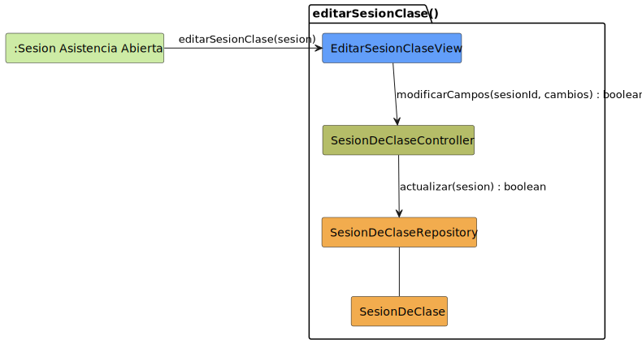

# CGU > editarSesionClase > Análisis

> | [🏠️](/README.md) | [Análisis](/RUP/01-analisis/README.md) | [Detalle](/RUP/00-requisitos/CasosDeUso/DetalladoCasosDeUso/Profesor/) | **Análisis** | Diseño | Desarrollo |
> |-|-|-|-|-|-|

## información del artefacto

- **Proyecto**: Centro de Gestión Universitaria (CGU)
- **Fase RUP**: Inception
- **Disciplina**: Análisis
- **Caso de uso**: `editarSesionClase()`
- **Actor**: Profesor
- **Versión**: 1.0
- **Fecha**: 2026-05-28

## propósito

Análisis del caso de uso `editarSesionClase()` mediante diagrama de colaboración MVC. El Profesor modifica los datos de una sesión de clase **que ya está activa** (fecha, hora, aula, tema) mientras pasa lista. La edición sucede **in-situ** dentro de `SESION_ASISTENCIA_ABIERTA` y al guardar el sistema vuelve al mismo estado con los cambios aplicados.

Es el primer CU `editar` del proyecto cuyo **único punto de entrada es un estado activo** (no un listado). No hay "carga previa" — la entidad ya está en memoria desde [[crearSesionClase]].

## diagrama de colaboración

||
|-|
|**Disciplina**: Análisis RUP **Enfoque**: Diagramas de colaboración MVC|

## clases de análisis identificadas

### clases model (naranja #F2AC4E)

| Clase | Responsabilidad | Trazabilidad |
|-|-|-|
| **SesionDeClase** | Entidad de dominio; gana las modificaciones del Profesor | Reutilizada de [[crearSesionClase]] |
| **SesionDeClaseRepository** | Persiste la modificación | Reutilizado; estrena `actualizar(sesion)` |

### clases view (azul #629EF9)

| Clase | Responsabilidad | Derivación |
|-|-|-|
| **EditarSesionClaseView** | Edición **in-situ** de los campos informativos en la cabecera de la pantalla de asistencias (fecha, hora, aula, tema). No es modal | [Prototipo SALT `editarSesionClase1.png`](/RUP/00-requisitos/CasosDeUso/Prototipos/Profesor/editarSesionClase1.png) |

Distinta de `CrearSesionClaseView` (que sí era modal): en `editar` la edición se hace sobre la misma pantalla activa que muestra el listado de asistencia. Refleja literalmente el prototipo (botón "Guardar" en la esquina superior derecha; los campos pasan de ser display a editables in-line).

### clases controller (verde #b5bd68)

| Clase | Responsabilidad | Casos de uso |
|-|-|-|
| **SesionDeClaseController** | Orquestación de las operaciones sobre `SesionDeClase` | Compartido con [[crearSesionClase]] y los próximos CUs de sesión |

### colaboraciones (verde claro #CDEBA5)

| Colaboración | Propósito | Invocación |
|-|-|-|
| **:Sesion Asistencia Abierta** | Único origen — el Profesor edita dentro de la sesión activa | Pasa la `sesion` ya cargada |

## mensajes de colaboración

### flujo principal

| # | Origen | Destino | Mensaje | Intención |
|-|-|-|-|-|
| 1 | **:Sesion Asistencia Abierta** | **EditarSesionClaseView** | `editarSesionClase(sesion)` | Activar el modo edición sobre la sesión ya cargada |
| 2 | **EditarSesionClaseView** | **SesionDeClaseController** | `modificarCampos(sesionId, cambios) : boolean` | Persistir los nuevos datos |
| 3 | **SesionDeClaseController** | **SesionDeClaseRepository** | `actualizar(sesion) : boolean` | Persistencia |

### flujo alternativo — cancelar sin guardar

El detallado no contempla explícitamente una transición de cancelación (a diferencia del crear que sí tenía `cancelarCreacion()`). El prototipo muestra un botón "Volver" en la cabecera que **podría** funcionar como cancelación. En el análisis se asume que cancelar equivale a no invocar el mensaje 2; el modo edición se desactiva y los cambios no aplicados se descartan localmente.

**Deuda para 02-diseño**: aclarar el comportamiento del botón "Volver" durante el modo edición — ¿descarta cambios automáticamente, pide confirmación, o solo navega manteniendo cambios en borrador local?

## CU más compacto del bloque sesión — sin carga previa

El editar del Alumno tenía 5 mensajes; el del Director tenía 3 (porque pre-cargado); este tiene también **solo 3** por la misma razón: la `SesionDeClase` ya está cargada en `SESION_ASISTENCIA_ABIERTA` (estado donde el Profesor está pasando lista). El editar no necesita `cargarSesionParaEdicion` ni `obtenerPorId`.

| Característica | [[editarSolicitudDispensa]] (Alumno) | `editarSolicitudDispensa` (Director) | `editarSesionClase` (Profesor) |
|-|-|-|-|
| Mensajes | 5 | 3 | 3 |
| Orígenes | 3 (listado, consulta, post-crear) | 1 (consulta master-detail) | 1 (estado activo) |
| Carga previa | Condicional | Nunca (pre-cargado) | Nunca (pre-cargado) |
| Vista | Modal/formulario aparte | Modal/formulario aparte | **In-situ** sobre la pantalla activa |
| Cancelación | Cerrar formulario | Cerrar formulario | Descartar modo edición (deuda) |

La "vista in-situ" es la **principal asimetría con todos los editar previos**, y refleja una decisión UX del prototipo: el Profesor no abandona la pantalla de asistencias para editar metadatos.

## ¿por qué `modificarCampos` y no `modificarVeredicto` u otro nombre?

Por consistencia con [[editarSolicitudDispensa]] del Alumno. Ambos representan "el dueño de la entidad ajusta sus datos genéricos". El método `modificarVeredicto` del Director es semánticamente distinto (no edita campos, emite resolución).

No se introduce un Parameter Object aquí (siguiendo el alcance acordado: refactor aplicado solo a [[crearSesionClase]]). El parámetro `cambios` se trata como opaco a nivel análisis — su materialización (DTO parcial, objeto delta, mapa de campos) es decisión de diseño.

## sin destino modelado — vuelta al mismo estado

Tras `actualizar()`, el sistema vuelve a `SESION_ASISTENCIA_ABIERTA` (el mismo estado de origen). No se modela como colaboración destino porque sería redundante con el origen y porque el patrón del proyecto es "el editar es terminal; los retornos viven en el detallado, no en el análisis" (decisión registrada en [[/conversation-log.md]]).

## enlaces de dependencia

- **EditarSesionClaseView** conoce a **SesionDeClaseController** (delegación)
- **SesionDeClaseController** conoce a **SesionDeClaseRepository** (escritura)
- **SesionDeClaseController** conoce a **SesionDeClase** (manipulación entidad)
- **SesionDeClaseRepository** conoce a **SesionDeClase** (gestión)

## trazabilidad con artefactos previos

### con especificación detallada

- **`SESION_ACTUAL_INICIAL` (= `SESION_ASISTENCIA_ABIERTA`)** → colaboración `:Sesion Asistencia Abierta` (origen)
- **Transición `editarSesionClase()`** → mensaje 1
- **Estado `PROCESO_EDICION_COMP` con sub-estado `ModificacionDatos`** → `EditarSesionClaseView` + mensaje 2
- **Nota "Sistema visualiza los cambios para confirmación. Profesor solicita guardar los cambios"** → submit del mensaje 2
- **Transición de cierre `PROCESO_EDICION_COMP → SESION_ACTUAL_FINAL`** → mensaje 3 + retorno implícito (no modelado)

### con wireframe (prototipo SALT)

- **`editarSesionClase1.png`** → `EditarSesionClaseView` con campos editables (Fecha, Hora, Aula, Tema) en la cabecera de la pantalla de asistencias; botón "Guardar" prominente
- Notable: el prototipo **muestra solo 4 campos editables** (sin asignatura ni grupo), confirmando que esos dos son fijos tras la creación

### con actores

- **`Profesor --> AsistenciasEditarSesion`** → invocación del CU

### con modelo del dominio

- **Sin trazabilidad directa** (deuda heredada de [[crearSesionClase]]).

## inmutables del CU — invariantes documentadas

| Campo | ¿Editable aquí? | Razón |
|-|-|-|
| `asignatura` | No | Fijada en el alta; cambiar de asignatura equivaldría a crear otra sesión |
| `grupo` | No | Mismo razonamiento |
| `profesor` | No | El propietario no cambia (invariante de propiedad del alta) |
| `fecha`, `hora` | Sí | Permite corregir horarios |
| `aula` | Sí | Permite reasignar espacio |
| `tema` | Sí | Permite ajustar contenido de la clase |

El prototipo lo refleja: asignatura y grupo no aparecen en la cabecera editable. **Deuda para 02-diseño**: forzar la inmutabilidad de los tres primeros campos (sin setters, o validación en el Controller).

## principios de análisis aplicados

### patrón mvc

- **Controller compartido por entidad**: `SesionDeClaseController` ya introducido en [[crearSesionClase]]
- **Vista específica con modo in-situ**: `EditarSesionClaseView` opera sobre la misma pantalla de asistencias

### diagramas de colaboración

- **3 mensajes**: CU mínimo (consistente con editares del Director cuando el origen pre-carga la entidad)
- **Sin destino**: editar es terminal en el flujo del actor

### análisis puro

- **Sin formato concreto del parámetro `cambios`**: decisión de diseño
- **Sin política de cancelación**: deuda

## características del análisis

### responsabilidades identificadas

- **EditarSesionClaseView**: presentar campos editables in-situ, recoger los cambios, disparar guardado
- **SesionDeClaseController**: aplicar cambios respetando invariantes (campos no editables), orquestar persistencia
- **SesionDeClaseRepository**: persistir
- **SesionDeClase**: representar la entidad modificada

### relaciones conceptuales

- **Delegación**: vista → controlador
- **In-situ vs modal**: la vista no abandona el contexto de trabajo (asistencias)
- **Invariantes por construcción**: asignatura/grupo/profesor no editables

## conexión con disciplinas rup

### desde requisitos

- **Detallado**: estado `PROCESO_EDICION_COMP` → modo edición de la View; transición de cierre → mensaje 3
- **Prototipo SALT**: cabecera editable in-situ → modo edición de `EditarSesionClaseView`
- **Actores**: `Profesor --> editarSesionClase()` en package "Asistencias"

### hacia diseño

- Política del botón "Volver" en modo edición (descartar / confirmar / borrador local)
- Materialización de `cambios` (DTO parcial, delta, mapa)
- Forzar inmutabilidad de `asignatura`/`grupo`/`profesor` (sin setters / validación en Controller)
- Concurrencia: dos pestañas del mismo Profesor editando la misma sesión
- Si la edición debería invalidar la asistencia ya tomada (p.ej. cambiar aula no la invalida, cambiar fecha probablemente sí — regla de negocio abierta)

**Código fuente:** [colaboracion.puml](colaboracion.puml)

## referencias

- [Detallado `editarSesionClase()`](/RUP/00-requisitos/CasosDeUso/DetalladoCasosDeUso/Profesor/editarSesionClase.puml)
- [Prototipo SALT `editarSesionClase1.png`](/RUP/00-requisitos/CasosDeUso/Prototipos/Profesor/editarSesionClase1.png)
- [Caso de uso del Profesor](/RUP/00-requisitos/CasosDeUso/CasoDeUso/Profesor/Profesor.puml)
- [Análisis `crearSesionClase()`](/RUP/01-analisis/casos-uso/crearSesionClase/README.md)
- [Análisis `editarSolicitudDispensa()` (Alumno)](/RUP/01-analisis/casos-uso/editarSolicitudDispensa/README.md)
- [Análisis `editarSolicitudDispensa()` (Director)](/RUP/01-analisis/casos-uso/editarSolicitudDispensaDirector/README.md)
- [conversation-log.md](/conversation-log.md)
