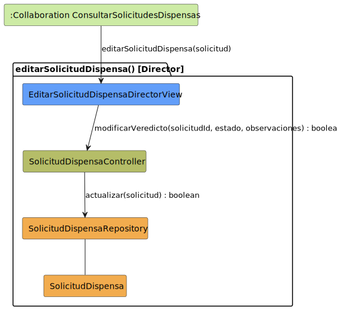

# CGU > editarSolicitudDispensa [Director] > Análisis

> | [🏠️](/README.md) | [Análisis](/RUP/01-analisis/README.md) | [Detalle](/RUP/00-requisitos/CasosDeUso/DetalladoCasosDeUso/DirectorDeGrado/) | **Análisis** | Diseño | Desarrollo |
> |-|-|-|-|-|-|

## información del artefacto

- **Proyecto**: Centro de Gestión Universitaria (CGU)
- **Fase RUP**: Inception
- **Disciplina**: Análisis
- **Caso de uso**: `editarSolicitudDispensa()` [actor: DirectorDeGrado]
- **Actor**: DirectorDeGrado
- **Versión**: 1.0
- **Fecha**: 2026-05-28

## propósito

> **Nota — scoping por grado.** Originalmente este CU implicaba que el Director podía emitir veredicto sobre **cualquier** dispensa. Una revisión posterior restauró la entidad `Grado` del SDR; ahora solo puede sobre las cuya asignatura pertenece a su grado — la `PoliticaDirector.puede_ver` deja de devolver `True` siempre y compara `solicitud.asignatura_matriculada.asignatura.grado_id == director.grado_id`. La estructura MVC del CU es idéntica; cambia el conjunto de solicitudes alcanzables. Detalle en [[gestionarCatalogoGrados]].

Análisis del caso de uso `editarSolicitudDispensa()` **invocado por el DirectorDeGrado** mediante diagrama de colaboración MVC. Es la operación mediante la cual el Director **emite veredicto** sobre una `SolicitudDispensa`: cambia su estado (Aprobar/Rechazar) y añade observaciones. El sistema registra fecha y responsable, y notifica al alumno.

Aunque comparte nombre con [[editarSolicitudDispensa]] del Alumno, las dos operaciones son **semánticamente distintas**: el Alumno modifica el contenido de su solicitud (motivo, adjuntos); el Director modifica el resultado/veredicto. Se modelan como **análisis separados** porque sus puntos de entrada, campos editables, side effects y vistas son diferentes — y porque el requisitado ya distingue dos detallados (`EditarSolicitudDispensa.puml` del Alumno vs `EditarSolicitud.puml` del Director).

## diagrama de colaboración

<div align=center>

||
|-|
|**Disciplina**: Análisis RUP<br>**Enfoque**: Diagramas de colaboración MVC|

</div>

## clases de análisis identificadas

### clases model (naranja #F2AC4E)

| Clase | Responsabilidad | Trazabilidad |
|-|-|-|
| **SolicitudDispensa** | Entidad de dominio; gana campos `estado`, `observaciones`, `fechaResolucion`, `responsable` (poblados por este CU) | Reutilizada de [[crearSolicitudDispensa]] |
| **SolicitudDispensaRepository** | Persiste la modificación del veredicto | Reutilizado de [[editarSolicitudDispensa]] del Alumno; mismo método `actualizar` |

### clases view (azul #629EF9)

| Clase | Responsabilidad | Derivación |
|-|-|-|
| **EditarSolicitudDispensaDirectorView** | Formulario de revisión: campos Estado (Aprobar/Rechazar), Observaciones | [Prototipo SALT `editarSolicitudDispensaDirector.png`](/RUP/00-requisitos/CasosDeUso/Prototipos/DirectorDeGrado/editarSolicitudDispensaDirector.png), [`guardarSolicitudDispensaDirector.png`](/RUP/00-requisitos/CasosDeUso/Prototipos/DirectorDeGrado/guardarSolicitudDispensaDirector.png), [`confirmacionGuardarSolicitudDispensaDirector.png`](/RUP/00-requisitos/CasosDeUso/Prototipos/DirectorDeGrado/confirmacionGuardarSolicitudDispensaDirector.png) |

Distinta de la `EditarSolicitudDispensaView` del Alumno porque los campos editables son distintos: el Alumno edita `motivo`/`adjuntos`; el Director edita `estado`/`observaciones`. Aunque sería tentador unificarlas con permisos por campo, en análisis las mantenemos separadas — la decisión de unificar/dividir vistas es de diseño UI.

### clases controller (verde #b5bd68)

| Clase | Responsabilidad | Casos de uso |
|-|-|-|
| **SolicitudDispensaController** | Orquestación del acceso a `SolicitudDispensa`; **estrena** `modificarVeredicto`, distinto de `modificarCampos` del Alumno | Compartido con todos los CUs de la entidad |

### colaboraciones (verde claro #CDEBA5)

| Colaboración | Propósito | Invocación |
|-|-|-|
| **:Collaboration ConsultarSolicitudesDispensas** | Único origen — el Director siempre llega desde el detalle abierto dentro del CU de consulta | Pasa la `solicitud` ya cargada |

## mensajes de colaboración

### flujo principal

| # | Origen | Destino | Mensaje | Intención |
|-|-|-|-|-|
| 1 | **:Collaboration ConsultarSolicitudesDispensas** | **EditarSolicitudDispensaDirectorView** | `editarSolicitudDispensa(solicitud)` | Abrir el formulario de revisión con la solicitud ya cargada |
| 2 | **EditarSolicitudDispensaDirectorView** | **SolicitudDispensaController** | `modificarVeredicto(solicitudId, estado, observaciones) : boolean` | Solicitar persistencia del veredicto |
| 3 | **SolicitudDispensaController** | **SolicitudDispensaRepository** | `actualizar(solicitud) : boolean` | Persistir cambios |

### flujo alternativo — cancelar sin guardar

El detallado contempla `cerrarSolicitudDispensa()` como salida sin persistir (transición roja). En el análisis equivale a no invocar el mensaje 2. No requiere clase adicional. Mismo patrón que [[editarSolicitudDispensa]] del Alumno.

## sin mensajes de carga — asimetría con el editar del Alumno

El editar del Alumno tiene 5 mensajes incluyendo `cargarSolicitudParaEdicion` + `obtenerPorId`. **Aquí solo hay 3** porque el único origen (`:Collaboration ConsultarSolicitudesDispensas`) **siempre llega con la entidad ya cargada**: el mensaje 5 del CU de consulta (`obtenerPorId(solicitudId)`) ya recuperó la `SolicitudDispensa` para abrir el detalle. Reutilizar esa instancia en lugar de re-cargarla es más fiel al detallado (`SOLICITUD_DISPENSA_ABIERTA_INICIAL` como punto de entrada — un estado donde la solicitud ya está abierta).

Esto se traduce en el análisis: **no hay mensajes condicionales en prosa** como en el editar del Alumno; el flujo es lineal.

## side effects responsabilidad del Controller (no del Repository)

El detallado del Director enumera tres acciones del sistema al guardar:

> Sistema **actualiza** el estado y datos, **registra** fecha y responsable, y **notifica** al alumno.

Decisiones de modelado en análisis:

| Side effect | Responsabilidad | Modelado |
|-|-|-|
| Actualizar estado y datos | `actualizar()` (mensaje 3) | Mensaje explícito |
| Registrar `fechaResolucion` | El **Controller** la añade antes de llamar al Repository | Implícito en el Controller (similar a cómo el Controller resuelve el `alumno` propietario en [[crearSolicitudDispensa]] desde `Sesion`) |
| Registrar `responsable` (Director que decide) | El **Controller** lo resuelve desde `Sesion.usuario` y lo añade | Implícito en el Controller |
| Notificar al alumno | **Side effect declarado**, no modelado como mensaje | Deuda explícita para 02-diseño |

**No se introduce una clase de notificación en el análisis** por dos razones: (1) el detallado no especifica destinatario técnico ni medio (email, in-app, push); (2) la decisión de "evento de dominio + suscriptor" vs "llamada directa a un servicio" vs "cola de mensajería" pertenece al diseño. En análisis basta con declarar la obligación.

## sin verificación de propiedad — consistencia con el resto del bloque Director

Mismo principio que [[consultarSolicitudesDispensas]]: el Director no tiene restricción de propiedad. Cualquier `SolicitudDispensa` es modificable por él. La verificación de propiedad vive en el `SolicitudDispensaController` y solo se activa cuando `Sesion.usuario` es subtipo `Alumno`.

Aquí se manifiesta de nuevo el **polimorfismo del Controller según subtipo de `Sesion.usuario`** introducido en [[consultarSolicitudesDispensas]]:

| Operación | Alumno | DirectorDeGrado |
|-|-|-|
| Campos editables | `motivo`, `adjuntos` | `estado`, `observaciones` |
| Método del Controller | `modificarCampos` | `modificarVeredicto` |
| Validación previa | "el alumno autenticado es el propietario" | (ninguna) |
| Side effects | (ninguno relevante) | Registrar fecha+responsable, notificar al alumno |

Que sean **dos métodos distintos del Controller** (`modificarCampos` vs `modificarVeredicto`) es una decisión consciente: hace explícita la asimetría semántica y evita una API genérica `actualizarConPermisos(solicitud, usuario, …)` que ocultaría la diferencia. Si en diseño se desea consolidar, se hará con justificación.

## enlaces de dependencia

- **EditarSolicitudDispensaDirectorView** conoce a **SolicitudDispensaController** (delegación)
- **SolicitudDispensaController** conoce a **SolicitudDispensaRepository** (escritura)
- **SolicitudDispensaController** conoce a **SolicitudDispensa** (manipulación entidad)
- **SolicitudDispensaController** conoce a **Sesion** (resolver `responsable` desde `Sesion.usuario`; no dibujada en el diagrama por ser conocida desde [[iniciarSesion]])
- **SolicitudDispensaRepository** conoce a **SolicitudDispensa** (gestión)

## comparación con `editarSolicitudDispensa()` del Alumno

| Característica | [[editarSolicitudDispensa]] (Alumno) | `editarSolicitudDispensa` (Director) |
|-|-|-|
| Mensajes | 5 | 3 |
| Orígenes | 3 (listado, consulta, post-crear) | 1 (consulta master-detail) |
| Carga previa al editar | Condicional (sí desde listado/consulta; no desde crear) | Nunca — siempre llega cargado |
| Método Controller | `modificarCampos(cambios)` | `modificarVeredicto(estado, observaciones)` |
| Campos editables | `motivo`, `adjuntos` | `estado`, `observaciones` |
| Verificación de propiedad | Sí (Alumno propietario) | No |
| Side effects | Ninguno declarado | `fechaResolucion`, `responsable`, notificación al alumno |
| Vista | `EditarSolicitudDispensaView` | `EditarSolicitudDispensaDirectorView` |

Las 8 diferencias justifican el análisis separado en lugar de añadir secciones "variante Director" al análisis del Alumno.

## cierre del flujo de dispensas — de extremo a extremo

Con este CU, el ciclo de vida completo de una `SolicitudDispensa` queda analizado entre los dos roles:

```
[Alumno]   crear → editar (motivos)
[Alumno]   consultar (ver mi propia)
[Director] consultar lista (ver todas)
[Director] editar (veredicto) → notificar al alumno
[Alumno]   consultar (ver mi propia, ahora con veredicto)
```

`SolicitudDispensa` es la primera entidad del proyecto que se ha modelado desde dos roles con responsabilidades complementarias. Esto valida la decisión de [[consultarSolicitudesDispensas]] de centralizar la regla de propiedad en el Controller (vs Repository), porque ahora se ve que **el mismo Repository es usado por dos roles con políticas opuestas**.

## trazabilidad con artefactos previos

### con especificación detallada

- **`SOLICITUD_DISPENSA_ABIERTA_INICIAL`** (estado inicial del detallado) → entrada desde **`:Collaboration ConsultarSolicitudesDispensas`**
- **Estado `EDITAR_SOLICITUD_DISPENSA`** con sub-estados `RevisarSolicitud → ModificarEstadoYDatos → GuardarCambios` → colapsado en **EditarSolicitudDispensaDirectorView** + **mensaje 2** (las transiciones internas son user interactions, no inter-object messages)
- **Nota del detallado "Estado (Aprobar/Rechazar), Observaciones o motivo, Otros campos editables"** → parámetros `estado, observaciones` del mensaje 2
- **Nota "Sistema actualiza el estado y datos, registra fecha y responsable, y notifica al alumno"** → mensaje 3 + side effects declarados en sección anterior
- **Transición `guardarSolicitudDispensa()`** del detallado → mensaje 3 `actualizar()` (igual que en el editar del Alumno, "guardar" no es CU separado)
- **Transición `cerrarSolicitudDispensa()` (cancelar)** → flujo alternativo
- **`DISPENSAS_ABIERTO_FINAL`** (estado final) → retorno a `:Collaboration ConsultarSolicitudesDispensas` (no representado como mensaje)

### con wireframe (prototipo SALT)

- **`editarSolicitudDispensaDirector.png`** → vista de edición de `EditarSolicitudDispensaDirectorView` (mensaje 1)
- **`guardarSolicitudDispensaDirector.png`** → momento de submit (mensaje 2)
- **`confirmacionGuardarSolicitudDispensaDirector.png`** → feedback post-`actualizar()` (mensaje 3 retorna `true`); también es la pantalla donde el Director ve confirmación antes de volver al listado

### con actores

- **`DirectorDeGrado --> EditarSolicitudDispensa`** → invocación del CU
- **`DirectorDeGrado --> GuardarSolicitudDispensa`** → transición interna del CU (no CU separado en el conteo; consistente con cómo se trató en todos los editar del proyecto)

### con modelo del dominio

- **Sin trazabilidad directa**: deuda compartida. Aquí se hace **más evidente la necesidad de promover `SolicitudDispensa` al modelo del dominio en 02-diseño** porque gana campos (`estado`, `observaciones`, `fechaResolucion`, `responsable`) que son atributos de negocio claros.

## principios de análisis aplicados

### patrón mvc

- **Controller compartido por entidad**, ya validado en todo el ciclo de vida
- **Vista específica por rol**: `EditarSolicitudDispensaDirectorView` ≠ `EditarSolicitudDispensaView` del Alumno
- **Método específico por veredicto**: `modificarVeredicto` ≠ `modificarCampos`

### diagramas de colaboración

- **CU mínimo** (3 mensajes) — más compacto que su homólogo del Alumno gracias a la pre-carga del origen
- **Sin destino**: el editar termina; el retorno al listado es transición de estado, no inclusión de CU
- **Side effects en prosa**: notificación y campos auto-poblados se documentan, no se modelan como mensajes

### análisis puro

- **Sin tecnología**: el mecanismo de notificación (email, in-app, evento de dominio) se decide en diseño
- **Sin política de estados**: ¿se puede pasar de "aprobada" a "rechazada" tras una primera resolución? ¿una solicitud "borrador" no puede ser revisada? Deuda de regla de negocio

## características del análisis

### responsabilidades identificadas

- **EditarSolicitudDispensaDirectorView**: presentar formulario de revisión, recoger veredicto
- **SolicitudDispensaController**: aplicar veredicto, **resolver `responsable` desde Sesion**, registrar `fechaResolucion`, disparar notificación al alumno (cómo, decisión de diseño)
- **SolicitudDispensaRepository**: persistir la actualización
- **SolicitudDispensa**: representar la entidad con su nuevo veredicto

### relaciones conceptuales

- **Delegación**: vista delega lógica al controlador
- **Polimorfismo de comportamiento del Controller**: por subtipo de `Sesion.usuario` (Alumno restringido vs Director libre)
- **Persistencia simple**: el guardado retorna `boolean` para señalizar éxito/fallo
- **Notificación como efecto secundario**: declarado, no modelado

## conexión con disciplinas rup

### desde requisitos

- **Detallado `EditarSolicitud.puml`**: estructura lineal Revisar → Modificar → Guardar → vista única + mensaje 2
- **Prototipos SALT**: tres pantallas (editar / guardar / confirmación) → `EditarSolicitudDispensaDirectorView` con secuencia de submit
- **Actores**: `DirectorDeGrado` extiende `Profesor`, asimetría con `Alumno`

### hacia diseño

- **Diseño del mecanismo de notificación al Alumno** (evento de dominio + suscriptor / llamada directa / cola de mensajería)
- **Resolución de la asimetría del Controller** ([[consultarSolicitudesDispensas]] ya planteó tres caminos; este CU añade un cuarto método-específico-por-rol, lo que sugiere que **separar métodos por rol** podría ser el camino más limpio)
- **Política de estados**: estados válidos de `SolicitudDispensa`, transiciones permitidas, idempotencia de la revisión
- **Concurrencia**: ¿dos pestañas del mismo Director revisando la misma solicitud? Política de bloqueo o de "última escritura gana"
- **Reconciliación de `SolicitudDispensa` con el modelo del dominio** (más urgente con los nuevos campos)
- **Renombrado del detallado del Director**: `EditarSolicitud.puml` → `EditarSolicitudDispensa.puml` por consistencia

**Código fuente:** [colaboracion.puml](colaboracion.puml)

## referencias

- [Detallado `EditarSolicitud.puml`](/RUP/00-requisitos/CasosDeUso/DetalladoCasosDeUso/DirectorDeGrado/EditarSolicitud.puml)
- [Prototipo SALT `editarSolicitudDispensaDirector.png`](/RUP/00-requisitos/CasosDeUso/Prototipos/DirectorDeGrado/editarSolicitudDispensaDirector.png)
- [Prototipo SALT `guardarSolicitudDispensaDirector.png`](/RUP/00-requisitos/CasosDeUso/Prototipos/DirectorDeGrado/guardarSolicitudDispensaDirector.png)
- [Prototipo SALT `confirmacionGuardarSolicitudDispensaDirector.png`](/RUP/00-requisitos/CasosDeUso/Prototipos/DirectorDeGrado/confirmacionGuardarSolicitudDispensaDirector.png)
- [Caso de uso del DirectorDeGrado](/RUP/00-requisitos/CasosDeUso/CasoDeUso/DirectorDeGrado/DirectorDeGrado.puml)
- [Análisis `consultarSolicitudesDispensas()` (Director)](/RUP/01-analisis/casos-uso/consultarSolicitudesDispensas/README.md)
- [Análisis `editarSolicitudDispensa()` (Alumno)](/RUP/01-analisis/casos-uso/editarSolicitudDispensa/README.md)
- [conversation-log.md](/conversation-log.md)
