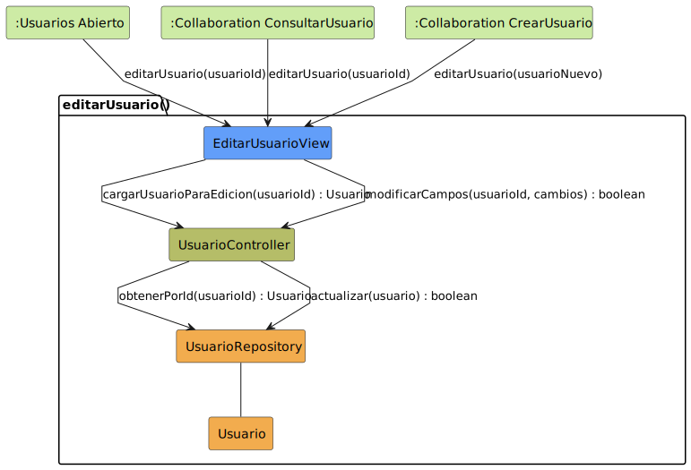

# CGU > editarUsuario > Análisis

> | [🏠️](/README.md) | [Análisis](/RUP/01-analisis/README.md) | [Detalle](/RUP/00-requisitos/CasosDeUso/DetalladoCasosDeUso/Administrador/) | **Análisis** | Diseño | Desarrollo |
> |-|-|-|-|-|-|

## información del artefacto

- **Proyecto**: Centro de Gestión Universitaria (CGU)
- **Fase RUP**: Inception
- **Disciplina**: Análisis
- **Caso de uso**: `editarUsuario()`
- **Actor**: Administrador
- **Versión**: 1.0
- **Fecha**: 2026-05-26

## propósito

Análisis del caso de uso `editarUsuario()` mediante diagrama de colaboración MVC. Es la sub-actividad que carga un `Usuario` existente y persiste cambios. Tiene **tres puntos de entrada** distintos: desde el listado, desde el detalle de consulta y como continuación tras [[crearUsuario]].

## diagrama de colaboración

<div align=center>

||
|-|
|**Disciplina**: Análisis RUP<br>**Enfoque**: Diagramas de colaboración MVC|

</div>

## clases de análisis identificadas

### clases model (naranja #F2AC4E)

| Clase | Responsabilidad | Trazabilidad |
|-|-|-|
| **Usuario** | Clase abstracta; la instancia editada conserva su subtipo concreto (el tipo se fijó en el alta) | Reutilizada de [[iniciarSesion]] y [[crearUsuario]] |
| **UsuarioRepository** | Recupera el usuario por id y persiste la modificación | Reutilizado; estrena `obtenerPorId(id)` y `actualizar(usuario)` |

### clases view (azul #629EF9)

| Clase | Responsabilidad | Derivación |
|-|-|-|
| **EditarUsuarioView** | Formulario de edición de un usuario existente; puede mostrar campos específicos del subtipo | [Prototipo SALT `editarUsuario.png`](/RUP/00-requisitos/CasosDeUso/Prototipos/Administrador/editarUsuario.png) |

### clases controller (verde #b5bd68)

| Clase | Responsabilidad | Casos de uso |
|-|-|-|
| **UsuarioController** | Orquestación del CRUD individual de `Usuario`: validación, alta, carga y modificación | Compartido entre `crearUsuario()`, `consultarUsuario()` y `editarUsuario()` (mismo controller que en [[crearUsuario]]) |

### colaboraciones (verde claro #CDEBA5)

| Colaboración | Propósito | Invocación |
|-|-|-|
| **:Usuarios Abierto** | Entrada desde el listado de usuarios | `editarUsuario(usuarioId)` |
| **:Collaboration ConsultarUsuario** | Entrada desde el detalle de consulta | `editarUsuario(usuarioId)` |
| **:Collaboration CrearUsuario** | Entrada como continuación del alta (via `<<include>>` desde el otro lado) | `editarUsuario(usuarioNuevo)` |

## mensajes de colaboración

### flujo principal

| # | Origen | Destino | Mensaje | Intención |
|-|-|-|-|-|
| 1 | **:Usuarios Abierto** / **:Collaboration ConsultarUsuario** / **:Collaboration CrearUsuario** | **EditarUsuarioView** | `editarUsuario(usuarioId \| usuarioNuevo)` | Abrir el formulario de edición |
| 2 | **EditarUsuarioView** | **UsuarioController** | `cargarUsuarioParaEdicion(usuarioId) : Usuario` | Recuperar el estado actual (solo si se entra por id) |
| 3 | **UsuarioController** | **UsuarioRepository** | `obtenerPorId(usuarioId) : Usuario` | Consulta al repositorio |
| 4 | **EditarUsuarioView** | **UsuarioController** | `modificarCampos(usuarioId, cambios) : boolean` | Solicitar persistencia de cambios |
| 5 | **UsuarioController** | **UsuarioRepository** | `actualizar(usuario) : boolean` | Persistir cambios |

### flujo alternativo — entrada desde `crearUsuario()`

Cuando la entrada es `:Collaboration CrearUsuario` con `usuarioNuevo`, los mensajes 2 y 3 **no se ejecutan**: el `Usuario` ya está cargado desde el alta. La `EditarUsuarioView` arranca directamente sobre la instancia recién creada. No se modela como ruta aparte: es el comportamiento por defecto de pasar la instancia en vez del id.

### flujo alternativo — cerrar sin guardar

El detallado contempla `cerrarUsuario()` como salida sin persistir. En el análisis equivale a no invocar el mensaje 4: la `EditarUsuarioView` se cierra y se vuelve al estado de origen (listado o detalle de consulta). No requiere clase adicional.

## enlaces de dependencia

- **EditarUsuarioView** conoce a **UsuarioController** (delegación)
- **UsuarioController** conoce a **UsuarioRepository** (lectura y escritura)
- **UsuarioController** conoce a **Usuario** (manipulación entidad)
- **UsuarioRepository** conoce a **Usuario** (gestión polimórfica)

## polimorfismo y herencia

`obtenerPorId(usuarioId) : Usuario` (mensaje 3) está tipado como `: Usuario` pero devuelve el **subtipo concreto** persistido en el alta. El tipo del usuario **no cambia en la edición** — es una invariante: una vez que un alta se hace como `Profesor`, sigue siendo `Profesor`.

La `EditarUsuarioView` puede aprovechar el subtipo para mostrar campos específicos (un `Profesor` tiene departamento; un `Alumno` tiene matrícula). Cómo se hace ese despacho en la vista (visitor, dispatch por instanceof, sub-vistas por subtipo) es una decisión de diseño, no de análisis.

```
Usuario (abstract)
├── Alumno
├── Profesor
│   └── DirectorDeGrado
└── SecretariaAcademica
        └── Administrador (hereda también de Alumno, Profesor y DirectorDeGrado)
```

## múltiples puntos de entrada

Esta es la característica diferenciadora del CU. A diferencia de [[crearUsuario]] (un único origen `:Usuarios Abierto`), `editarUsuario` se invoca desde tres contextos:

| Origen | Parámetro | Mensajes 2-3 necesarios |
|-|-|-|
| `:Usuarios Abierto` | `usuarioId` | Sí — hay que cargar |
| `:Collaboration ConsultarUsuario` | `usuarioId` | Sí — hay que cargar |
| `:Collaboration CrearUsuario` | `usuarioNuevo` (instancia) | No — ya viene cargado |

El patrón sigue a pySigHor (`editarProfesor`, `editarAula`): el CU de edición es **el punto de convergencia** del CRUD y se reutiliza desde múltiples flujos.

## trazabilidad con artefactos previos

### con especificación detallada

- **Transición de entrada unificada `USUARIOS_ABIERTO → USUARIO_ABIERTO : crearUsuario() / consultarUsuario()`** → **tres colaboraciones de origen** del análisis
- **Auto-actividad `editarUsuario()` en `ModificacionDatos`** → **mensajes 4-5** (`modificarCampos` + `actualizar`)
- **Transición `guardarUsuario()`** → **mensaje 5** `actualizar()` (la persistencia efectiva)
- **Transición `cerrarUsuario()`** → flujo alternativo (cierre sin invocar al Controller)

### con wireframe (prototipo SALT)

- **`editarUsuario.png`** → **EditarUsuarioView**
- El prototipo muestra el formulario; el subtipo concreto del usuario determina qué campos aparecen (responsabilidad de la vista en tiempo de render)

### con actores

- **Jerarquía `Usuario → {Alumno, Profesor, …}`** → invariante de subtipo durante la edición; los campos editables dependen del subtipo cargado

### con modelo del dominio

- **Sin trazabilidad directa**: `Usuario` sigue siendo concepto de análisis. Deuda compartida con [[iniciarSesion]] y [[crearUsuario]].

## principios de análisis aplicados

### patrón mvc

- **Controller compartido por entidad**: `UsuarioController` (consistente con [[crearUsuario]])
- **Vista específica por CU**: `EditarUsuarioView` ≠ `CrearUsuarioView` ≠ `ConsultarUsuarioView`
- **Modelo polimórfico**: subtipo invariante durante la edición

### diagramas de colaboración

- **Múltiples enlaces de entrada explícitos**: las tres colaboraciones origen aparecen como nodos separados, no fusionadas en una
- **Foco en estructura**: los flujos alternativos (carga sí/no, guardar sí/no) se documentan en prosa, no como mensajes adicionales
- **Mensajes de intención**: `cargarUsuarioParaEdicion`, `modificarCampos`, no detalles de SQL/HTTP

### análisis puro

- **Sin tecnología**: cómo se serializa el `cambios` (DTO, dict, form-data) se decide en diseño
- **Sin UI específica del subtipo**: la vista "conoce" el subtipo, no se modela cómo lo renderiza

## características del análisis

### responsabilidades identificadas

- **EditarUsuarioView**: cargar la instancia (o aceptarla del invocador), presentar campos editables coherentes con el subtipo, y coordinar guardado/cierre
- **UsuarioController**: mediar entre vista y repositorio para lectura y escritura
- **UsuarioRepository**: recuperar la instancia tipada y persistir la modificación
- **Usuario**: representar la entidad editada (subtipo invariante)

### relaciones conceptuales

- **Delegación**: vista delega lógica al controlador (idéntica a [[crearUsuario]])
- **Convergencia**: múltiples CUs externos (crear, consultar, listado) convergen en esta vista
- **Persistencia**: el guardado retorna `boolean` para señalizar éxito/fallo a la vista

## conexión con disciplinas rup

### desde requisitos

- **Detallado**: convergencia de transiciones `crearUsuario()/consultarUsuario()` → tres colaboraciones origen del análisis
- **Prototipo SALT**: wireframe → diseño conceptual de la vista
- **Actores**: jerarquía → invariante de subtipo en la edición

### hacia diseño

- Estrategia de render para campos específicos por subtipo (visitor, sub-vistas, formularios dinámicos)
- Política de concurrencia: ¿qué pasa si dos Admins editan el mismo usuario simultáneamente?
- Validación de cambios (¿puede cambiarse el login? ¿la contraseña requiere flujo aparte?)
- Bloqueo del tipo (`tipo` no debería ser editable post-alta — invariante a hacer cumplir)
- Reconciliación de `Usuario` con el modelo del dominio (compartida con [[iniciarSesion]] y [[crearUsuario]])

**Código fuente:** [colaboracion.puml](colaboracion.puml)

## referencias

- [Detallado `editarUsuario()`](/RUP/00-requisitos/CasosDeUso/DetalladoCasosDeUso/Administrador/editarUsuario.puml)
- [Prototipo SALT `editarUsuario.png`](/RUP/00-requisitos/CasosDeUso/Prototipos/Administrador/editarUsuario.png)
- [Caso de uso del Administrador](/RUP/00-requisitos/CasosDeUso/CasoDeUso/Administrador/Administrador.puml)
- [Análisis `crearUsuario()`](/RUP/01-analisis/casos-uso/crearUsuario/README.md)
- [conversation-log.md](/conversation-log.md)
