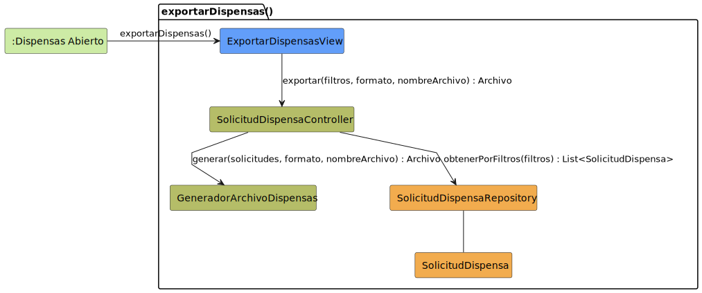

# CGU > exportarDispensas > Análisis

> | [🏠️](/README.md) | [Análisis](/RUP/01-analisis/README.md) | [Detalle](/RUP/00-requisitos/CasosDeUso/DetalladoCasosDeUso/Secretaria/) | **Análisis** | Diseño | Desarrollo |
> |-|-|-|-|-|-|

## información del artefacto

- **Proyecto**: Centro de Gestión Universitaria (CGU)
- **Fase RUP**: Inception
- **Disciplina**: Análisis
- **Caso de uso**: `exportarDispensas()`
- **Actor**: Secretaria
- **Versión**: 1.0
- **Fecha**: 2026-05-28

## propósito

Análisis del caso de uso `exportarDispensas()` mediante diagrama de colaboración MVC. La Secretaria genera un archivo descargable con las solicitudes de dispensa filtradas por criterios de búsqueda (curso, asignatura, nombre, identificador), en el formato elegido.

Es el **segundo CU de exportación** del proyecto (tras [[exportarHistorialAsistencias]] del Profesor) y **valida la hipótesis** anunciada en aquel análisis: el patrón "Controller orquesta + Servicio especializa" se generaliza a una segunda entidad sin abstracciones adicionales.

## diagrama de colaboración

||
|-|
|**Disciplina**: Análisis RUP **Enfoque**: Diagramas de colaboración MVC|

## el patrón "Controller delega en servicio especializado" — segundo caso

El análisis se construye sobre el patrón consolidado en [[exportarHistorialAsistencias]]: el Controller orquesta (recupera datos + delega generación), un servicio dedicado genera el archivo. Sin ExportadorController genérico — cada entidad gestiona su propia exportación con un generador análogo.

| Operación | Lectura | Transformación | Escritura |
|-|-|-|-|
| [[exportarHistorialAsistencias]] (Profesor) | `AsistenciaRepository.obtenerPorRango` | `GeneradorArchivoAsistencias` | Archivo |
| [[importarMatriculas]] (Secretaria) | Archivo | `ValidadorArchivoMatriculas` | `MatriculaRepository.guardarLote` |
| [[importarListasAlumnos]] (Secretaria) | Archivo | `ValidadorArchivoListasAlumnos` | `AlumnoRepository.guardarLote` |
| **`exportarDispensas` (Secretaria)** | **`SolicitudDispensaRepository.obtenerPorFiltros`** | **`GeneradorArchivoDispensas`** | **Archivo** |

Con **cuatro CUs de I/O masiva** ya analizados, la abstracción `ImportadorMasivo<T>` / `ExportadorMasivo<T>` (Template Method + servicio inyectable) anunciada en [[importarMatriculas]] gana solidez como hipótesis hacia 02-diseño.

## clases de análisis identificadas

### clases model (naranja #F2AC4E)

| Clase | Responsabilidad | Trazabilidad |
|-|-|-|
| **SolicitudDispensa** | Entidad de dominio (read-only para este CU) | Reutilizada del bloque Alumno [[crearSolicitudDispensa]] |
| **SolicitudDispensaRepository** | Recupera solicitudes según filtros multi-criterio | Reutilizado; estrena `obtenerPorFiltros(filtros) : List<SolicitudDispensa>` |

### clases view (azul #629EF9)

| Clase | Responsabilidad | Derivación |
|-|-|-|
| **ExportarDispensasView** | Panel/modal con campos de filtro (curso, asignatura, nombre, identificador), selector de formato y nombre del archivo; botón de descarga | Prototipo SALT [`exportarSolicitudesDispensa.png`](/RUP/00-requisitos/CasosDeUso/Prototipos/Secretaria/exportarSolicitudesDispensa.png) (a confirmar — ver discrepancia abajo) |

### clases controller / servicios (verde #b5bd68)

| Clase | Responsabilidad | Casos de uso |
|-|-|-|
| **SolicitudDispensaController** | Orquestación del export: recuperar dataset filtrado + delegar generación | Reutilizado del bloque Alumno y Director — quinta operación sobre `SolicitudDispensa` desde el Controller único |
| **GeneradorArchivoDispensas** | **Servicio de aplicación**: convierte `List<SolicitudDispensa>` a un `Archivo` según formato | **Nuevo**; tercer servicio del análisis (tras `GeneradorArchivoAsistencias` y los dos `ValidadorArchivo*`) |

### colaboraciones (verde claro #CDEBA5)

| Colaboración | Propósito | Invocación |
|-|-|-|
| **:Dispensas Abierto** | Estado de origen — la Secretaria en el listado de dispensas | Punto de entrada |

## mensajes de colaboración

### flujo principal

| # | Origen | Destino | Mensaje | Intención |
|-|-|-|-|-|
| 1 | **:Dispensas Abierto** | **ExportarDispensasView** | `exportarDispensas()` | Abrir el panel de exportación |
| 2 | **ExportarDispensasView** | **SolicitudDispensaController** | `exportar(filtros, formato, nombreArchivo) : Archivo` | Solicitar exportación |
| 3 | **SolicitudDispensaController** | **SolicitudDispensaRepository** | `obtenerPorFiltros(filtros) : List<SolicitudDispensa>` | Recuperar el dataset filtrado |
| 4 | **SolicitudDispensaController** | **GeneradorArchivoDispensas** | `generar(solicitudes, formato, nombreArchivo) : Archivo` | Convertir a formato elegido |

### flujo alternativo — filtros inválidos

El detallado modela explícitamente la validación de filtros con transición de error: `ValidarFiltros -[#red]-> SolicitudFiltros`. La validación es **previa al mensaje 2** (lado vista) y/o **dentro del Controller** antes del mensaje 3 (lado servidor) — defensa en profundidad. Si los filtros no validan, el dataset no se recupera y se devuelve un error a la vista.

### flujo alternativo — dataset vacío

Si `obtenerPorFiltros` retorna `[]`, el Controller puede:
- (a) Generar archivo vacío con cabecera (semántica "no hay dispensas que cumplan los filtros")
- (b) Devolver error a la vista sin invocar al generador

Análisis adopta (a) por consistencia con [[exportarHistorialAsistencias]] — el archivo es resultado válido del CU. Deuda blanda para confirmar con el cliente.

### flujo alternativo opcional — drill-down a una solicitud

El detallado modela una transición `EXPORTAR_DISPENSAS_COMP -[#green]---> SOLICITUD_DISPENSA_ABIERTA_FINAL : consultarSolicitudDispensa()` (línea 99). Es **navegación** desde el panel a una solicitud específica, no inclusión del CU de export. **No se modela como `<<include>>`** — misma decisión que en [[consultarSolicitudDispensa]] (Alumno) sobre transiciones de navegación. La invocación de `consultarSolicitudDispensa()` desde el contexto Secretaria pertenece al CU futuro `consultarSolicitudDispensa()` (Secretaria).

## discrepancias en el requisitado

| # | Tipo | Detalle | Decisión |
|-|-|-|-|
| 1 | Notas con actor incorrecto | El detallado dice "**Alumno solicita** exportar las dispensas" — el actor real es Secretaria | Documentado como deuda menor (misma raíz que en [[importarMatriculas]]) |
| 2 | Filename del prototipo | El prototipo se llama `exportarSolicitudesDispensa.png` (plural "Solicitudes", singular "Dispensa"); el CU del detallado es `exportarDispensas` (plural "Dispensas") | Análisis adopta `exportarDispensas()` (consistente con detallado y con el índice). Deuda menor |
| 3 | CU no listado en `DiagramaCompletoCasoDeUso.puml` | El actor `Secretaria` (`SecretariaAcademica` en ese diagrama) **no incluye** `exportarDispensas()` en su package "Dispensas". Solo lista crear/consultar/editar/guardar/cerrar | El CU existe en el detallado y prototipo, por lo que se modela y cuenta en el denominador 26. **Deuda urgente**: añadir el CU al `DiagramaCompletoCasoDeUso.puml` o registrar la decisión inversa |
| 4 | Formatos enumerados | Detallado: "PDF, CSV, etc."; prototipo: a confirmar | Análisis adopta `formato` como string/enum opaco. Misma deuda que [[exportarHistorialAsistencias]] |

## la **quinta operación** sobre `SolicitudDispensa` desde el Controller único

Tras crear (Alumno + Secretaria), editar (Alumno + Director), consultar (Alumno + Profesor + Director + Secretaria), este CU añade una **operación derivada** (no CRUD): exportación filtrada. El `SolicitudDispensaController` acumula:

| Método | Rol(es) | Política |
|-|-|-|
| `crearSolicitudDispensa(...)` | Alumno | Propietario implícito |
| `crearSolicitudDispensaEnNombreDe(...)` | Secretaria | Propietario explícito + auditoría |
| `modificarCampos(...)` | Alumno | Solo propias |
| `modificarVeredicto(...)` | Director | Sin restricción |
| `obtenerPorId(...)` | Alumno, Director | Variantes con/sin filtro de propiedad |
| `obtenerPorAsignaturas(...)` | Profesor | "Profesor competente" |
| `obtenerTodas(...)` | Director | Sin restricción |
| **`exportar(filtros, formato, nombreArchivo)`** | **Secretaria** | **Sin restricción** |

Es la entidad **más operada** del proyecto. **Deuda crítica para 02-diseño**: con 8 métodos en un único Controller, considerar (a) partir por rol, (b) Strategy `PoliticaAcceso`, o (c) mantener como Service de aplicación con métodos por intención. La decisión se ha pospuesto consistentemente; ahora con la imagen completa puede tomarse.

## `obtenerPorFiltros` vs `obtenerTodas` — métodos del Repository

[[consultarSolicitudesDispensas]] (Director) introdujo `obtenerTodas() : List<SolicitudDispensa>`. Este CU introduce `obtenerPorFiltros(filtros) : List<SolicitudDispensa>`. ¿Son métodos distintos o el mismo con filtros opcionales?

Análisis adopta **dos métodos distintos** en el Repository por dos razones:
- **Semánticas distintas**: "todas" implica sin paginación ni filtrado; "por filtros" implica criterio explícito (curso, asignatura, nombre, identificador).
- **Honestidad con el detallado**: el detallado del Director no menciona filtros; el de la Secretaria sí los modela explícitamente como sub-estado `SolicitudFiltros`.

**Deuda blanda**: en 02-diseño podría unificarse como `obtener(filtros: FiltrosDispensa?)` con `filtros = null` ≡ "todas". El refactor "Introduce Parameter Object" sobre `filtros` es candidato natural (curso + asignatura + nombre + identificador → `FiltrosDispensa`), análogo al `DatosSesionClase` introducido en [[crearSesionClase]].

## tipos opacos — `Archivo` y `filtros`

Dos tipos opacos en este CU, consistentes con el manejo previo:

| Tipo | Naturaleza | Decisión |
|-|-|-|
| `Archivo` | Resultado del CU | Stream/blob/URL — mismo manejo que [[exportarHistorialAsistencias]] |
| `filtros` | Criterios de búsqueda multi-campo | Tipo opaco a nivel análisis; candidato a `FiltrosDispensa` value object en diseño |

## enlaces de dependencia

- **ExportarDispensasView** conoce a **SolicitudDispensaController** (delegación)
- **SolicitudDispensaController** conoce a **SolicitudDispensaRepository** (lectura)
- **SolicitudDispensaController** conoce a **GeneradorArchivoDispensas** (servicio)
- **SolicitudDispensaRepository** conoce a **SolicitudDispensa** (gestión)

## trazabilidad con artefactos previos

### con especificación detallada

- **`DISPENSAS_ABIERTO_INICIAL`** → colaboración `:Dispensas Abierto` (origen)
- **Transición `exportarDispensas()`** → mensaje 1
- **Estado `EXPORTAR_DISPENSAS_COMP` con sub-estados:**
  - `SolicitudFiltros` (Selección de Filtros) → vista (mensaje 1)
  - `ValidarFiltros` (Validación de Filtros) → validación previa al mensaje 2/3
  - `SolicitudFormato` (Selección de Formato) → input adicional de la vista
  - `Descarga` (Descarga de Archivo) → mensaje 4 + retorno a la vista
- **Nota "criterios de búsqueda: curso, asignatura, nombre e identificador"** → contenido conceptual de `filtros`
- **Nota "formato de salida (PDF, CSV, etc.) y el nombre del archivo"** → parámetros `formato` y `nombreArchivo`
- **Transición de cierre → `DISPENSAS_ABIERTO_FINAL`** → vuelta implícita al estado de partida
- **Transición opcional `consultarSolicitudDispensa()`** → navegación documentada, no `<<include>>`

### con wireframe (prototipo SALT)

- **[`exportarSolicitudesDispensa.png`](/RUP/00-requisitos/CasosDeUso/Prototipos/Secretaria/exportarSolicitudesDispensa.png)** → panel con filtros + selector de formato + descarga → `ExportarDispensasView`

### con actores

- **NO aparece en `DiagramaCompletoCasoDeUso.puml`** — discrepancia 3 arriba

### con modelo del dominio

- **Sin trazabilidad directa**: `SolicitudDispensa` no está en el modelo del SDR (deuda heredada y máxima ya con cinco operaciones documentadas)

## comparación con [[exportarHistorialAsistencias]]

| Característica | exportarHistorialAsistencias (Profesor) | exportarDispensas (Secretaria) |
|-|-|-|
| Mensajes | 4 | 4 |
| Filtros | Rango de fechas + asignatura | Multi-criterio (curso, asignatura, nombre, identificador) |
| Política del Controller | "Profesor competente" | Sin restricción |
| Servicio generador | `GeneradorArchivoAsistencias` | `GeneradorArchivoDispensas` |
| Formatos del detallado | Excel, PDF | PDF, CSV |
| Formatos del prototipo | CSV | a confirmar |
| Navegación post-export | Vuelve al listado | Vuelve al listado **o** abre detalle de solicitud específica |

**Estructura idéntica, variaciones en filtros y política**. Confirma que el patrón es estable y la abstracción `ExportadorMasivo<T>` es viable.

## principios de análisis aplicados

### patrón mvc

- **Controller por entidad** acumulando responsabilidades (8 métodos sobre `SolicitudDispensa`)
- **Servicio de aplicación**: `GeneradorArchivoDispensas` separado del Controller (SRP)
- **Vista específica del CU**: panel con filtros + formato

### diagramas de colaboración

- **4 mensajes**: idéntico a [[exportarHistorialAsistencias]] — patrón estable
- **Sin destino**: el archivo es efímero; la sesión vuelve al estado de partida (drill-down opcional documentado en prosa)
- **`Archivo` y `filtros` como tipos opacos**

### análisis puro

- **Sin librerías de generación**: PDF/CSV son labels — diseño decide implementación
- **Sin política de auditoría del export** (¿se registra quién exportó qué y cuándo? — más sensible que el export de asistencias porque hay datos personales de Alumnos)
- **Sin política de paginación** del dataset filtrado — relevante si las dispensas crecen mucho

## características del análisis

### responsabilidades identificadas

- **ExportarDispensasView**: recoger filtros, formato, nombre del archivo; presentar archivo descargable
- **SolicitudDispensaController**: orquestar (recuperar + delegar), validar filtros (defensa en profundidad)
- **SolicitudDispensaRepository**: consulta multi-criterio
- **GeneradorArchivoDispensas**: generar el archivo según formato
- **SolicitudDispensa**: dato de entrada para la generación

### relaciones conceptuales

- **Delegación a servicio**: el Controller no genera, **delega**
- **Composición de capas**: View (UX) → Controller (orquestación) → Repository (lectura) → Servicio (transformación)

## conexión con disciplinas rup

### desde requisitos

- **Detallado**: `EXPORTAR_DISPENSAS_COMP` con sub-estados → estructura del CU
- **Prototipo SALT**: panel con filtros + selector de formato → `ExportarDispensasView`
- **Actor**: ausente en `DiagramaCompletoCasoDeUso.puml` — discrepancia documentada

### hacia diseño

- **Añadir el CU al `DiagramaCompletoCasoDeUso.puml`** (deuda urgente)
- **Confirmar formatos soportados** con el cliente (PDF/CSV del detallado; prototipo por revisar)
- **Materializar `GeneradorArchivoDispensas`**: Strategy / jerarquía polimórfica / factory — mismo dilema que en [[exportarHistorialAsistencias]] pero ahora con dos generadores en el sistema. **Plantear `Generador<T>` abstracto compartido**
- **Refactor "Introduce Parameter Object" sobre `filtros`** → `FiltrosDispensa` (curso, asignatura, nombre, identificador)
- **Unificar `obtenerTodas` y `obtenerPorFiltros`** en el Repository (¿`obtener(filtros: FiltrosDispensa?)`?)
- **Auditoría del export**: si los datos exportados incluyen información sensible de Alumnos, registrar quién/cuándo
- **Política de paginación / tamaño máximo** del export
- **Política sobre dataset vacío** (archivo vacío vs error)
- **Materialización del polimorfismo del `SolicitudDispensaController`** — decisión central ya con 8 métodos
- **Promoción de `SolicitudDispensa` al modelo del dominio** (deuda máxima)

**Código fuente:** [colaboracion.puml](colaboracion.puml)

## referencias

- [Detallado `exportarDispensas()`](/RUP/00-requisitos/CasosDeUso/DetalladoCasosDeUso/Secretaria/exportarDispensas.puml)
- [Prototipo SALT `exportarSolicitudesDispensa.png`](/RUP/00-requisitos/CasosDeUso/Prototipos/Secretaria/exportarSolicitudesDispensa.png)
- [Caso de uso de Secretaria](/RUP/00-requisitos/CasosDeUso/CasoDeUso/Secretaria/DiagramaCompletoCasoDeUso.puml)
- [Análisis `exportarHistorialAsistencias()` (Profesor) — patrón paralelo](/RUP/01-analisis/casos-uso/exportarHistorialAsistencias/README.md)
- [Análisis `importarMatriculas()` (Secretaria) — operación inversa](/RUP/01-analisis/casos-uso/importarMatriculas/README.md)
- [Análisis `crearSolicitudDispensa()` (Secretaria) — entrada al bloque dispensas Secretaria](/RUP/01-analisis/casos-uso/crearSolicitudDispensaSecretaria/README.md)
- [conversation-log.md](/conversation-log.md)
