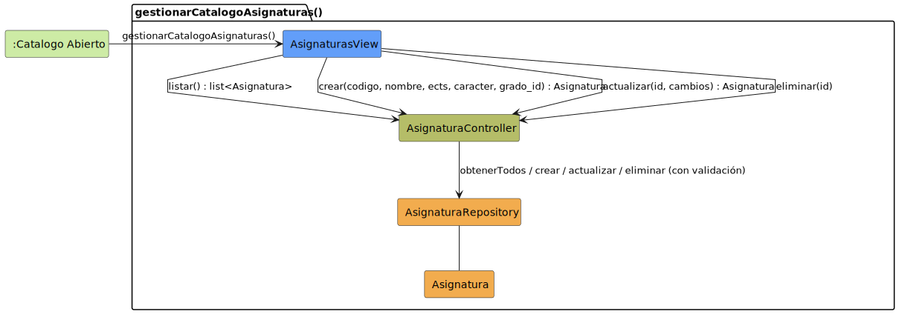

# CGU > gestionarCatalogoAsignaturas > Análisis

> | [🏠️](/README.md) | [Análisis](/RUP/01-analisis/README.md) | Detalle | **Análisis** | Diseño | Desarrollo |
> |-|-|-|-|-|-|

## información del artefacto

- **Proyecto**: Centro de Gestión Universitaria (CGU)
- **Fase RUP**: Construction
- **Disciplina**: Análisis
- **Caso de uso**: `gestionarCatalogoAsignaturas()`
- **Actor**: Secretaria
- **Versión**: 1.0
- **Fecha**: 2026-06-11

## propósito

Análisis del caso de uso `gestionarCatalogoAsignaturas()` mediante diagrama de colaboración MVC. La Secretaria opera el CRUD básico de la entidad `Asignatura`: alta, listado, ver, editar, baja. Hoy las asignaturas existen solo si el `seed.py` las crea — limitación seria del sistema que este CU resuelve, llevando la entidad a estar gestionada en runtime.

La asignación de qué profesor imparte qué asignatura **no forma parte de este CU**: vive en [[asignarAsignaturasAProfesor]] porque opera sobre una abstracción distinta (la relación N:M `profesor_asignaturas`) y se invoca desde la ficha del profesor, no desde la asignatura.

## diagrama de colaboración

||
|-|
|**Disciplina**: Análisis RUP **Enfoque**: Diagramas de colaboración MVC|

## clases de análisis identificadas

### clases model (naranja #F2AC4E)

| Clase | Responsabilidad | Trazabilidad |
|-|-|-|
| **Asignatura** | Entidad de dominio: código único, nombre, ECTS, carácter (FB/OB/OP), grado al que pertenece (FK a [[gestionarCatalogoGrados]]). Identidad estable, referenciada desde `AsignaturaMatriculada`, `SesionDeClase`, `SolicitudDispensa` y la relación N:M con `Profesor`. | Modelada en el SDR ([`ModeloCompleto.puml`](/RUP/00-requisitos/ModeloDelDominio/DiagramasDeClase/ModeloCompleto.puml)) |
| **AsignaturaRepository** | Persiste el catálogo de asignaturas. Garantiza unicidad de `codigo`, valida ausencia de referencias antes de borrar | Pre-existente — hasta ahora solo se usaba en lectura desde otros CUs; este CU estrena las operaciones de escritura |

### clases view (azul #629EF9)

| Clase | Responsabilidad | Derivación |
|-|-|-|
| **AsignaturasView** | Pantalla del catálogo: listado, formulario de alta/edición y ficha de detalle. Se especializa en 02-diseño en sub-vistas concretas | Sin prototipo SALT; mismo patrón que [[gestionarCatalogoGrados]] / `UsuariosPage` |

### clases controller (verde #b5bd68)

| Clase | Responsabilidad | Casos de uso |
|-|-|-|
| **AsignaturaController** | Orquestación del CRUD individual de `Asignatura`: listado, validación, alta, consulta, edición, borrado | **Nuevo** — este CU lo introduce. Patrón "Controller por entidad" (igual que `UsuarioController`, `GradoController`) |

### colaboraciones (verde claro #CDEBA5)

| Colaboración | Propósito | Invocación |
|-|-|-|
| **:Catalogo Abierto** | Estado de origen — la Secretaria navega al apartado "Asignaturas" del catálogo desde el menú principal | Punto de entrada del caso de uso |

## mensajes de colaboración

### flujo principal

| # | Origen | Destino | Mensaje | Intención |
|-|-|-|-|-|
| 1 | **:Catalogo Abierto** | **AsignaturasView** | `gestionarCatalogoAsignaturas()` | Abrir la pantalla del catálogo |
| 2 | **AsignaturasView** | **AsignaturaController** | `listar() : list<Asignatura>` | Solicitar el catálogo actual |
| 3 | **AsignaturasView** | **AsignaturaController** | `crear(codigo, nombre, ects, caracter, grado_ids) : Asignatura` | Alta con validación de unicidad de `codigo` y existencia de **cada** `grado_id` |
| 4 | **AsignaturasView** | **AsignaturaController** | `actualizar(id, cambios) : Asignatura` | Edición parcial (`codigo` no editable post-creación) |
| 5 | **AsignaturasView** | **AsignaturaController** | `eliminar(id)` | Baja con validación de no-referencias |
| 6 | **AsignaturaController** | **AsignaturaRepository** | `obtenerTodos / crear / actualizar / eliminar` | Persistencia. El Controller valida unicidad antes de crear, existencia del `grado_id` y `tieneReferencias` antes de eliminar. |

### flujos alternativos

- **Código en uso al alta**: el Controller rechaza el `crear` y la `AsignaturasView` muestra el error. Comportamiento por defecto del retorno booleano de la validación de unicidad.
- **Algún `grado_id` inexistente al alta**: si cualquier id de la lista `grado_ids` no existe, el Controller aborta al primero detectado y la vista muestra el motivo (qué grado falta).
- **Borrado con referencias**: si `tieneReferencias(id)` devuelve `true` (hay matrículas, sesiones de clase, dispensas o profesores que la imparten), el Controller aborta antes del `eliminar` y la vista muestra el motivo. **No** se hace borrado lógico — coherente con [[gestionarCatalogoGrados]].
- **Cancelar formulario**: no se llega a `crear`/`actualizar`. Sin clase adicional.

## enlaces de dependencia

- **AsignaturasView** conoce a **AsignaturaController** (delegación)
- **AsignaturaController** conoce a **AsignaturaRepository** (validación y persistencia)
- **AsignaturaController** y **AsignaturaRepository** conocen a **Asignatura** (manipulación entidad)
- **AsignaturaController** conoce a **Sesion** (auditoría `responsable`; no dibujada en el diagrama — patrón "auto-poblado por Controller")

## decisiones de análisis

### un único CU para todo el CRUD

Mismo argumento que [[gestionarCatalogoGrados]]: el catálogo se modela como **un único CU** con cuatro operaciones internas. El SDR no tiene detallado por verbo para Asignatura, la gestión es administrativa y poco frecuente, y pySigHor usa el mismo enfoque para catálogos.

### asignación profesor↔asignatura fuera de este CU

Aunque la relación N:M `profesor_asignaturas` involucra a `Asignatura`, la operación de añadir/quitar parejas vive en su propio CU [[asignarAsignaturasAProfesor]] porque:

- La operación no muta la entidad `Asignatura` (sus atributos no cambian) sino una relación entre `Profesor` y `Asignatura`.
- El punto de entrada natural en la UI es la **ficha del profesor** ("¿qué imparte X?"), no el catálogo ("¿qué asignaturas existen?").
- Mezclarlas obligaría a `gestionarCatalogoAsignaturas` a saber de `Profesor`, contaminando una preocupación con la otra.

### auditoría con `responsable_id`

Cada `Asignatura` lleva `responsable_id` apuntando a la Secretaria que la dio de alta. Coherente con la decisión heredada en [[importarMatriculas]] y [[importarListasAlumnos]] (que ya persisten `responsable`). Si las entidades del bloque académico llevan auditoría, **Asignatura también debe llevarla** — el principio es "auditoría coherente por entidad". El `responsable_id` no se introduce como parámetro del mensaje 3: lo resuelve el Controller desde `Sesion.usuario`, idéntico al patrón de imports masivos. Es información administrativa, no editable post-creación.

### cardinalidad `Asignatura ↔ Grado` — N:M

Una `Asignatura` puede pertenecer a **uno o varios `Grado`** simultáneamente. El caso canónico que justifica la cardinalidad N:M es "Inglés" impartido a la vez a ADE + Ing. Informática + Ing. Org. Industrial — el mismo curso, mismas sesiones, mismas dispensas: una sola entidad `Asignatura` que apunta a los grados implicados. El caso común sigue siendo una sola pareja (`grados=[unico]`); soportar el caso multi-grado evita duplicar la asignatura por grado (con el dolor consiguiente: tres entradas en `gestionarCatalogoAsignaturas`, tres asignaciones en [[asignarAsignaturasAProfesor]], tres listados en `crearSesionClase`).

El alta exige al menos un `grado_id` válido; el Controller valida la existencia de **cada** id de la lista antes de delegar al repositorio. La `facultad` no se captura en `Asignatura` — se infiere del o de los grados implicados.

Es el mismo movimiento que hizo [[crearSesionClase]] con la cardinalidad de `grupo` (singular → plural) cuando se detectó la realidad multi-grupo: la decisión inicial pareció minimal, la realidad lo desmintió, y la migración fue barata (una tabla extra para el caso multi-X, sin penalizar el caso simple).

### catálogo global (no scoped por grado)

Mismo razonamiento que [[gestionarCatalogoGrados]] y por simetría: el catálogo es meta-data, lo opera Secretaría como departamento colectivo. Cualquier Secretaria puede dar de alta una asignatura de cualquier grado. **No** se restringe a "asignaturas de mi grado" porque la Secretaría es colectiva (corrección del SDR aplicada en M7).

## trazabilidad con artefactos previos

### con el modelo del dominio

- **Clase `Asignatura` del SDR** → entidad gestionada por este CU.
- **Relación `Asignatura → Grado : Pertenece a`** → tabla N:M `asignatura_grados`. Cada id de la lista `grado_ids` se valida en el alta.
- **Relación `Asignatura ↔ Profesor : Imparte` (N:M)** → no la materializa este CU, sino [[asignarAsignaturasAProfesor]].

### sin trazabilidad con detallados ni prototipos

- CU sin detallado ni prototipo en el SDR. La especificación canónica del comportamiento es este README, igual que [[gestionarCatalogoGrados]].

## conexión con disciplinas rup

### desde requisitos

- **Modelo del dominio (`ModeloCompleto.puml`)**: clase `Asignatura` y su relación con `Grado` — promovida a entidad gestionable en runtime.

### hacia diseño

- Tabla `asignaturas` SQL con `codigo` único + nueva tabla N:M `asignatura_grados(asignatura_id, grado_id)` para materializar la cardinalidad multi-grado.
- Cascade vs restrict en las FKs entrantes (`asignaturas_matriculadas`, `sesiones_clase`, `solicitudes_dispensa`, `profesor_asignaturas`). Recomendación: **restrict** + validación explícita en service (`tieneReferencias`), idéntico a [[gestionarCatalogoGrados]]. Para la N:M `asignatura_grados`, en cambio, el borrado de la asignatura sí limpia (cascada implícita: la fila de la N:M ya no tiene sentido si la asignatura no existe).
- Endpoints REST: ya existe `GET /asignaturas`; este CU añade `POST`, `GET /{id}`, `PATCH /{id}`, `DELETE /{id}`. Body con `grado_ids: list[int]` (longitud mínima 1).
- Permission: `require_rol(["secretaria"])` para los verbos de escritura. La lectura es accesible por más roles (los profesores consultan asignaturas).
- Cuerpo del 409 al borrar debe indicar qué tipo de referencia bloquea (mismo patrón que `GradoConReferencias`).
- Validar `caracter` contra el dominio cerrado del SDR (FB/OB/OP — confirmar valores) y `ects > 0`.
- Implicación transversal: el scoping de [[consultarSolicitudesDispensas]] / [[editarSolicitudDispensaDirector]] (M7) usa hoy "el grado de la asignatura". Con N:M pasa a "alguno de los grados de la asignatura" — si "Inglés" se imparte a INF + ADE, tanto el Director de INF como el de ADE ven las dispensas. El refactor del query en `PoliticaDirector` es trivial (`asignatura.grado_id == director.grado_id` → `director.grado_id IN asignatura.grados`).

**Código fuente:** [colaboracion.puml](colaboracion.puml)

## referencias

- [Modelo del dominio (SDR)](/RUP/00-requisitos/ModeloDelDominio/DiagramasDeClase/ModeloCompleto.puml)
- [Análisis `gestionarCatalogoGrados()`](/RUP/01-analisis/casos-uso/gestionarCatalogoGrados/README.md) — patrón espejado
- [Análisis `asignarAsignaturasAProfesor()`](/RUP/01-analisis/casos-uso/asignarAsignaturasAProfesor/README.md) — gestión de la relación N:M, complementaria a este CU
- [Análisis `importarMatriculas()`](/RUP/01-analisis/casos-uso/importarMatriculas/README.md) — precedente de `responsable_id` por auditoría
- [conversation-log.md](/conversation-log.md)
