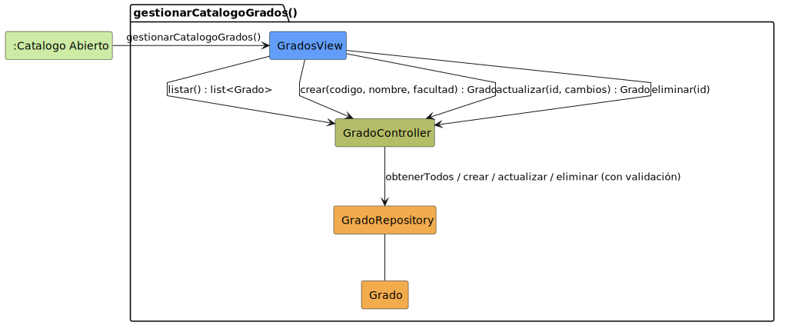

# CGU > gestionarCatalogoGrados > Análisis

> | [🏠️](/README.md) | [Análisis](/RUP/01-analisis/README.md) | Detalle | **Análisis** | Diseño | Desarrollo |
> |-|-|-|-|-|-|

## información del artefacto

- **Proyecto**: Centro de Gestión Universitaria (CGU)
- **Fase RUP**: Construction
- **Disciplina**: Análisis
- **Caso de uso**: `gestionarCatalogoGrados()`
- **Actor**: Secretaria
- **Versión**: 1.0
- **Fecha**: 2026-06-10

## propósito

Análisis del caso de uso `gestionarCatalogoGrados()` mediante diagrama de colaboración MVC. La Secretaria opera un CRUD básico sobre la entidad `Grado`: alta, listado, ver, editar, baja. El catálogo es **global** (no scoped por grado) — cualquier Secretaria puede mantenerlo, a diferencia de las operaciones académicas (dispensas, matrículas, alumnos) que sí están scoped por su grado. Esta excepción se justifica porque (a) los catálogos son meta-datos, no operación académica, y (b) sin él una Secretaria nueva no podría dar de alta su propio grado.

`Grado` está modelado en el SDR ([`ModeloCompleto.puml`](/RUP/00-requisitos/ModeloDelDominio/DiagramasDeClase/ModeloCompleto.puml)) con relaciones `Matricula → Grado`, `Asignatura → Grado`, `Grado → DirectorDeGrado` y `Grado → SecretariaAcademica`. Este CU es el encargado de mantener la tabla.

## diagrama de colaboración

||
|-|
|**Disciplina**: Análisis RUP **Enfoque**: Diagramas de colaboración MVC|

## clases de análisis identificadas

### clases model (naranja #F2AC4E)

| Clase | Responsabilidad | Trazabilidad |
|-|-|-|
| **Grado** | Entidad de dominio: representa un grado universitario (código, nombre, facultad). Identidad estable, referenciada desde `Matricula`, `Asignatura`, `DirectorDeGrado` y `SecretariaAcademica` | Modelado en el SDR ([`ModeloCompleto.puml`](/RUP/00-requisitos/ModeloDelDominio/DiagramasDeClase/ModeloCompleto.puml)) |
| **GradoRepository** | Persiste el catálogo de grados. Garantiza unicidad de `codigo`, valida ausencia de referencias antes de borrar | **Nueva** |

### clases view (azul #629EF9)

| Clase | Responsabilidad | Derivación |
|-|-|-|
| **GradosView** | Pantalla del catálogo: listado, formulario de alta/edición y ficha de detalle. Se especializa en 02-diseño en sub-vistas concretas (lista, form, ficha) | Sin prototipo SALT; patrón heredado de `UsuariosPage` |

### clases controller (verde #b5bd68)

| Clase | Responsabilidad | Casos de uso |
|-|-|-|
| **GradoController** | Orquestación del CRUD individual de `Grado`: listado, validación, alta, consulta, edición, borrado | Único — este CU lo introduce. Patrón "Controller por entidad" (igual que `UsuarioController`) |

### colaboraciones (verde claro #CDEBA5)

| Colaboración | Propósito | Invocación |
|-|-|-|
| **:Catalogo Abierto** | Estado de origen — la Secretaria navega al apartado "Grados" del catálogo desde el menú principal | Punto de entrada del caso de uso |

## mensajes de colaboración

### flujo principal

| # | Origen | Destino | Mensaje | Intención |
|-|-|-|-|-|
| 1 | **:Catalogo Abierto** | **GradosView** | `gestionarCatalogoGrados()` | Abrir la pantalla del catálogo |
| 2 | **GradosView** | **GradoController** | `listar() : list<Grado>` | Solicitar el catálogo actual |
| 3 | **GradosView** | **GradoController** | `crear(codigo, nombre, facultad) : Grado` | Alta con validación de unicidad de `codigo` |
| 4 | **GradosView** | **GradoController** | `actualizar(id, cambios) : Grado` | Edición parcial (codigo no editable post-creación) |
| 5 | **GradosView** | **GradoController** | `eliminar(id)` | Baja con validación de no-referencias |
| 6 | **GradoController** | **GradoRepository** | `obtenerTodos / crear / actualizar / eliminar` | Persistencia. El Controller valida unicidad antes de crear y `tieneReferencias` antes de eliminar. |

### flujos alternativos

- **Código en uso al alta**: el Controller rechaza el `crear` y la `GradosView` muestra el error. Comportamiento por defecto del retorno booleano de la validación de unicidad; no se modela como mensaje aparte.
- **Borrado con referencias**: si `tieneReferencias(id)` devuelve `true` (hay matrículas, asignaturas, directores o secretarias enlazadas), el Controller aborta antes del `eliminar` y la vista muestra el motivo. **No** se hace borrado lógico — coherente con cómo `UsuarioRepository.eliminar` validaría dependencias.
- **Cancelar formulario**: no se llega a `crear`/`actualizar`. Sin clase adicional.

## enlaces de dependencia

- **GradosView** conoce a **GradoController** (delegación)
- **GradoController** conoce a **GradoRepository** (validación y persistencia)
- **GradoController** y **GradoRepository** conocen a **Grado** (manipulación entidad)

## decisiones de análisis

### un único CU para todo el CRUD

A diferencia del patrón "1 verbo = 1 CU" del bloque Usuario (`crearUsuario`, `consultarUsuario`, `editarUsuario` separados), aquí el catálogo se modela como **un único CU** con cuatro operaciones internas. Justificación:

- El SDR no tiene detallado por verbo para Grado (sin referencia previa).
- La gestión de catálogo es **administrativa y poco frecuente** — no merece la granularidad de un CRUD operativo.
- pySigHor usa el mismo enfoque para los catálogos administrativos.

### grado como entidad de primer orden

Argumentos para promover de string libre a entidad, todos cumplidos:

| Criterio | ¿Aplica? |
|-|-|
| **Identidad estable y reusable** entre filas | ✅ "INF" como Grado es el mismo desde Matricula, Asignatura, Director y Secretaria |
| **Atributos propios** más allá del nombre | ✅ Tiene facultad; potencialmente coordinador, calendario, normativa |
| **Existe un CU de gestión** | ✅ Este — el propio `gestionarCatalogoGrados` lo justifica |
| **El SDR lo modelaba como entidad** | ✅ Explícito en `ModeloCompleto.puml` |

### catálogo global (no scoped por grado)

El sistema introduce scoping por grado para todas las operaciones académicas (`PoliticaDirector` y `PoliticaSecretaria` filtran dispensas/alumnos/matrículas por `grado_id`). **El catálogo de grados queda exento**: cualquier Secretaria puede dar de alta cualquier grado. Razones:

- Es meta-data, no operación académica.
- Sin esta excepción, una Secretaria nueva no podría dar de alta su propio grado.
- El catálogo de asignaturas seguirá el mismo principio por consistencia.

## trazabilidad con artefactos previos

### con el modelo del dominio

- **Clase `Grado` del SDR** → entidad `Grado` instanciada por este CU.
- **Relaciones `Matricula → Grado`, `Asignatura → Grado`, `Grado → DirectorDeGrado`, `Grado → SecretariaAcademica` del SDR** → FKs en los modelos correspondientes (responsabilidad de 02-diseño y 03-desarrollo).

### sin trazabilidad con detallados ni prototipos

- CU sin detallado ni prototipo en el SDR. La especificación canónica del comportamiento es este README.

## conexión con disciplinas rup

### desde requisitos

- **Modelo del dominio (`ModeloCompleto.puml`)**: clase `Grado` y sus relaciones — restauradas por este CU.

### hacia diseño

- Tabla `grados` SQL con `codigo` único.
- Cascade vs restrict en las FKs (`matriculas`, `asignaturas`, `Director.grado_id`, `Secretaria.grado_id`). Recomendación: **restrict** + validación explícita en service (`tieneReferencias`).
- Endpoints REST: `GET /grados`, `POST /grados`, `GET /grados/{id}`, `PATCH /grados/{id}`, `DELETE /grados/{id}`.
- Permission: `require_rol(["secretaria"])` para todos. El catálogo es global pero accesible solo a rol Secretaria.

**Código fuente:** [colaboracion.puml](colaboracion.puml)

## referencias

- [Modelo del dominio (SDR)](/RUP/00-requisitos/ModeloDelDominio/DiagramasDeClase/ModeloCompleto.puml)
- [Análisis `crearUsuario()`](/RUP/01-analisis/casos-uso/crearUsuario/README.md) — patrón Controller por entidad
- [conversation-log.md](/conversation-log.md)
