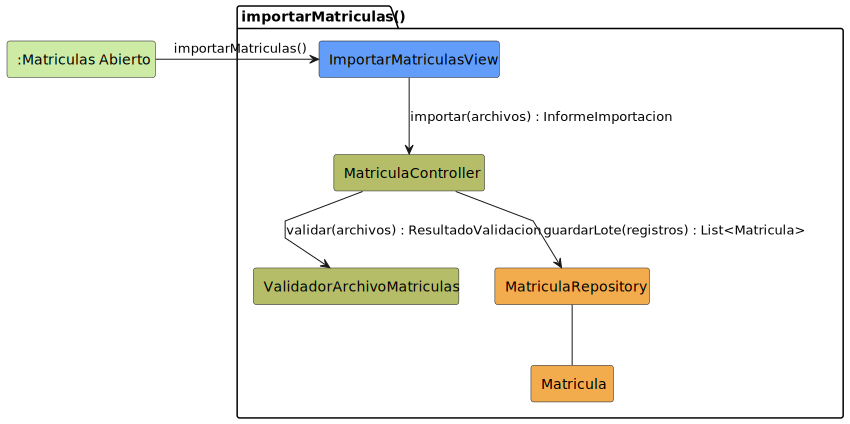

# CGU > importarMatriculas > Análisis

> | [🏠️](/README.md) | [Análisis](/RUP/01-analisis/README.md) | [Detalle](/RUP/00-requisitos/CasosDeUso/DetalladoCasosDeUso/Secretaria/) | **Análisis** | Diseño | Desarrollo |
> |-|-|-|-|-|-|

## información del artefacto

- **Proyecto**: Centro de Gestión Universitaria (CGU)
- **Fase RUP**: Inception
- **Disciplina**: Análisis
- **Caso de uso**: `importarMatriculas()`
- **Actor**: Secretaria
- **Versión**: 1.0
- **Fecha**: 2026-05-28

## propósito

Análisis del caso de uso `importarMatriculas()` mediante diagrama de colaboración MVC. Apertura del bloque Secretaria con el primer CU de **carga masiva** del proyecto: la Secretaria adjunta uno o varios archivos de matrículas, el sistema los valida, importa los registros válidos y presenta un informe con los errores detectados.

Es estructuralmente paralelo a [[exportarHistorialAsistencias]] del Profesor pero **en sentido inverso** (datos externos → sistema, vs sistema → datos externos). Introduce la entidad `Matricula` y el segundo servicio de aplicación del análisis: `ValidadorArchivoMatriculas`.

## diagrama de colaboración

||
|-|
|**Disciplina**: Análisis RUP **Enfoque**: Diagramas de colaboración MVC|

## discrepancias en el requisitado

| # | Tipo | Detalle | Decisión |
|-|-|-|-|
| 1 | Plural/singular | Filename del detallado: `importarMatricula.puml` (singular); actor `Secretaria.puml` y contenido del detallado: `importarMatriculas()` (plural); SVG: `importarMatriculas.svg` (plural) | **Adoptado plural** `importarMatriculas()` (mayoría de artefactos + el prototipo permite **múltiples archivos** simultáneos, lo que refuerza la pluralidad). Deuda: renombrar `.puml` |
| 2 | Actor nombrado distinto | El actor en `DiagramaCompletoCasoDeUso.puml` es **`SecretariaAcademica`**; el resto del proyecto usa **`Secretaria`** | **Adoptado `Secretaria`** (consistencia con el índice y el resto del proyecto). Deuda |
| 3 | Notas de los detallados | Las notas de los detallados de Secretaria dicen "**Alumno** solicita..." cuando debería decir "Secretaria solicita..." (probable copia-pega del bloque Alumno) | Documentado como deuda menor — no afecta el modelado de análisis |
| 4 | CU `importarAlumnos()` | El actor lista `importarAlumnos()` en el package "Alumnos" pero **no hay detallado**; no se cuenta en el denominador 26 | Fuera de scope — no se modela |

## clases de análisis identificadas

### clases model (naranja #F2AC4E)

| Clase | Responsabilidad | Trazabilidad |
|-|-|-|
| **Matricula** | **Nueva entidad de dominio**: relaciona `Alumno`, curso académico, grado, fecha de importación | **Debut**; ya aparecía implícita en la columna "Curso" de [[consultarDetalleAlumno]] |
| **MatriculaRepository** | Persiste registros de matrícula en lote | **Nuevo**; estrena `guardarLote(registros) : List<Matricula>` |

### clases view (azul #629EF9)

| Clase | Responsabilidad | Derivación |
|-|-|-|
| **ImportarMatriculasView** | Modal con selector de archivos múltiples + drag-and-drop, lista de archivos cargados (con opción de eliminar), botones Cancelar/Importar; presentación del informe tras procesamiento | Prototipos SALT [`importarMatriculas1.png`](/RUP/00-requisitos/CasosDeUso/Prototipos/Secretaria/importarMatriculas1.png) (modal inicial), [`importarMatriculas2.png`](/RUP/00-requisitos/CasosDeUso/Prototipos/Secretaria/importarMatriculas2.png) (varios archivos seleccionados), [`importarMatriculas3.png`](/RUP/00-requisitos/CasosDeUso/Prototipos/Secretaria/importarMatriculas3.png) (notificación de error) |

### clases controller / servicios (verde #b5bd68)

| Clase | Responsabilidad | Casos de uso |
|-|-|-|
| **MatriculaController** | Orquestación: validar archivos + delegar persistencia + componer informe | **Nuevo**; "Controller por entidad" para `Matricula` |
| **ValidadorArchivoMatriculas** | **Servicio de aplicación**: valida formato y estructura de los archivos; produce `ResultadoValidacion` con registros válidos y errores | **Nuevo**; segundo servicio del análisis (tras `GeneradorArchivoAsistencias` de [[exportarHistorialAsistencias]]) |

### colaboraciones (verde claro #CDEBA5)

| Colaboración | Propósito | Invocación |
|-|-|-|
| **:Matriculas Abierto** | Estado de origen — la Secretaria en el listado de matrículas | Punto de entrada |

## mensajes de colaboración

### flujo principal

| # | Origen | Destino | Mensaje | Intención |
|-|-|-|-|-|
| 1 | **:Matriculas Abierto** | **ImportarMatriculasView** | `importarMatriculas()` | Abrir modal de importación |
| 2 | **ImportarMatriculasView** | **MatriculaController** | `importar(archivos) : InformeImportacion` | Solicitar procesamiento |
| 3 | **MatriculaController** | **ValidadorArchivoMatriculas** | `validar(archivos) : ResultadoValidacion` | Validar formato y estructura |
| 4 | **MatriculaController** | **MatriculaRepository** | `guardarLote(registros) : List<Matricula>` | Persistir los registros válidos |

### flujo alternativo — error de formato

Si `ResultadoValidacion` indica errores totales (ningún registro válido), el Controller **no invoca el mensaje 4** y devuelve un `InformeImportacion` con solo los errores. La View presenta la notificación de error (prototipo 3: "Verifique que los archivos importados sigan el formato requerido"). El usuario puede ajustar y reintentar.

### flujo alternativo — error parcial

Si `ResultadoValidacion` contiene registros válidos **y** errores, el Controller invoca el mensaje 4 con los **válidos** y compone un informe con ambos. Patrón "best-effort": importar lo que se puede, reportar el resto.

### flujo alternativo — cancelar

El prototipo muestra "Cancelar" en el modal. Si se cancela, no se invocan los mensajes 2-4. La vista se cierra y el sistema vuelve a `:Matriculas Abierto`.

## el patrón "Validador + Repository + Informe" — categoría operativa nueva

Es el primer CU de **carga masiva** del proyecto. Comparte estructura con [[exportarHistorialAsistencias]] (descarga masiva) pero invierte el flujo: en vez de leer del Repository y generar archivo, **lee del archivo y persiste en el Repository**.

| Operación | Lectura | Transformación | Escritura |
|-|-|-|-|
| Exportar (Profesor) | Repository | `GeneradorArchivoAsistencias` | Archivo |
| **Importar (Secretaria)** | **Archivo** | **`ValidadorArchivoMatriculas`** | **Repository** |

Ambos siguen el patrón **"Controller orquesta + Servicio especializa"** introducido en [[exportarHistorialAsistencias]]. Reutilización conceptual confirmada.

## tipos de retorno opacos — `InformeImportacion`, `ResultadoValidacion`, `Archivo`

Tres value objects efímeros emergen en estos CUs sin clase formal en el análisis:

| Tipo | Origen | Contenido conceptual |
|-|-|-|
| `Archivo` (en exportar) | Generado por servicio | Stream + metadata |
| **`InformeImportacion`** | Devuelto por Controller | `{registrosImportados: List<Matricula>, errores: List<ErrorImportacion>}` |
| **`ResultadoValidacion`** | Devuelto por Validador | `{registrosValidos: List<RegistroCrudo>, errores: List<ErrorImportacion>}` |

Decisión consistente con el manejo previo de `cambios`, `datos`, `Archivo`: a nivel análisis se modelan como **tipos opacos** (referenciados pero no rectángulos en el diagrama). Su materialización (DTO, record, tuple, value class) pertenece a diseño.

**Deuda blanda — refactor "Introduce Parameter Object" retroactivo**: si en revisión futura se quiere uniformar, podría introducirse `Informe`, `Resultado`, etc. como clases naranjas (value objects). Por ahora se mantiene como en [[crearSesionClase]]: refactor aplicado solo donde el smell es claro.

## entidad `Matricula` — atributos identificados

| Atributo | Origen | Notas |
|-|-|-|
| `numIdentidad` | Prototipo "Nº de Identidad" | Identificador del documento del alumno |
| `alumno` (referencia o nombre) | Prototipo "Alumno" | ¿Se referencia al `Alumno` existente o se importa al mismo tiempo? Deuda |
| `curso` (año académico) | Prototipo "Curso" → "2025/2026" | Año académico de matriculación |
| `grado` | Prototipo "Grado" → "Ingeniería Informática" | Programa académico |
| `fechaImportacion` | Prototipo "Fecha de Importación" | Auto-poblado por el Controller |

**Deuda crítica para 02-diseño**: ¿qué pasa si el alumno referenciado por `numIdentidad` no existe en `AlumnoRepository`? Tres opciones:

| Opción | Comportamiento |
|-|-|
| A | Error de validación: el alumno debe existir previamente (importado por [[importarListasAlumnos]] o creado por Admin) |
| B | Creación implícita: si no existe, se crea con los datos del CSV |
| C | Política mixta: validación con flag "permitir creación implícita" |

El detallado no resuelve. Es **regla de negocio crítica** para diseño.

## múltiples archivos — orquestación del Controller

El prototipo 2 muestra **tres archivos cargados simultáneamente**. El parámetro del mensaje 2 es `archivos` (plural). Decisiones de modelado:

- **El Controller invoca `validar(archivos)` una sola vez** — el validador conoce el manejo de múltiples archivos. Razón: el `ResultadoValidacion` necesita agregar resultados de los varios archivos para presentar un informe único.
- **El Controller invoca `guardarLote(registros)` una sola vez** con los registros agregados — el Repository hace un lote único en lugar de un lote por archivo. Razón: atomicidad y eficiencia.

Alternativa rechazada: invocar `validar` y `guardarLote` una vez por archivo. Razón: dispersaría el informe y complicaría la atomicidad transaccional.

## auto-resolución de `fechaImportacion` por el Controller

Mismo patrón "auto-poblado por Controller" ya consolidado en el proyecto:
- `crearSolicitudDispensa` → `alumno` propietario desde `Sesion`
- `crearSesionClase` → `profesor` propietario desde `Sesion`
- `cerrarSesionClase` → `horaFin = ahora`
- `editarSolicitudDispensaDirector` → `fechaResolucion` + `responsable`
- **`importarMatriculas` → `fechaImportacion = ahora` en cada `Matricula`**

Adicionalmente, podría poblarse `responsable = Sesion.usuario` (la Secretaria que ejecutó el import) como campo de auditoría — deuda blanda.

## enlaces de dependencia

- **ImportarMatriculasView** conoce a **MatriculaController** (delegación)
- **MatriculaController** conoce a **ValidadorArchivoMatriculas** (servicio)
- **MatriculaController** conoce a **MatriculaRepository** (escritura)
- **MatriculaController** conoce a **Matricula** (construye instancias desde registros validados)
- **MatriculaController** conoce a **Sesion** (auditoría `responsable`; no dibujada)
- **MatriculaRepository** conoce a **Matricula** (gestión)

## trazabilidad con artefactos previos

### con especificación detallada

- **`MATRICULAS_ABIERTO_INICIAL`** → colaboración `:Matriculas Abierto` (origen)
- **Transición `importarMatriculas()`** → mensaje 1
- **Estado `IMPORTAR_MATRICULAS_COMP` con sub-estados:**
  - `SolicitudArchivo` (Selección de Archivo) → vista modal (mensaje 1)
  - `ValidarFormato` (Validación de Formato) → mensaje 3 (validador)
  - `ImportarRegistros` (Importación de Registros) → mensaje 4 (repository)
  - `MostrarInforme` (Informe de Importación) → retorno del mensaje 2 (`InformeImportacion`)
- **Nota "Si hay error: informa inconsistencias y solicita un nuevo archivo"** → flujo alternativo "error de formato"
- **Transición opcional `verDetalleMatricula()`** → invocación de CU posterior (no modelada como `<<include>>` — es navegación, no inclusión)
- **Transición `regresar al módulo de matrículas`** → vuelta implícita

### con wireframe (prototipo SALT)

- **`importarMatriculas1.png`** → modal inicial con selector + drag-and-drop → `ImportarMatriculasView`
- **`importarMatriculas2.png`** → modal con archivos cargados → estado intermedio (selección antes de submit)
- **`importarMatriculas3.png`** → notificación de error → flujo alternativo "error de formato"

### con actores

- **`SecretariaAcademica --> MatriculasImportar`** en `Secretaria/DiagramaCompletoCasoDeUso.puml` package "Matrículas" → invocación del CU (discrepancia de nombre del actor documentada arriba)

### con modelo del dominio

- **Sin trazabilidad directa**: `Matricula` no está en el modelo del SDR. **Deuda urgente** — entidad central del bloque Secretaria.

## principios de análisis aplicados

### patrón mvc

- **Controller por entidad**: `MatriculaController` (nuevo)
- **Servicio de aplicación**: `ValidadorArchivoMatriculas` separado del Controller (SRP)
- **Vista modal**: `ImportarMatriculasView`

### diagramas de colaboración

- **4 mensajes**: equivalente a [[exportarHistorialAsistencias]] (4 mensajes) — patrón "Controller + Servicio + Repository" consolidado
- **Sin destino**: el CU termina con el informe presentado en la misma vista
- **Tipos de retorno opacos**: `InformeImportacion`, `ResultadoValidacion`

### análisis puro

- **Sin formato de archivo específico**: ¿CSV, XLSX, JSON, XML? — decisión de diseño + producto (el prototipo muestra `.csv`)
- **Sin política de unicidad / actualización**: ¿qué pasa si una matrícula ya existe? — sobreescribir, ignorar, error
- **Sin tamaño máximo del archivo / batch**: deuda

## características del análisis

### responsabilidades identificadas

- **ImportarMatriculasView**: presentar selector + drag-and-drop, mostrar archivos cargados, presentar informe / error
- **MatriculaController**: orquestar (validar + persistir + componer informe), auto-poblar `fechaImportacion`
- **ValidadorArchivoMatriculas**: parsear, validar formato y estructura, devolver registros válidos + errores
- **MatriculaRepository**: persistir en lote
- **Matricula**: representar la entidad

### relaciones conceptuales

- **Delegación a servicio**: el Controller delega la lógica de parsing/validación
- **Composición de capas**: View (UX) → Controller (orquestación) → Servicio (transformación) → Repository (persistencia)
- **Best-effort import**: registros válidos se persisten incluso si hay errores parciales

## conexión con disciplinas rup

### desde requisitos

- **Detallado**: `IMPORTAR_MATRICULAS_COMP` con sub-estados → estructura del CU
- **Prototipos SALT**: modal con 3 estados (vacío, con archivos, error) → vista única con cambios visuales
- **Actores**: `SecretariaAcademica --> importarMatriculas()` en package "Matrículas"

### hacia diseño

- **Renombrar `importarMatricula.puml` → `importarMatriculas.puml`** (consistencia con actor)
- **Reconciliar actor `SecretariaAcademica` ↔ `Secretaria`** en todo el proyecto
- **Promover `Matricula` al modelo del dominio** (deuda urgente)
- **Política "alumno no existente"** (tres opciones documentadas — crítica)
- **Política de unicidad/actualización** de matrículas existentes
- **Formatos soportados** del archivo (CSV confirmado por prototipo; ¿otros?)
- **Materialización de `InformeImportacion` y `ResultadoValidacion`** como DTOs / records / value objects
- **Tamaño máximo de archivo / batch / paginación de errores** en el informe
- **Atomicidad**: ¿transacción única para todo el lote o por archivo?
- **Auditoría**: campo `responsable` (Secretaria que importó) en `Matricula`
- **Patrón reutilizable**: estructura idéntica para [[importarListasAlumnos]] — `ValidadorArchivoX` como **plantilla** para futuras importaciones

**Código fuente:** [colaboracion.puml](colaboracion.puml)

## referencias

- [Detallado `importarMatricula.puml` (sic, plural en contenido)](/RUP/00-requisitos/CasosDeUso/DetalladoCasosDeUso/Secretaria/importarMatricula.puml)
- [Prototipo SALT `importarMatriculas1.png`](/RUP/00-requisitos/CasosDeUso/Prototipos/Secretaria/importarMatriculas1.png)
- [Prototipo SALT `importarMatriculas2.png`](/RUP/00-requisitos/CasosDeUso/Prototipos/Secretaria/importarMatriculas2.png)
- [Prototipo SALT `importarMatriculas3.png`](/RUP/00-requisitos/CasosDeUso/Prototipos/Secretaria/importarMatriculas3.png)
- [Caso de uso de Secretaria](/RUP/00-requisitos/CasosDeUso/CasoDeUso/Secretaria/DiagramaCompletoCasoDeUso.puml)
- [Análisis `exportarHistorialAsistencias()` (Profesor) — patrón paralelo](/RUP/01-analisis/casos-uso/exportarHistorialAsistencias/README.md)
- [Análisis `importarListasAlumnos()` — patrón gemelo](/RUP/01-analisis/casos-uso/importarListasAlumnos/README.md)
- [conversation-log.md](/conversation-log.md)
