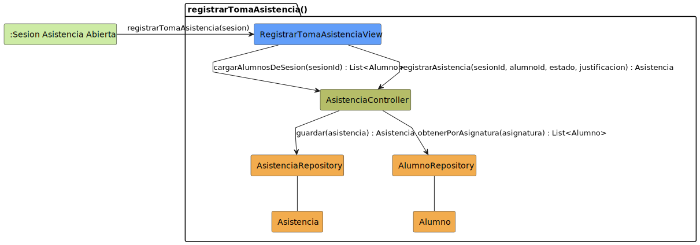

# CGU > registrarTomaAsistencia > Análisis

> | [🏠️](/README.md) | [Análisis](/RUP/01-analisis/README.md) | [Detalle](/RUP/00-requisitos/CasosDeUso/DetalladoCasosDeUso/Profesor/) | **Análisis** | Diseño | Desarrollo |
> |-|-|-|-|-|-|

## información del artefacto

- **Proyecto**: Centro de Gestión Universitaria (CGU)
- **Fase RUP**: Inception
- **Disciplina**: Análisis
- **Caso de uso**: `registrarTomaAsistencia()`
- **Actor**: Profesor
- **Versión**: 1.0
- **Fecha**: 2026-05-28

## propósito

Análisis del caso de uso `registrarTomaAsistencia()` mediante diagrama de colaboración MVC. Es la **operación principal del bloque Profesor** y el **primer CU no-CRUD** del proyecto: el Profesor marca el estado de asistencia (Presente / Ausente / Tarde) de cada alumno matriculado en la asignatura de la sesión activa, opcionalmente con justificación.

Es el **debut formal de la entidad `Asistencia`** en el proyecto, que vive en el corazón del negocio académico junto a `SesionDeClase` y `SolicitudDispensa`.

## diagrama de colaboración

||
|-|
|**Disciplina**: Análisis RUP **Enfoque**: Diagramas de colaboración MVC|

## clases de análisis identificadas

### clases model (naranja #F2AC4E)

| Clase | Responsabilidad | Trazabilidad |
|-|-|-|
| **Asistencia** | **Nueva entidad de dominio**: relaciona `Alumno`, `SesionDeClase`, `estado` (Presente/Ausente/Tarde) y `justificacion` opcional | **Debut formal**; ya aparecía referenciada en [[consultarDetalleAlumno]] como dato de la ficha |
| **AsistenciaRepository** | Persiste y recupera asistencias | **Nuevo** |
| **Alumno** | Entidad de dominio (read-only en este CU) | Reutilizada de [[consultarListaAlumnos]] |
| **AlumnoRepository** | Recupera alumnos matriculados en la asignatura de la sesión | Reutilizado de [[consultarListaAlumnos]] (mismo `obtenerPorAsignatura`) |

### clases view (azul #629EF9)

| Clase | Responsabilidad | Derivación |
|-|-|-|
| **RegistrarTomaAsistenciaView** | Listado de alumnos con selector de estado por fila (radio o dropdown) + campo de justificación. Es la **misma pantalla** que muestra la sesión activa — el Profesor pasa lista in-situ | Pantalla principal de `SESION_ASISTENCIA_ABIERTA`; vista heredada de [[crearSesionClase]] cuando termina con `iniciarSesionClase()` |

### clases controller (verde #b5bd68)

| Clase | Responsabilidad | Casos de uso |
|-|-|-|
| **AsistenciaController** | Orquestación del registro de asistencia: cargar alumnos + persistir cada marca | **Nuevo**; "Controller por entidad" aplicado a `Asistencia` |

### colaboraciones (verde claro #CDEBA5)

| Colaboración | Propósito | Invocación |
|-|-|-|
| **:Sesion Asistencia Abierta** | Único origen — el Profesor está en la sesión activa | Punto de entrada (la sesión activa se creó en [[crearSesionClase]]) |

## mensajes de colaboración

### flujo principal

| # | Origen | Destino | Mensaje | Intención |
|-|-|-|-|-|
| 1 | **:Sesion Asistencia Abierta** | **RegistrarTomaAsistenciaView** | `registrarTomaAsistencia(sesion)` | Activar el modo "pasar lista" sobre la sesión actual |
| 2 | **RegistrarTomaAsistenciaView** | **AsistenciaController** | `cargarAlumnosDeSesion(sesionId) : List<Alumno>` | Recuperar los alumnos matriculados en la asignatura de la sesión |
| 3 | **AsistenciaController** | **AlumnoRepository** | `obtenerPorAsignatura(asignatura) : List<Alumno>` | Consulta de matriculados |
| 4 | **RegistrarTomaAsistenciaView** | **AsistenciaController** | `registrarAsistencia(sesionId, alumnoId, estado, justificacion) : Asistencia` | Persistir la marca de un alumno (un mensaje por alumno marcado) |
| 5 | **AsistenciaController** | **AsistenciaRepository** | `guardar(asistencia) : Asistencia` | Upsert (crea si no existía, actualiza si ya estaba marcado) |

### flujo alternativo — entrada y salida de modo

El mensaje 4 (y por tanto el 5) **se repite por alumno**: cada cambio de estado genera una invocación. El detallado no especifica si es por-alumno o batch al final; el prototipo del listado de asistencias (cf. [[editarSesionClase]]) muestra checkboxes individuales, sugiriendo persistencia granular (por alumno).

Si el Profesor sale de la sesión sin marcar a todos, los marcados quedan persistidos. Es el comportamiento esperado por `iniciarSesionClase()` → la sesión activa puede ser editada parcialmente.

## el método del Controller es `guardar` (no `crear` ni `actualizar`) — upsert idempotente

A diferencia de los `crear` previos del proyecto (que asumían entidad nueva) y de los `actualizar` (que asumían entidad existente), aquí el Controller invoca **`guardar`** al Repository — semántica de **upsert**:

- Si no existe `Asistencia(sesionId, alumnoId)`, la crea.
- Si ya existe (el Profesor cambia su criterio), la actualiza.

Razón: el Profesor puede marcar, desmarcar, cambiar estado, añadir justificación a posteriori, todo desde la misma pantalla. Modelar dos operaciones distintas (crear/actualizar) introduciría una decisión que no agrega valor al análisis.

**Implicación para el modelo del dominio**: la unicidad de `Asistencia` se da por la **pareja `(sesionId, alumnoId)`** — una asistencia por sesión y alumno. Deuda para 02-diseño: restricción de unicidad.

## entidad `Asistencia` — atributos identificados

| Atributo | Origen | Notas |
|-|-|-|
| `sesion` (referencia a `SesionDeClase`) | Por construcción (contexto de la View) | |
| `alumno` (referencia a `Alumno`) | Selección del Profesor | |
| `estado` | Detallado "Presente / Ausente / Tarde" | **3 estados, no booleano** — primer enum del análisis |
| `justificacion` | Detallado "Justificación (si aplica)" | Opcional |

Atributos derivados implícitos para el modelo del dominio (en 02-diseño):

- `fechaRegistro` (cuándo se marcó la asistencia, ≠ fecha de la sesión)
- Posible relación a `SolicitudDispensa` si el alumno tiene dispensa para esa asignatura/sesión (visible en [[consultarDetalleAlumno]] columna "Dispensa")

## interacción con `SolicitudDispensa` — emerge la relación entre entidades de negocio

El prototipo `consultarDetalleAlumno2.png` muestra la columna **"Dispensa"** con valor "Dispensado" o "-". Esto sugiere que cuando un alumno tiene una `SolicitudDispensa` **aprobada** para la asignatura/sesión, su estado de asistencia se muestra de forma diferenciada.

**Decisión de análisis**: no se modela aquí formalmente — `registrarTomaAsistencia` se limita a registrar la marca del Profesor. La integración Asistencia ↔ Dispensa es **regla de presentación / cálculo derivado** que pertenece a diseño.

**Posibles interpretaciones para diseño**:

| Opción | Descripción |
|-|-|
| A | La dispensa **no afecta** al registro de asistencia; ambas entidades coexisten y la vista las combina al mostrar |
| B | La dispensa **se cuenta como "Presente" automáticamente** sin marca del Profesor; el sistema pre-marca |
| C | La dispensa **excluye** al alumno del listado de toma; el Profesor no la marca |

El detallado y los prototipos no resuelven. **Deuda para 02-diseño** — regla de negocio crítica.

## ¿por qué `AsistenciaController` y no reutilizar `SesionDeClaseController`?

Patrón "Controller por entidad" mantenido: `Asistencia` es entidad propia (con su ciclo de vida, sus consultas, sus reglas), por tanto tiene su Controller. Lo mismo se aplicó al introducir `AlumnoController` en [[consultarListaAlumnos]].

Alternativa rechazada: tratar `Asistencia` como atributo del aggregate `SesionDeClase`. Razón del rechazo: las asistencias se consultan también **por alumno** (en [[consultarDetalleAlumno]]) y **por rango de fechas** (en [[exportarHistorialAsistencias]]), no solo por sesión. Su acceso es polivalente, lo que sugiere entidad con Repository propio.

## sin destino modelado — vuelta al mismo estado

Tras los `guardar()` repetidos, el Profesor permanece en `:Sesion Asistencia Abierta`. La transición de salida del detallado (`PROCESO_TOMA_COMP → SESION_ACTUAL_FINAL`) es el mismo estado de partida. No se modela. Política coherente con [[editarSesionClase]].

## enlaces de dependencia

- **RegistrarTomaAsistenciaView** conoce a **AsistenciaController** (delegación)
- **AsistenciaController** conoce a **AsistenciaRepository** (escritura)
- **AsistenciaController** conoce a **AlumnoRepository** (lectura de matriculados)
- **AsistenciaController** conoce a **Asistencia** (manipulación)
- **AsistenciaRepository** conoce a **Asistencia** (gestión)
- **AlumnoRepository** conoce a **Alumno** (gestión)

## trazabilidad con artefactos previos

### con especificación detallada

- **`SESION_ACTUAL_INICIAL`** → colaboración `:Sesion Asistencia Abierta` (origen)
- **Transición `registrarTomaAsistencia()`** → mensaje 1
- **Estado `PROCESO_TOMA_COMP` con sub-estado `VisualizacionListado`** → `RegistrarTomaAsistenciaView` + mensajes 2-3 (cargar matriculados)
- **Nota "Sistema permite introducir el estado de cada alumno. Profesor introduce los cambios necesarios: Presente / Ausente / Tarde, Justificación (si aplica)"** → mensaje 4 (parámetros `estado, justificacion`)
- **Transición de cierre (sin etiqueta) → `SESION_ACTUAL_FINAL`** → vuelta implícita al estado de partida

### con wireframe (prototipo SALT)

- **`editarSesionClase1.png`** y **`cerrarSesionClase.png`** muestran el **listado de asistencias** con la columna "Asistencia" (checkbox) y la columna mostrando "Con Dispensa" para algunos alumnos. Este listado es el mismo que `RegistrarTomaAsistenciaView` opera — confirma la decisión de "vista compartida con la sesión activa"
- Pero **no hay prototipo dedicado** a `registrarTomaAsistencia` en `Prototipos/Profesor/`. El listado de la pantalla de asistencias es el wireframe efectivo

### con actores

- **`Profesor --> registrarTomaAsistencia`** en package "Asistencias" → invocación del CU

### con modelo del dominio

- **Sin trazabilidad directa**: `Asistencia` no aparece en el modelo del SDR. **Deuda urgente para 02-diseño** — entidad central del negocio.

## principios de análisis aplicados

### patrón mvc

- **Controller por entidad**: `AsistenciaController` (nuevo, por consistencia con [[consultarListaAlumnos]] que introdujo `AlumnoController`)
- **Vista compartida con la sesión activa**: `RegistrarTomaAsistenciaView` no es ventana nueva, es modo sobre la pantalla de asistencias
- **Sin polimorfismo en la entidad**: `Asistencia` concreta

### diagramas de colaboración

- **5 mensajes**: dos fases (cargar matriculados + persistir marcas) — más amplio que un consultar pero más enfocado que un master-detail
- **Mensaje 4-5 se repite por alumno**: documentado en prosa; el diagrama muestra una sola flecha por simplicidad
- **Sin destino**: el CU es terminal en el flujo del actor

### análisis puro

- **Sin reglas de negocio sobre dispensas**: cómo se integra `Asistencia` con `SolicitudDispensa` es decisión abierta (tres opciones documentadas)
- **Sin política de cierre temporal**: ¿pasada la fecha de la sesión, se pueden seguir marcando asistencias? Deuda

## características del análisis

### responsabilidades identificadas

- **RegistrarTomaAsistenciaView**: listar matriculados, presentar selector de estado por fila, persistir marcas en vivo
- **AsistenciaController**: orquestar carga y registro, **aplicar verificación "Profesor competente"** (defensa en profundidad — el Profesor solo puede registrar asistencias en sus asignaturas)
- **AsistenciaRepository**: upsert idempotente
- **AlumnoRepository**: recuperar matriculados (reutilizado)
- **Asistencia**: representar la marca de un alumno en una sesión

### relaciones conceptuales

- **Operación granular en lote**: cada alumno marcado genera una persistencia individual; no hay "submit final"
- **Idempotencia**: marcar dos veces al mismo alumno con el mismo estado no causa duplicado (gracias al upsert)
- **Vista heredada del estado activo**: continuidad UX con [[crearSesionClase]] y [[editarSesionClase]]

## conexión con disciplinas rup

### desde requisitos

- **Detallado**: `PROCESO_TOMA_COMP` → modo de toma; nota con los tres estados → enum `estado`
- **Wireframe**: el listado de la pantalla de sesión activa (sin prototipo dedicado) es la vista efectiva
- **Actores**: `Profesor --> registrarTomaAsistencia()` en package "Asistencias"

### hacia diseño

- **Promover `Asistencia` al modelo del dominio** (entidad central, no estaba en el SDR)
- **Restricción de unicidad** `(sesionId, alumnoId)` — pareja única por sesión
- **Definir enum del campo `estado`**: Presente / Ausente / Tarde (¿ampliable a "Justificado"? — depende de cómo se modele la integración con `SolicitudDispensa`)
- **Resolver integración `Asistencia` ↔ `SolicitudDispensa`** (tres opciones documentadas — regla de negocio crítica)
- **Política de cierre temporal**: ¿modificar asistencia post-cierre de sesión? Probablemente sí dentro de ventana, con auditoría
- **Estrategia de persistencia granular vs batch**: el análisis adopta granular (un mensaje por alumno) — verificar viabilidad o adoptar batch si el volumen lo justifica
- **Concurrencia**: dos pestañas del mismo Profesor marcando asistencias en la misma sesión
- **Auditoría**: ¿quién marcó? ¿cuándo? — campos derivados a añadir a `Asistencia`

**Código fuente:** [colaboracion.puml](colaboracion.puml)

## referencias

- [Detallado `registrarTomaAsistencia()`](/RUP/00-requisitos/CasosDeUso/DetalladoCasosDeUso/Profesor/registrarTomaAsistencia.puml)
- [Caso de uso del Profesor](/RUP/00-requisitos/CasosDeUso/CasoDeUso/Profesor/Profesor.puml)
- [Análisis `crearSesionClase()`](/RUP/01-analisis/casos-uso/crearSesionClase/README.md)
- [Análisis `editarSesionClase()`](/RUP/01-analisis/casos-uso/editarSesionClase/README.md)
- [Análisis `consultarListaAlumnos()`](/RUP/01-analisis/casos-uso/consultarListaAlumnos/README.md)
- [Análisis `consultarDetalleAlumno()`](/RUP/01-analisis/casos-uso/consultarDetalleAlumno/README.md)
- [conversation-log.md](/conversation-log.md)
