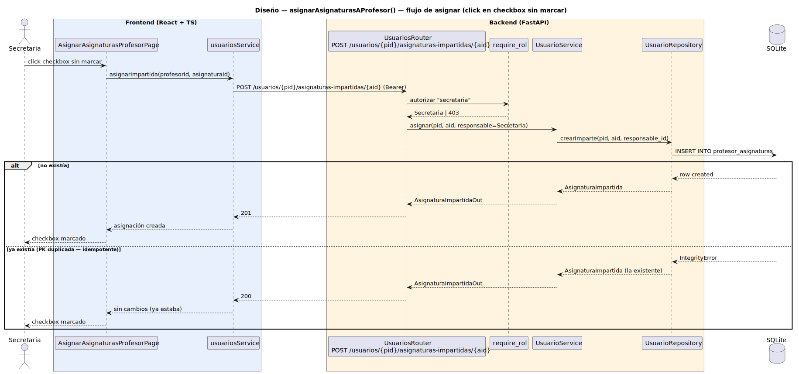

# CGU > asignarAsignaturasAProfesor > Diseño

> | [🏠️](/README.md) | [Diseño](/RUP/02-diseño/README.md) | Detalle | [Análisis](/RUP/01-analisis/casos-uso/asignarAsignaturasAProfesor/README.md) | **Diseño** | Desarrollo |
> |-|-|-|-|-|-|

## información del artefacto

- **Proyecto**: Centro de Gestión Universitaria (CGU)
- **Fase RUP**: Construction
- **Disciplina**: Diseño
- **Caso de uso**: `asignarAsignaturasAProfesor()`
- **Actor**: Secretaria
- **Versión**: 1.0
- **Fecha**: 2026-06-11

## diagrama de secuencia

||
|-|
|**Disciplina**: Diseño RUP **Enfoque**: Diagrama de secuencia con tecnología concreta — flujo de **asignar** (operación más representativa: idempotencia explícita 201/200)|

[Código PlantUML](secuencia.puml)

## participantes

| Participante | Rol |
|---|---|
| **AsignarAsignaturasProfesorPage** (React, ruta `/asignaciones`) | Pantalla con selector de profesor en la cabecera + tabla de asignaturas como checkboxes. Cada toggle dispara `asignarImpartida`/`desasignarImpartida` y actualiza el checkbox optimistamente; revierte si la respuesta falla. |
| **usuariosService** (axios) | Cliente HTTP para `/usuarios/{pid}/asignaturas-impartidas/{aid}`. Métodos nuevos: `obtenerImpartidas(pid)`, `asignarImpartida(pid, aid)`, `desasignarImpartida(pid, aid)`. |
| **UsuariosRouter** (FastAPI) | Endpoints REST sobre `/usuarios/{pid}/asignaturas-impartidas/{aid}` (POST/DELETE) y `/usuarios/{pid}/asignaturas-impartidas` (GET). |
| **require_rol** (dependency) | Autoriza con `current_user.tipo == "secretaria"` para POST/DELETE. El GET queda abierto a Secretaria; el Profesor consulta sus propias asignaturas vía `Sesion.usuario.asignaturas_impartidas` en otros CUs. |
| **UsuarioService** | Reglas de negocio: valida que el `usuarioId` corresponde a un Profesor (o subtipo, p. ej. `DirectorDeGrado`), resuelve `responsable_id` desde la sesión, gestiona la idempotencia del alta (200 si ya existía, 201 si nueva). |
| **UsuarioRepository** (SQLAlchemy) | Nuevos métodos `obtener_impartidas`, `crear_imparte`, `eliminar_imparte` sobre la tabla `profesor_asignaturas` (extendida con `responsable_id`). |
| **SQLite** | Tabla `profesor_asignaturas(profesor_id, asignatura_id, responsable_id)` — PK compuesta `(profesor_id, asignatura_id)`, FKs RESTRICT. |

## materialización del análisis

| Mensaje del análisis | Materialización en diseño |
|---|---|
| `View → AsignaturaController : listar() : list<Asignatura>` | `GET /asignaturas` (reutilizado de [[gestionarCatalogoAsignaturas]]) |
| `View → UsuarioController : obtenerImpartidas(pid) : list<Asignatura>` | `GET /usuarios/{pid}/asignaturas-impartidas` → 200 + `list[AsignaturaOut]` |
| `View → UsuarioController : asignar(pid, aid) : AsignaturaImpartida` | `POST /usuarios/{pid}/asignaturas-impartidas/{aid}` → 201 (creada) o 200 (ya existía). Diagrama de arriba. |
| `View → UsuarioController : desasignar(pid, aid)` | `DELETE /usuarios/{pid}/asignaturas-impartidas/{aid}` → 204. Idempotente: 204 también si no existía. |
| `UsuarioController → UsuarioRepository : crearImparte / eliminarImparte (con validación)` | El service valida primero el subtipo del usuario (Profesor o subtipo); el repo escribe en `profesor_asignaturas`. |
| `AsignaturaImpartida` (entidad reificada del análisis) | Modelo SQLAlchemy `AsignaturaImpartida` mapeado a `profesor_asignaturas` con `responsable_id`. El acceso desde Python pasa a ser `usuario.asignaturas_impartidas` (igual que ahora vía `relationship`) y, cuando se necesita la auditoría, `select(AsignaturaImpartida).where(...)`. |
| Choice point "el usuario no es Profesor" | El service consulta el subtipo (`isinstance(usuario, Profesor)`) y aborta con `NoEsProfesor` → 422. |
| Choice point "asignación duplicada" | `IntegrityError` por PK compuesta → el service la captura y devuelve la fila existente → 200 (no 201). Idempotencia explícita. |
| Choice point "asignatura no existe" | `IntegrityError` por FK → `AsignaturaNoEncontrada` → 404. |

> El diagrama muestra solo las dos ramas que distinguen este CU del resto: **creación nueva (201)** y **alta idempotente (200)** sobre PK duplicada. Las otras dos ramas (`NoEsProfesor → 422` y `AsignaturaNoEncontrada → 404`) se materializan según los choice points anteriores y siguen patrones ya documentados (`require_rol` para 403, validación en service para 422 — ver [[crearUsuario]]; FK error → 404 — ver [[gestionarCatalogoGrados]]).

## decisiones de diseño

- **Tabla N:M evoluciona de `Table` a modelo declarativo (`AsignaturaImpartida`)** — hoy `profesor_asignaturas` es un `Table` desnudo en `models/profesor_asignatura.py` sin atributos propios. Añadir `responsable_id` cambia su naturaleza: deja de ser una pura asociación y pasa a ser una **Association Object** (Fowler / SQLAlchemy idiom). Mapeado a una clase `AsignaturaImpartida(Base)` con PK compuesta `(profesor_id, asignatura_id)` y `responsable_id` como FK a `usuarios`. El `relationship('asignaturas_impartidas')` en `Usuario` se reconfigura para pasar por `secondary=AsignaturaImpartida.__table__` (compatible) o se migra a `relationship(... viewonly=True)` + escrituras explícitas vía repository. **Recomendación**: viewonly + escrituras explícitas, para que el `responsable_id` no se pierda accidentalmente al hacer `usuario.asignaturas_impartidas.append(asignatura)` (que omitiría la auditoría).

- **Endpoints REST anidados bajo `/usuarios/{pid}/asignaturas-impartidas/...`** — el path refleja la asimetría sujeto/objeto identificada en el análisis: la operación pertenece al Profesor. Alternativa rechazada: `/profesor-asignaturas` plano — perdería el contexto del sujeto y obligaría a pasar `profesor_id` en el body, contra el principio REST de que el recurso identificable va en el path.

- **POST idempotente con 201 vs 200** — `201 Created` cuando la fila se acaba de crear, `200 OK` cuando ya existía. Razones: (a) la UI dispara `POST` por cada toggle, sin saber el estado; (b) un cliente bien informado podría desambiguar; (c) si el código `409 Conflict` pareciera "natural" para duplicado, complicaría la UI (tendría que distinguir el 409 "ya estaba" del 409 "error real"). El idempotente con 200/201 es más simple operacionalmente.

- **DELETE también idempotente: 204 incluso si no existía** — semánticamente "la fila no está, hagas lo que hagas". 404 sería más estricto pero obligaría a la UI a tratar dos resultados de éxito (existía + se borró, no existía pero ahora tampoco). La idempotencia plena es más simple.

- **Validación del subtipo en service, no en BD** — la BD acepta cualquier `usuario_id` como `profesor_id` en la N:M (no hay un CHECK que restrinja a subtipo). La validación vive en `UsuarioService.asignar`: consulta el `usuario` y comprueba `isinstance(usuario, Profesor)` antes de delegar al repo. Si falla, raises `NoEsProfesor` → 422. Mismo patrón que la validación de "tipo válido" en `crearUsuario`.

- **`responsable_id` auto-poblado, no parámetro del cliente** — el cliente envía solo el path (`/usuarios/{pid}/asignaturas-impartidas/{aid}`); el service resuelve `responsable_id = current_user.id` antes de delegar. Sin posibilidad de falseo por el cliente. Coherente con [[gestionarCatalogoAsignaturas]] y los imports masivos.

- **Toggle inmediato con UI optimista, revierte al fallar** — el frontend marca el checkbox antes de la respuesta (optimismo); si la promesa rechaza, lo desmarca y muestra el error. Latencia mental baja. La alternativa "espera la respuesta antes de marcar" es más conservadora pero hace la UI lenta en escenarios habituales (red local, tráfico ligero).

- **Sin transacción multi-toggle: cada operación es atómica e independiente** — si la Secretaria marca 3 checkboxes seguidos, son 3 POST distintos. No hay "batch" ni "guardar todo". Consecuencia: si la pestaña se cierra a mitad, los toggles ya enviados quedan persistidos y los pendientes no — comportamiento esperable, no hace falta gestión especial.

- **El `responsable_id` no se conserva al desasignar** — el DELETE elimina la fila. Si en el futuro se quiere auditoría de bajas (`desasignadoPor`, `desasignadoEn`), habría que migrar a soft-delete con `activo: bool` o `eliminado_en: datetime`. Deuda blanda registrada en el análisis. No se aplica ahora — el coste (pérdida de "qué profesor imparte" pasaría a ser un filtro WHERE activo en todas las queries) supera el beneficio actual.

- **`AsignaturaImpartidaOut`** — schema mínimo: `{profesor_id, asignatura_id, responsable_id, responsable: {id, username, nombre, apellidos}}` para que la UI pueda mostrar quién hizo la asignación si en algún momento se quiere. Por defecto la lista del CU usa solo `list[AsignaturaOut]` (el endpoint `GET /usuarios/{pid}/asignaturas-impartidas` proyecta solo las asignaturas, sin la fila de auditoría); `AsignaturaImpartidaOut` se devuelve desde POST como confirmación pero su uso en el listado se difiere a una hipotética vista "Auditoría de asignaciones".

## referencias

- [Análisis `asignarAsignaturasAProfesor()`](/RUP/01-analisis/casos-uso/asignarAsignaturasAProfesor/README.md)
- [Diseño `gestionarCatalogoAsignaturas()`](/RUP/02-diseño/casos-uso/gestionarCatalogoAsignaturas/README.md) — CU complementario
- [Diseño `crearUsuario()`](/RUP/02-diseño/casos-uso/crearUsuario/README.md) — patrón de validación de subtipo en service
- [Diseño `gestionarCatalogoGrados()`](/RUP/02-diseño/casos-uso/gestionarCatalogoGrados/README.md) — patrón router/service/repository
- [Modelo del dominio (SDR)](/RUP/00-requisitos/ModeloDelDominio/DiagramasDeClase/ModeloCompleto.puml)
- [conversation-log.md](/conversation-log.md)
