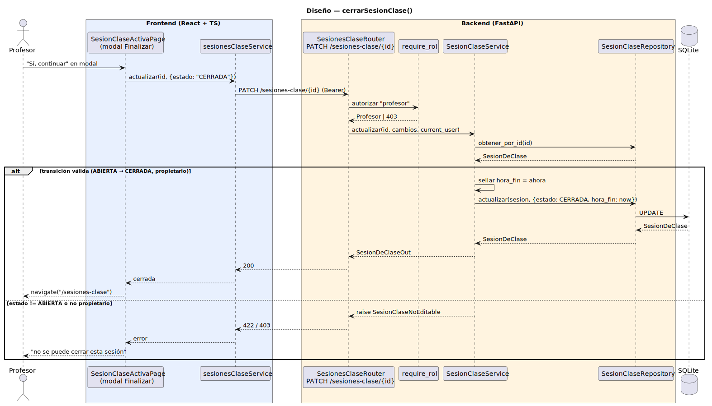

# CGU > cerrarSesionClase > Diseño

> | [🏠️](/README.md) | [Diseño](/RUP/02-diseño/README.md) | [Detalle](/RUP/00-requisitos/CasosDeUso/DetalladoCasosDeUso/Profesor/cerrarSesionClase.puml) | [Análisis](/RUP/01-analisis/casos-uso/cerrarSesionClase/README.md) | **Diseño** | Desarrollo |
> |-|-|-|-|-|-|

## información del artefacto

- **Proyecto**: Centro de Gestión Universitaria (CGU)
- **Fase RUP**: Elaboración
- **Disciplina**: Diseño
- **Caso de uso**: `cerrarSesionClase()`
- **Actor**: Profesor
- **Versión**: 1.0
- **Fecha**: 2026-06-02

## diagrama de secuencia

||
|-|
|**Disciplina**: Diseño RUP **Enfoque**: Diagrama de secuencia con tecnología concreta|

[Código PlantUML](secuencia.puml)

## participantes

| Participante | Rol |
|---|---|
| **SesionClaseActivaPage** (React, `/sesiones-clase/{id}`) | Modal "Finalizar Sesión" con texto del prototipo + botones Cancelar / Sí, continuar. La hora de fin se muestra informativa (sellada por el backend, no editable) |
| **sesionesClaseService** (axios) | Reutiliza `actualizar(id, cambios)` ya introducido por `editarSesionClase` — el body es `{estado: "CERRADA"}` |
| **SesionesClaseRouter** (FastAPI) | Endpoint `PATCH /sesiones-clase/{id}` ya existente — el Service detecta la transición de estado |
| **require_rol** (dependency) | Autoriza `"profesor"` |
| **SesionClaseService** | Valida propietario + transición `ABIERTA → CERRADA`. Sella `hora_fin = datetime.now()` antes de persistir |
| **SesionClaseRepository** | Mismo `actualizar` que en `editarSesionClase` |
| **SQLite** | Tabla `sesiones_clase` |

## materialización del análisis

| Mensaje del análisis | Materialización en diseño |
|---|---|
| `:Sesion Asistencia Abierta → CerrarSesionClaseView : cerrarSesionClase()` | Click "Finalizar" en `SesionClaseActivaPage` abre modal de confirmación |
| `confirmarCierre(sesionId) : boolean` | Click "Sí, continuar" → `PATCH /sesiones-clase/{id}` con body `{estado: "CERRADA"}` |
| `actualizar(sesion) : boolean` con side effect `horaFin` | El Service detecta `cambios["estado"] == CERRADA` y sella `hora_fin = now` antes del UPDATE — patrón "auto-poblado por Service" idéntico al `fecha_resolucion` en `editarSolicitudDispensaDirector` |
| `volverAListado()` → `:Asistencias Abierto` | Tras 200, frontend hace `navigate("/sesiones-clase")` (listado del Profesor) |

## decisiones de diseño

- **Mismo endpoint `PATCH /sesiones-clase/{id}` que `editarSesionClase`** — el cierre es una transición de estado de la state machine de `SesionDeClase`. Modelarla como endpoint dedicado `POST /sesiones-clase/{id}/cerrar` sería más verboso sin ganar honestidad: el Service ya distingue intenciones por los campos del body (igual que `PATCH /dispensas/{id}` distingue `{estado: EN_REVISION}` vs `{observaciones: ...}` en el ramillete Director). Coherencia consolidada en el proyecto.
- **State machine de `SesionDeClase` se materializa aquí** — `cambios["estado"]` activa la lógica de transición en el Service. Reglas:
  - `ABIERTA → CERRADA`: válida (acción de este CU). Side effect: sellar `hora_fin = now`.
  - Cualquier otra transición: 422 `SesionClaseNoEditable`.
  - Si la edición no incluye `estado`, es edición de campos (caso de `editarSesionClase`).
- **`hora_fin` auto-poblada por el Service** — patrón consolidado del proyecto: side effects ligados a transiciones los aplica el Service, no el cliente. Mismo razonamiento que `fecha_resolucion`/`responsable_id` en el veredicto del Director, `fecha_importacion` en importadores, `fecha_solicitud` en alta de dispensa. El modal muestra la hora informativa (calculada client-side al abrir el modal), pero el backend la sella con su propio `datetime.now()` — fuente de verdad única.
- **Modal de confirmación obligatorio (frontend)** — el prototipo y análisis lo exigen explícitamente: "Se guardará la sesión en curso. ¿Desea continuar?". Implementado como modal React con `window.confirm` o componente custom. Asimetría consciente con `cerrarSesion` del Usuario (sin modal por decisión explícita en su análisis).
- **Sin reapertura** (deuda del análisis) — diferida. La transición `CERRADA → ABIERTA` no está modelada en el Service. Si emerge la necesidad, se añade una transición específica con auditoría (no como simple PATCH de estado). YAGNI.
- **Sin edición post-cierre** — `editarSesionClase` ya valida `sesion.estado == ABIERTA`. Misma validación aplica a futuras operaciones (`registrarTomaAsistencia` también exigirá ABIERTA). La invariante es coherente entre CUs.
- **Sin cierre forzado/automático** (deuda del análisis) — confirmado fuera de scope, mismo razonamiento que `sesionInactiva()` del login. No hay actor "Sistema" que dispare cierres.
- **Tras 200, navegar al listado** — coherente con el análisis (vuelta a `:Asistencias Abierto`). El listado `GET /sesiones-clase` retorna sesiones del Profesor (ABIERTAS arriba, CERRADAS abajo o filtradas).

## simetría con otros CUs del proyecto

| CU | Endpoint | Transición |
|---|---|---|
| `cerrarSesionClase` | `PATCH /sesiones-clase/{id}` | `ABIERTA → CERRADA` |
| `editarSolicitudDispensaDirector` | `PATCH /dispensas/{id}` | `PENDIENTE → EN_REVISION → APROBADA/RECHAZADA` |
| `editarSolicitudDispensa` (Alumno) | `PATCH /dispensas/{id}` | `PENDIENTE → ANULADA` |

Las tres comparten el mismo patrón: una sola firma HTTP, el Service detecta la transición por el body y aplica auto-poblado de side effects. Confirma el patrón "PATCH con state machine inferida" como modus operandi del proyecto para entidades con ciclo de vida.

## referencias

- [Análisis `cerrarSesionClase()`](/RUP/01-analisis/casos-uso/cerrarSesionClase/README.md)
- [Diseño `crearSesionClase()` — origen de la state machine](/RUP/02-diseño/casos-uso/crearSesionClase/README.md)
- [Diseño `editarSesionClase()` — comparte endpoint](/RUP/02-diseño/casos-uso/editarSesionClase/README.md)
- [Diseño `editarSolicitudDispensa()` (Director) — patrón de PATCH con transición + side effects](/RUP/02-diseño/casos-uso/editarSolicitudDispensaDirector/README.md)
- [conversation-log.md](/conversation-log.md)
