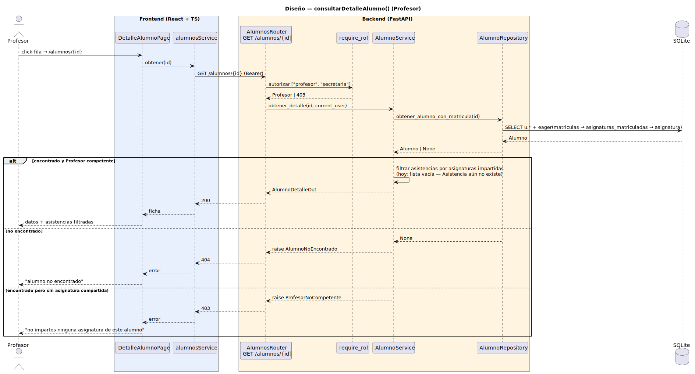

# CGU > consultarDetalleAlumno (Profesor) > Diseño

> | [🏠️](/README.md) | [Diseño](/RUP/02-diseño/README.md) | [Detalle](/RUP/00-requisitos/CasosDeUso/DetalladoCasosDeUso/Profesor/consultarDetalleAlumno.puml) | [Análisis](/RUP/01-analisis/casos-uso/consultarDetalleAlumno/README.md) | **Diseño** | Desarrollo |
> |-|-|-|-|-|-|

## información del artefacto

- **Proyecto**: Centro de Gestión Universitaria (CGU)
- **Fase RUP**: Elaboración
- **Disciplina**: Diseño
- **Caso de uso**: `consultarDetalleAlumno()` (Profesor)
- **Actor**: Profesor
- **Versión**: 1.0
- **Fecha**: 2026-06-02

## diagrama de secuencia

||
|-|
|**Disciplina**: Diseño RUP **Enfoque**: Diagrama de secuencia con tecnología concreta|

[Código PlantUML](secuencia.puml)

## participantes

| Participante | Rol |
|---|---|
| **DetalleAlumnoPage** (React, ruta `/alumnos/{id}`) | Ficha con secciones colapsables ("Datos básicos" siempre visible; "Información Adicional" y "Asistencias" expandibles) |
| **alumnosService** (axios) | Método nuevo `obtener(id)` — `GET /alumnos/{id}` |
| **AlumnosRouter** (FastAPI) | Endpoint nuevo `GET /alumnos/{id}` con `require_rol(["profesor", "secretaria"])` |
| **require_rol** (dependency) | Autoriza `["profesor", "secretaria"]` |
| **AlumnoService** | `obtener_detalle(id, current_user)` — aplica verificación "Profesor competente" (si rol Profesor) + filtra asistencias por asignaturas impartidas |
| **AlumnoRepository** | Método nuevo `obtener_alumno_con_matricula(id)` — eager-load `matriculas → asignaturas_matriculadas → asignatura` (necesario para verificar overlap con asignaturas del Profesor y para los datos académicos de la ficha) |
| **SQLite** | Tablas `usuarios`, `matriculas`, `asignaturas_matriculadas`, `asignaturas`, `profesor_asignaturas` |

## materialización del análisis

| Mensaje del análisis | Materialización en diseño |
|---|---|
| `:Lista Abierta → ConsultarDetalleAlumnoView : consultarDetalleAlumno(alumnoId)` | Click en fila o menú contextual de `ListaAlumnosPage` → `navigate("/alumnos/{id}")` |
| `cargarDetalle(alumnoId) : Alumno` | `alumnosService.obtener(id)` → `GET /alumnos/{id}` |
| `obtenerPorId(alumnoId) : Alumno` | `AlumnoRepository.obtener_alumno_con_matricula(id)` con eager-load del agregado |
| Filtrado de asistencias por asignaturas del Profesor (regla "Profesor competente") | `AlumnoService` calcula la intersección `current_user.asignaturas_impartidas ∩ alumno.asignaturas_matriculadas`; si vacía → 403; si no, las asistencias se filtran a esas asignaturas |

## decisiones de diseño

- **Verificación "Profesor competente" extendida al detalle** — no basta con que el Profesor pida un alumno cualquiera. Regla: debe **impartir al menos una asignatura en la que el alumno está matriculado**. Si la intersección es vacía → 403 `ProfesorNoCompetente`. La intersección se calcula con la relación `profesor_asignaturas` (introducida en [consultarListaAlumnos](/RUP/02-diseño/casos-uso/consultarListaAlumnos/README.md)) y el agregado de matriculaciones del alumno. La Secretaria salta esta verificación (acceso global).
- **Filtro de asistencias en el Service, no en el Repository** — el Repository devuelve el `Alumno` con su agregado de asistencias completo; el Service filtra antes de serializar. Resuelve la ambigüedad del prototipo del análisis (que muestra dos asignaturas distintas) en favor del filtro estricto. Coherente con la decisión paralela del Service en `SolicitudDispensa` (la política vive en el Service, no en el Repository).
- **`Asistencia` diferida al CU dueño `registrarTomaAsistencia`** — la entidad no se introduce aquí. El schema `AlumnoDetalleOut` reserva `asistencias: List[AsistenciaResumenOut]` pero hoy retorna `[]` para todos los alumnos. Cuando entre `registrarTomaAsistencia`, las asistencias persistidas aparecerán automáticamente. Mismo enfoque que se usó con `Matricula` (entró con `importarMatriculas`, su CU dueño semántico). Evita seed manual de asistencias inventadas.
- **Endpoint `GET /alumnos/{id}` nuevo** — no colisiona con `GET /usuarios/{id}` (admin-only, vista de Usuario), ni con `GET /matriculas/{id}` (Secretaria, vista de la matrícula). Recurso distinto: la ficha del Alumno como persona académica, con su agregado de matriculaciones y futuras asistencias.
- **Eager-load del agregado** — `selectinload(matriculas).selectinload(asignaturas_matriculadas).joinedload(asignatura)` para evitar lazy-load en sesión async (problema clásico ya conocido del ramillete Director). Una request, agregado completo.
- **Schema `AlumnoDetalleOut` distinto de `MatriculaDetalleOut`** — el segundo es la ficha de **una matrícula** (un curso académico, lista de asignaturas matriculadas); el primero es la ficha de **una persona** (datos personales + matriculaciones + asistencias). Aunque comparten datos, los puntos de entrada y la audiencia difieren (Profesor consulta personas; Secretaria consulta matrículas). Dos schemas honestos.
- **Sin lazy loading de la sección Asistencias** — el análisis lo dejó como deuda potencial. Hoy es trivial (lista vacía); cuando entre `registrarTomaAsistencia` y haya volumen real, se reconsidera. YAGNI.
- **Política de privacidad implícita** — deuda del análisis ("¿qué datos personales son visibles al Profesor?"). Hoy expone los mismos campos que `UsuarioOut` (nombre, apellidos, email, teléfono) más datos académicos. El refinamiento por sensibilidad (ocultar dirección/documento/etc.) queda como deuda blanda.
- **404 vs 403** — el Service distingue: si el alumno **no existe** → 404 `AlumnoNoEncontrado`. Si existe pero el Profesor no comparte asignatura → 403 `ProfesorNoCompetente`. Sin enmascaramiento por privacidad (no filtra la existencia del alumno como mecanismo defensivo); coherente con la decisión paralela del bloque Administrador.

## reutilización en el ramillete

| Recurso | Origen |
|---|---|
| Tabla `profesor_asignaturas` | Introducida en [consultarListaAlumnos (Profesor)](/RUP/02-diseño/casos-uso/consultarListaAlumnos/README.md) |
| `AlumnoService` | Introducido en [consultarListaAlumnos (Profesor)](/RUP/02-diseño/casos-uso/consultarListaAlumnos/README.md) — gana `obtener_detalle` |
| `AlumnoRepository` | Introducido aquí (`obtener_alumno_con_matricula`) y compartido con `buscar_por_asignatura` del listado |
| `current_user.asignaturas_impartidas` | Relación M:M de `Usuario` |

## referencias

- [Análisis `consultarDetalleAlumno()`](/RUP/01-analisis/casos-uso/consultarDetalleAlumno/README.md)
- [Diseño `consultarListaAlumnos()` (Profesor) — origen de `profesor_asignaturas` y `AlumnoService`](/RUP/02-diseño/casos-uso/consultarListaAlumnos/README.md)
- [Diseño `consultarDetalleMatricula()` (Secretaria) — patrón de eager-load del agregado](/RUP/02-diseño/casos-uso/consultarDetalleMatricula/README.md)
- [conversation-log.md](/conversation-log.md)
