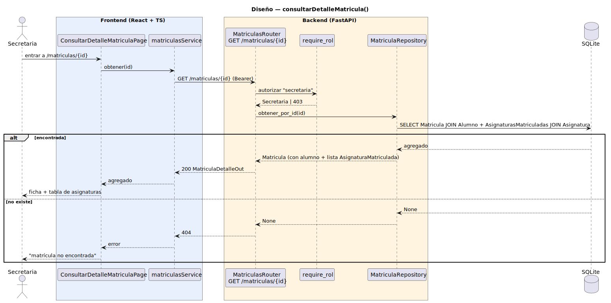

# CGU > consultarDetalleMatricula > Diseño

> | [🏠️](/README.md) | [Diseño](/RUP/02-diseño/README.md) | [Detalle](/RUP/00-requisitos/CasosDeUso/DetalladoCasosDeUso/Secretaria/consultarDetalleMatricula.puml) | [Análisis](/RUP/01-analisis/casos-uso/consultarDetalleMatricula/README.md) | **Diseño** | Desarrollo |
> |-|-|-|-|-|-|

## información del artefacto

- **Proyecto**: Centro de Gestión Universitaria (CGU)
- **Fase RUP**: Elaboración
- **Disciplina**: Diseño
- **Caso de uso**: `consultarDetalleMatricula()`
- **Actor**: Secretaria
- **Versión**: 1.0
- **Fecha**: 2026-06-01

## diagrama de secuencia

<div align=center>

||
|-|
|**Disciplina**: Diseño RUP<br>**Enfoque**: Diagrama de secuencia con tecnología concreta|

</div>

[Código PlantUML](secuencia.puml)

## participantes

| Participante | Rol |
|---|---|
| **ConsultarDetalleMatriculaPage** (React, ruta `/matriculas/{id}`) | "Ficha Matrícula": cabecera (alumno, curso académico, plan de estudios, facultad derivados) + tabla de asignaturas matriculadas |
| **matriculasService** (axios) | Método `obtener(id)` |
| **MatriculasRouter** (FastAPI) | Endpoint `GET /matriculas/{id}` |
| **require_rol** (dependency) | Autoriza exigiendo `tipo == "secretaria"` |
| **MatriculaRepository** (extendido) | `obtener_por_id(id) → Matricula | None` con eager-load del agregado completo |
| **SQLite** | Tablas `matriculas`, `asignaturas_matriculadas`, `asignaturas`, `usuarios` |

## materialización del análisis

| Mensaje del análisis | Materialización en diseño |
|---|---|
| `:Matriculas Abierto → ConsultarDetalleMatriculaView : consultarDetalleMatricula(id)` | Click en una fila de `MatriculasPage` → navegación SPA a `/matriculas/{id}` |
| `ConsultarDetalleMatriculaView → MatriculaController : cargarDetalle(id) : Matricula` | `GET /matriculas/{id}` |
| `MatriculaController → MatriculaRepository : obtenerPorId(id) : Matricula` | `MatriculaRepository.obtener_por_id(id)` con eager-load del agregado |
| Carga del agregado completo (alumno + asignaturas matriculadas + catálogo de asignatura) | Eager-load vía `selectinload(Matricula.asignaturas_matriculadas).joinedload(AsignaturaMatriculada.asignatura)` + `joinedload(Matricula.alumno)` en la consulta |

## decisiones de diseño

- **Sin capa de Service** — mismo patrón que [[consultarListaAlumnosSecretaria]] y `consultarUsuario`. Consulta read-only va Router → Repository directos. No hay reglas de negocio que orquestar — la única "lógica" es el shape de la consulta, que vive en el Repository.
- **Eager-load del agregado en una sola consulta** — `selectinload` para la relación 1:N `Matricula → AsignaturaMatriculada` (evita el problema de cardinalidad del `JOIN` que `joinedload` causaría) y `joinedload` para los 1:1 internos (`AsignaturaMatriculada → Asignatura`, `Matricula → Alumno`). Una sola request HTTP devuelve el agregado completo — paralelo a cómo `consultarSolicitudDispensa` ya devuelve `Alumno` y `Responsable` embebidos.
- **Sin paginación de asignaturas dentro del agregado** — un plan de Ingeniería tiene ~40 asignaturas máximo; cabe holgadamente en una respuesta. Si en algún momento aparecieran agregados grandes (másteres con muchas convocatorias acumuladas), se introduciría paginación dentro del detalle. Hoy YAGNI.
- **`facultad` y `plan_estudios` derivados de las asignaturas matriculadas** — viven en `Asignatura` (catálogo), no en `Matricula` (header). La cabecera de la ficha los muestra tomando el valor de la primera asignatura matriculada (asunción: todas las asignaturas de un mismo header pertenecen al mismo plan, garantizado por la coherencia del catálogo). Si en el futuro el plan de estudios cambia de la primera a la última asignatura, se promoverá a entidad propia. Hoy es decisión consciente de simplicidad.
- **`Acciones` futuras desde la ficha**: el análisis menciona "el detallado permite mantener la lista abierta para operaciones detalladas". Hoy no hay CU `editarMatricula` ni `anularMatricula` en el actor — la ficha es **estrictamente read-only**. Cuando entre `crearSolicitudDispensa` (Secretaria) y siguientes, podrían aparecer botones para iniciar una dispensa desde una `AsignaturaMatriculada` concreta — deuda blanda.
- **404 honesto al id inexistente** — `obtener_por_id` retorna `None`, el Router lo traduce a HTTP 404 y el frontend renderiza estado de error claro. Mismo patrón que `consultarUsuario`.
- **Misma URL para el detalle desde cualquier punto del agregado** — la ficha pertenece al **header** `Matricula`, no a cada `AsignaturaMatriculada`. Si la lista de `/matriculas` muestra una fila por header (decisión consistente con el modelo refactorizado de [[importarMatriculas]]), no hay ambigüedad de id.

## schema de salida

```
MatriculaDetalleOut {
  id: int,
  alumno: AlumnoEmbed { id, username, nombre, apellidos, email },
  curso_academico: str,
  fecha_importacion: datetime,
  responsable: ResponsableEmbed { id, nombre, apellidos } | null,
  plan_estudios: str,       // derivado: asignaturas_matriculadas[0].asignatura.plan_estudios
  facultad: str,            // derivado: asignaturas_matriculadas[0].asignatura.facultad
  asignaturas_matriculadas: [
    {
      id: int,
      n_matricula: int,
      asignatura: {
        id: int,
        codigo: str,
        nombre: str,
        ects: float,
        caracter: "OB" | "OP" | "FB",
        curso_plan: int,
      }
    }
  ]
}
```

`plan_estudios` y `facultad` se computan en el Router (no en SQL) tras cargar el agregado. `null` controlado si el agregado está vacío (no debería pasar — un header sin detalle es estado inconsistente, registrar log si ocurre).

## referencias

- [Análisis `consultarDetalleMatricula()`](/RUP/01-analisis/casos-uso/consultarDetalleMatricula/README.md)
- [Diseño `importarMatriculas()` — refactor del modelo agregado](/RUP/02-diseño/casos-uso/importarMatriculas/README.md)
- [Diseño `consultarListaAlumnosSecretaria()` — patrón gemelo de consulta](/RUP/02-diseño/casos-uso/consultarListaAlumnosSecretaria/README.md)
- [Detallado `consultarDetalleMatricula.puml`](/RUP/00-requisitos/CasosDeUso/DetalladoCasosDeUso/Secretaria/consultarDetalleMatricula.puml)
- [conversation-log.md](/conversation-log.md)
