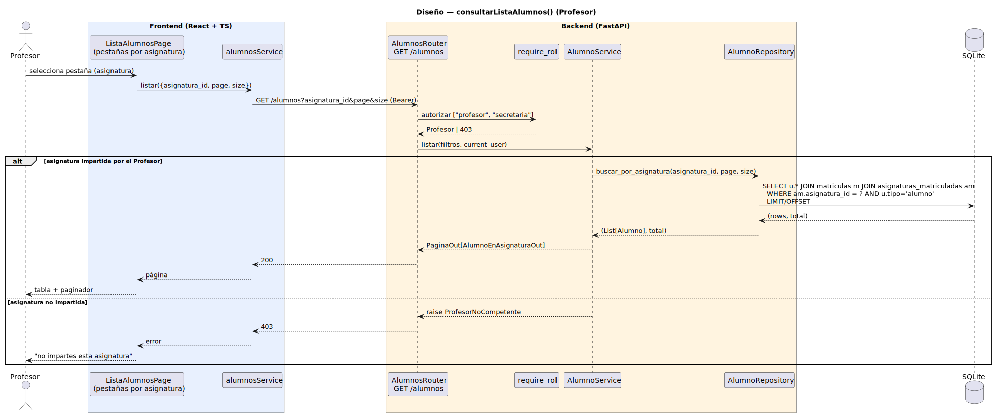

# CGU > consultarListaAlumnos (Profesor) > Diseño

> | [🏠️](/README.md) | [Diseño](/RUP/02-diseño/README.md) | [Detalle](/RUP/00-requisitos/CasosDeUso/DetalladoCasosDeUso/Profesor/consultarListaAlumnos.puml) | [Análisis](/RUP/01-analisis/casos-uso/consultarListaAlumnos/README.md) | **Diseño** | Desarrollo |
> |-|-|-|-|-|-|

## información del artefacto

- **Proyecto**: Centro de Gestión Universitaria (CGU)
- **Fase RUP**: Elaboración
- **Disciplina**: Diseño
- **Caso de uso**: `consultarListaAlumnos()` (Profesor)
- **Actor**: Profesor
- **Versión**: 1.0
- **Fecha**: 2026-06-02

## diagrama de secuencia

||
|-|
|**Disciplina**: Diseño RUP **Enfoque**: Diagrama de secuencia con tecnología concreta|

[Código PlantUML](secuencia.puml)

## participantes

| Participante | Rol |
|---|---|
| **ListaAlumnosPage** (React, ruta `/alumnos`) | Cabecera con pestañas (una por asignatura impartida; carga inicial vía `GET /profesores/yo/asignaturas`); tabla paginada de alumnos matriculados en la asignatura activa |
| **alumnosService** (axios) | Método `listar(filtros)` ya existente; pasa `asignatura_id` como query param adicional |
| **AlumnosRouter** (FastAPI) | Endpoint `GET /alumnos` ya existente — se amplía `require_rol` a `["profesor", "secretaria"]` y se añade query param `asignatura_id?` |
| **require_rol** (dependency) | Autoriza `["profesor", "secretaria"]` |
| **AlumnoService** | **Nuevo** — ramifica por rol: si Profesor, exige `asignatura_id` y verifica que `asignatura_id ∈ current_user.asignaturas_impartidas`; si Secretaria, `asignatura_id` opcional sin restricción |
| **AlumnoRepository** | Método nuevo `buscar_por_asignatura(asignatura_id, page, size)` — join `usuarios JOIN matriculas JOIN asignaturas_matriculadas` filtrado por asignatura |
| **SQLite** | Tablas `usuarios`, `matriculas`, `asignaturas_matriculadas`, `asignaturas` + tabla nueva `profesor_asignaturas` (ver "entidad nueva") |

## materialización del análisis

| Mensaje del análisis | Materialización en diseño |
|---|---|
| `:Listas Abierto → ConsultarListaAlumnosView : consultarListaAlumnos(asignatura)` | Click en pestaña de asignatura → `GET /alumnos?asignatura_id={id}` |
| `cargarLista(asignatura) : List<Alumno>` | `alumnosService.listar({asignatura_id, page, size})` |
| `obtenerPorAsignatura(asignatura) : List<Alumno>` | `AlumnoRepository.buscar_por_asignatura(asignatura_id, page, size)` con paginación server-side (igual que el listado de Secretaria) |
| Verificación "Profesor competente" en el Controller (regla emergente del análisis) | `AlumnoService.listar` valida `asignatura_id ∈ current_user.asignaturas_impartidas` antes de invocar al Repository; 403 `ProfesorNoCompetente` si no |
| Carga de pestañas (decisión de diseño abierta en el análisis) | Endpoint `GET /profesores/yo/asignaturas` retorna el catálogo de asignaturas impartidas por `current_user`. La página lo invoca al montar para construir las pestañas |

## decisiones de diseño

- **Tabla N:M `profesor_asignaturas` introducida en este ramillete** — cierra la deuda diferida en [crearSesionClase](/RUP/02-diseño/casos-uso/crearSesionClase/README.md) ("`profesor.asignaturas_impartidas` diferida hasta consultarListaAlumnos"). Es la primera vez que la relación es load-bearing: sin ella no se puede aplicar la regla "Profesor competente". Estructura: `(profesor_id PK→usuarios.id, asignatura_id PK→asignaturas.id)`, sin atributos adicionales (la asignación de docencia es binaria). Seed la pobla con `profesor1 → IYA038, IYA040, IYA041` o similar.
- **Defensa "Profesor competente" en el Service** — `AlumnoService.listar` consulta la tabla N:M antes de invocar al Repository. Si el cliente envía `asignatura_id` que no imparte, 403 `ProfesorNoCompetente`. Defensa en profundidad: aunque la UI solo muestre pestañas válidas, un cliente malicioso podría forjar la query. Coherente con la regla emergente del análisis.
- **Endpoint `GET /alumnos` extendido** — mismo recurso REST que la Secretaria, con query param `asignatura_id?` opcional. Service ramifica:
  - Rol Secretaria: `asignatura_id` opcional. Si presente, filtra; si ausente, lista todos los alumnos (comportamiento previo conservado).
  - Rol Profesor: `asignatura_id` **requerido** + defensa "Profesor competente".
  - Si el rol Profesor llega sin `asignatura_id`, 422 `AsignaturaRequerida`.
- **Sin Strategy `PoliticaAcceso`** — el ramillete actual tiene dos roles operando sobre Alumno, pero las firmas del Repository difieren (`buscar_alumnos(page, size, q)` Secretaria vs `buscar_por_asignatura(asignatura_id, page, size)` Profesor). Aplica la regla emergente: cuando la **signatura difiere**, métodos específicos del Service por rol; cuando solo la política varía, Strategy. Esta es la lección consolidada en [`crearSolicitudDispensaSecretaria`](/RUP/02-diseño/casos-uso/crearSolicitudDispensaSecretaria/README.md). Sin abstracción prematura.
- **Schema `AlumnoEnAsignaturaOut`** — distinto del `AlumnoListaItemOut` de la Secretaria. Lleva los campos académicos visibles en el prototipo (`carnet`/`curso_academico`/`estado_matricula`) derivados del join con `Matricula`. Mantener dos schemas separados es más honesto que un schema unión con campos `Optional` siempre llenos en un rol y `None` en otro.
- **Paginación server-side** reutilizando `PaginaOut[T]` — el prototipo del SDR muestra 332 elementos en 24 páginas; la paginación no es opcional. Mismo patrón que el listado de Secretaria.
- **Carga de pestañas vía endpoint dedicado `GET /profesores/yo/asignaturas`** — la página llama al endpoint al montar y guarda el resultado en estado local. Decisión sobre eager vs on-demand del análisis resuelta como eager (el dataset es pequeño: máximo decenas de asignaturas por profesor). Reutiliza la tabla `profesor_asignaturas`.
- **Sin filtro por "estado de matrícula"** en este CU — el prototipo lo muestra como columna pero no como filtro. La política "alumnos dados de baja aparecen sí/no" queda como deuda blanda; hoy aparecen todos los que estén matriculados (estado="activa", único valor en el seed).
- **Reconciliación nominal `LISTA_ABIERTA` vs `ALUMNOS_ABIERTO`** del análisis: el endpoint y la ruta no llevan ese nombre. La discrepancia del SDR queda sin tocar (el repo de origen) y se materializa unificada como `/alumnos` en código.

## entidad nueva introducida en este ramillete

| Entidad | Capa | Notas |
|---|---|---|
| `profesor_asignaturas` (tabla N:M) | modelo SQLAlchemy `app/models/profesor_asignatura.py` o como relación `Many-to-Many` declarada en `Usuario`/`Asignatura` con `secondary=` | Sin clase de dominio independiente — es una relación binaria. Acceso desde Python: `current_user.asignaturas_impartidas` (lazy="selectin") |
| Endpoint `GET /profesores/yo/asignaturas` | router `profesores.py` ligero | Devuelve `List[AsignaturaOut]` filtrado por la relación |

## referencias

- [Análisis `consultarListaAlumnos()`](/RUP/01-analisis/casos-uso/consultarListaAlumnos/README.md)
- [Diseño `consultarListaAlumnos()` (Secretaria) — endpoint base extendido aquí](/RUP/02-diseño/casos-uso/consultarListaAlumnosSecretaria/README.md)
- [Diseño `crearSesionClase()` — donde se difirió la tabla `profesor_asignaturas`](/RUP/02-diseño/casos-uso/crearSesionClase/README.md)
- [conversation-log.md](/conversation-log.md)
