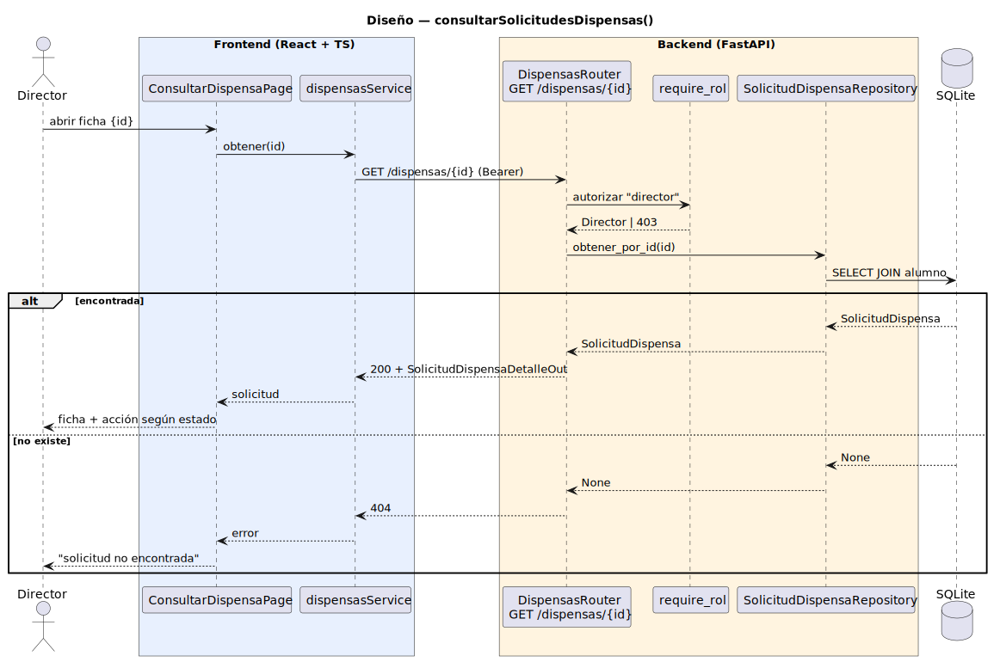

# CGU > consultarSolicitudesDispensas > Diseño

> | [🏠️](/README.md) | [Diseño](/RUP/02-diseño/README.md) | [Detalle](/RUP/00-requisitos/CasosDeUso/DetalladoCasosDeUso/DirectorDeGrado/consultarSolicitudesDispensas.puml) | [Análisis](/RUP/01-analisis/casos-uso/consultarSolicitudesDispensas/README.md) | **Diseño** | Desarrollo |
> |-|-|-|-|-|-|

## información del artefacto

- **Proyecto**: Centro de Gestión Universitaria (CGU)
- **Fase RUP**: Elaboración
- **Disciplina**: Diseño
- **Caso de uso**: `consultarSolicitudesDispensas()`
- **Actor**: DirectorDeGrado
- **Versión**: 1.0
- **Fecha**: 2026-05-30

## diagrama de secuencia

||
|-|
|**Disciplina**: Diseño RUP **Enfoque**: Diagrama de secuencia con tecnología concreta|

[Código PlantUML](secuencia.puml)

> El diagrama muestra **solo la fase de detalle**. La fase de **listado** (`GET /dispensas` desde `DispensasPage`) es estructuralmente idéntica al patrón de cualquier list endpoint genérico (auth → `Repository.obtener_todas` → 200 + lista), igual que el `GET /usuarios` que documentamos solo en el README de [`consultarUsuario`](/RUP/02-diseño/casos-uso/consultarUsuario/README.md). No se duplica en el diagrama. La parte de valor de diseño es el detalle con JOIN al `Alumno` propietario + el render condicional de acción según `estado`.

## participantes

| Participante | Rol |
|---|---|
| **ConsultarDispensaPage** (React, ruta `/dispensas/{id}`) | Ficha detalle con datos del Alumno + asignatura/periodo/horario + acción según estado |
| **dispensasService** (axios) | Cliente HTTP, método `obtener(id)` (también `listar()` para la `DispensasPage` no modelada) |
| **DispensasRouter** (FastAPI) | Endpoints `GET /dispensas` (listado complementario) y `GET /dispensas/{id}` (modelado en el diagrama) |
| **require_rol** (dependency) | Autoriza ambos endpoints exigiendo `tipo == "director"` |
| **SolicitudDispensaRepository** (SQLAlchemy) | `obtener_todas()` (para el listado) y `obtener_por_id(id)` (modelado) con JOIN al `Alumno` propietario |
| **SQLite** | Tabla `solicitudes_dispensa` + FK a `usuarios` |

## materialización del análisis

| Mensaje del análisis | Materialización en diseño |
|---|---|
| `:Sistema Disponible → ConsultarSolicitudesDispensasView : consultarSolicitudesDispensas()` | Navegación SPA a `/dispensas` desde la home del Director (fuera del diagrama) |
| `ConsultarSolicitudesDispensasView → SolicitudDispensaController : cargarSolicitudes()` | `dispensasService.listar()` → `GET /dispensas` — fuera del diagrama (patrón genérico list endpoint); **sin filtros server-side** por ahora (cuando entren Alumno/Secretaria se añadirán params opcionales `?estado=`, `?alumno=`) |
| `SolicitudDispensaController → SolicitudDispensaRepository : obtenerTodas()` | `SolicitudDispensaRepository.obtener_todas()` invocado por el listado |
| `ConsultarSolicitudesDispensasView → SolicitudDispensaController : abrirDetalle(id)` | **Lo que sí modela el diagrama** — click en una fila → navegación SPA a `/dispensas/{id}` + `dispensasService.obtener(id)` |
| `SolicitudDispensaController → SolicitudDispensaRepository : obtenerPorId(id)` | `SolicitudDispensaRepository.obtener_por_id(id)` con eager-load del `Alumno` para la ficha |
| `<<include>> editarSolicitudDispensa(id)` (opcional) | Botón en la ficha → `navigate("/dispensas/{id}/veredicto")`. Transición de navegación, no incluida en la secuencia. |

## decisiones de diseño

- **Master-detail materializado en dos endpoints, modelado solo el detalle** — el CU del análisis es master-detail, pero el listado (`GET /dispensas`) es estructuralmente igual a cualquier list endpoint del proyecto. Misma decisión que en [`consultarUsuario`](/RUP/02-diseño/casos-uso/consultarUsuario/README.md), donde el listado vivía solo en el README. El detalle individual también es accesible vía URL `/dispensas/{id}` (deep-link), pero el flujo natural es lista → click.
- **Sin filtros server-side en este ramillete** — el Director ve todo y sin parámetros. Cuando Alumno entre con "solo propias" y Secretaria con filtros explícitos (`?estado=PENDIENTE`, `?alumno=X`), el `GET /dispensas` aceptará query params opcionales. YAGNI hoy.
- **`SolicitudDispensa` debuta como entidad del dominio** — tabla `solicitudes_dispensa`, FK `alumno_id` y `responsable_id` a `usuarios.id`. Es la primera entidad del dominio que se materializa (cierre de la deuda máxima del análisis). El detalle de columnas y la state machine viven documentados en el diseño de [editarSolicitudDispensa](/RUP/02-diseño/casos-uso/editarSolicitudDispensaDirector/README.md).
- **Render condicional de la acción por estado** — la ficha muestra distintos botones según `solicitud.estado`: "Iniciar revisión" si `PENDIENTE`, "Aprobar"/"Rechazar" si `EN_REVISION`, ninguno si terminal (`APROBADA`/`RECHAZADA`/`ANULADA`). La página de veredicto se encarga del PATCH; aquí solo se muestra el estado actual.
- **Polimorfismo del Controller diferido** — el análisis dejó tres caminos abiertos para gestionar "el mismo Repository, distintas políticas por rol" (métodos por rol / Strategy `PoliticaAcceso` / Controllers especializados). En este ramillete solo opera el Director, así que no se introduce abstracción. Cuando el Alumno entre con "solo propias" y la Secretaria con filtros, se elegirá el patrón con los casos concretos delante.
- **`require_rol(["director"])` reutilizado del ramillete Administrador** — patrón consolidado.
- **404 honesto en el detalle** — `obtener_por_id` retorna `None` → 404 explícito → mensaje en frontend.

## referencias

- [Análisis `consultarSolicitudesDispensas()`](/RUP/01-analisis/casos-uso/consultarSolicitudesDispensas/README.md)
- [Detallado `consultarSolicitudesDispensas()`](/RUP/00-requisitos/CasosDeUso/DetalladoCasosDeUso/DirectorDeGrado/consultarSolicitudesDispensas.puml)
- [Diseño `editarSolicitudDispensa()` (Director)](/RUP/02-diseño/casos-uso/editarSolicitudDispensaDirector/README.md)
- [Diseño `consultarUsuario()`](/RUP/02-diseño/casos-uso/consultarUsuario/README.md) — patrón de read-only ya consolidado
- [conversation-log.md](/conversation-log.md)
