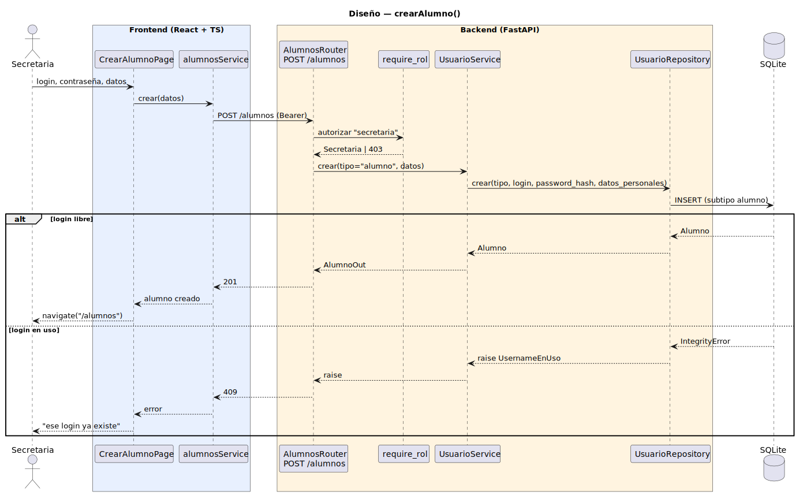

# CGU > crearAlumno > Diseño

> | [🏠️](/README.md) | [Diseño](/RUP/02-diseño/README.md) | Detalle | [Análisis](/RUP/01-analisis/casos-uso/crearAlumno/README.md) | **Diseño** | Desarrollo |
> |-|-|-|-|-|-|

## información del artefacto

- **Proyecto**: Centro de Gestión Universitaria (CGU)
- **Fase RUP**: Construction
- **Disciplina**: Diseño
- **Caso de uso**: `crearAlumno()`
- **Actor**: Secretaria
- **Versión**: 1.0
- **Fecha**: 2026-06-11

## diagrama de secuencia

||
|-|
|**Disciplina**: Diseño RUP **Enfoque**: Diagrama de secuencia con tecnología concreta|

[Código PlantUML](secuencia.puml)

## participantes

| Participante | Rol |
|---|---|
| **CrearAlumnoPage** (React, ruta `/alumnos/nuevo`) | Formulario único: login + contraseña + datos personales (nombre, apellidos, email, teléfono opcional) |
| **alumnosService** (axios) | Cliente HTTP para `/alumnos` (extendido con `crear(datos)`) |
| **AlumnosRouter** (FastAPI) | `POST /alumnos` (nuevo endpoint sobre el router preexistente) |
| **require_rol** (dependency) | Autoriza con `current_user.tipo == "secretaria"` |
| **UsuarioService** | Reutilizado: hash de contraseña + delegación al repositorio polimórfico |
| **UsuarioRepository** (SQLAlchemy) | Reutilizado: `crear(tipo, …)` con despacho polimórfico al subtipo concreto |
| **SQLite** | Tabla `usuarios` con `UNIQUE(username)` y discriminador `tipo` (STI heredado) |

## materialización del análisis

| Mensaje del análisis | Materialización en diseño |
|---|---|
| `CrearAlumnoView → AlumnoController : validarUnicidad(login)` + `existeLogin(login)` | `UNIQUE(username)` de BD + captura `IntegrityError` → 409. Un único POST en lugar de pre-check separado. Mismo patrón que [[crearUsuario]]. |
| `CrearAlumnoView → AlumnoController : crearAlumno(login, contraseña, datos)` | `POST /alumnos` con body `{ login, password, nombre, apellidos, email, telefono? }` → 201 + `AlumnoOut` |
| `AlumnoController → UsuarioRepository : crear(tipo="alumno", login, contraseña, datos)` | `UsuarioService.crear(datos, tipo="alumno")` (hash bcrypt) → `UsuarioRepository.crear(tipo, username, password_hash, datos_personales)` |
| `DatosPersonalesAlumno` (value object del análisis) | `CrearAlumnoRequest` (schema Pydantic). El "value object" se materializa como modelo Pydantic con los 4 campos personales. En el wire HTTP viaja **aplanado** dentro del body junto a `login` y `password` (ergonomía del formulario); el agrupamiento conceptual del análisis se preserva al pasar `datos` como una unidad entre service y repository. |
| Choice point "login en uso" | 409 → mensaje inline en el form |

## decisiones de diseño

- **Canal HTTP separado: `POST /alumnos`, no `POST /usuarios`** — el reparto Administrador (cuentas de personal) ↔ Secretaria (datos académicos) se materializa también en la superficie REST. Cada actor opera su propio recurso. Complemento: `POST /usuarios` debe **rechazar `tipo="alumno"` con 422** y mensaje explícito ("Use POST /alumnos como Secretaria") — la superficie HTTP no debe permitir saltarse el canal. La decisión es paralela a la separación entre `POST /usuarios` (alta) y `POST /sesiones` (login) — distintos verbos para distintos actos, aunque ambos toquen la tabla `usuarios`.

- **`UsuarioService.crear` reutilizado, no `AlumnoService` nuevo** — el polimorfismo de instanciación ya vive en `UsuarioRepository.crear(tipo, …)` desde [[crearUsuario]]. Crear un `AlumnoService` duplicaría la lógica de hash y reconstruiría el despacho. La firma del service crece para aceptar `tipo` como argumento (antes implícito en el body del request); el router de `/alumnos` lo fija a `"alumno"` antes de invocar al service. Mismo precedente: `GradoService` reutiliza el patrón de service fino aunque la lógica sea mínima, pero allí no había alternativa de delegación — aquí sí, así que se delega.

- **`require_rol(["secretaria"])` simple, sin scoping por grado** — el alta de alumno es operación de Secretaría (departamento colectivo, [[gestionarCatalogoGrados]] estableció que la Secretaría no está scopeada por grado), por lo que cualquier Secretaria puede dar de alta cualquier alumno. El grado del alumno se deriva en su momento desde sus matrículas (M7), no se asigna en el alta — esto evita acoplar este CU al catálogo de grados antes de tiempo.

- **`DatosPersonalesAlumno` se materializa como modelo Pydantic, no como clase de dominio aparte** — el análisis identificó el value object para resolver el smell "Long Parameter List"; en diseño la materialización natural es `CrearAlumnoRequest` (Pydantic). El cuerpo HTTP viaja aplanado por ergonomía del formulario, pero la abstracción conceptual del "bundle" se preserva: dentro del backend, `datos` se pasa como unidad entre service y repository sin descomponerse. Lo mismo hizo [[crearSesionClase]] con `CrearSesionClaseRequest` materializando `DatosSesionClase`.

- **Ruta `/alumnos/nuevo` en lugar de modal** — coherencia con `/usuarios/nuevo` de [[crearUsuario]]. Permite enlace directo, refresco sin perder estado y evita el "cierro modal sin guardar".

- **Validación de unicidad sin pre-check** — el `UNIQUE(username)` de la BD es la autoridad. Un endpoint adicional `check-login` introduciría duplicación y race condition. Mismo patrón que [[crearUsuario]] y [[gestionarCatalogoGrados]].

- **El botón "+ Nuevo alumno" en `/alumnos` solo visible para Secretaria** — el listado de alumnos hoy lo ven Profesor y Secretaria (con scoping distintos en [[consultarListaAlumnos]] / [[consultarListaAlumnosSecretaria]]). El acceso al alta es exclusivo de Secretaria: condicional en el `Layout`/`AlumnosPage` por rol.

- **En `CrearUsuarioPage` (Administrador) se retira la opción `alumno` del `<select>` de tipo** — sin opción cliente + rechazo backend = doble defensa coherente. El cliente no presenta lo que ya no debe; el backend rechaza por si acaso.

## referencias

- [Análisis `crearAlumno()`](/RUP/01-analisis/casos-uso/crearAlumno/README.md)
- [Diseño `crearUsuario()`](/RUP/02-diseño/casos-uso/crearUsuario/README.md) — patrón espejado
- [Diseño `crearSesionClase()`](/RUP/02-diseño/casos-uso/crearSesionClase/README.md) — materialización de value object con Pydantic
- [Diseño `gestionarCatalogoGrados()`](/RUP/02-diseño/casos-uso/gestionarCatalogoGrados/README.md) — precedente del split router/service/repository fino
- [conversation-log.md](/conversation-log.md)
