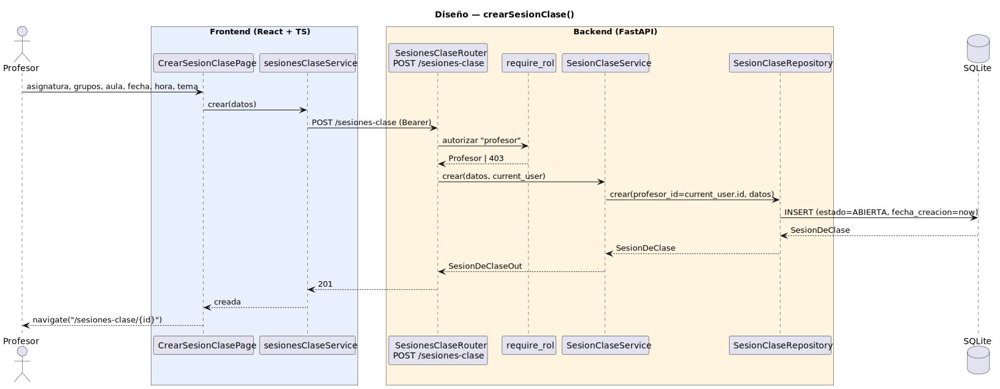

# CGU > crearSesionClase > Diseño

> | [🏠️](/README.md) | [Diseño](/RUP/02-diseño/README.md) | [Detalle](/RUP/00-requisitos/CasosDeUso/DetalladoCasosDeUso/Profesor/crearSesionClase.puml) | [Análisis](/RUP/01-analisis/casos-uso/crearSesionClase/README.md) | **Diseño** | Desarrollo |
> |-|-|-|-|-|-|

## información del artefacto

- **Proyecto**: Centro de Gestión Universitaria (CGU)
- **Fase RUP**: Elaboración
- **Disciplina**: Diseño
- **Caso de uso**: `crearSesionClase()`
- **Actor**: Profesor
- **Versión**: 1.0
- **Fecha**: 2026-06-02

> **Nota — Asignatura promovida con FK a `Grado`.** Una revisión posterior restauró la entidad `Grado` del SDR. En este CU el cambio se manifiesta en la tabla `sesiones_clase` solo de forma indirecta — la sesión no toca grado, pero su `asignatura_id` apunta a una `Asignatura` que ahora ya no tiene `plan_estudios` ni `facultad` como strings libres, sino una FK `grado_id`. El `AsignaturaOut` que devuelve `GET /sesiones-clase/{id}` y `POST /sesiones-clase` lleva el `grado` anidado. Diagrama y decisiones de la sesión, intactos. Detalle en [[gestionarCatalogoGrados]].

## diagrama de secuencia

||
|-|
|**Disciplina**: Diseño RUP **Enfoque**: Diagrama de secuencia con tecnología concreta|

[Código PlantUML](secuencia.puml)

## participantes

| Participante | Rol |
|---|---|
| **CrearSesionClasePage** (React, ruta `/sesiones-clase/nuevo`) | Form con selector de Asignatura (dropdown contra `GET /asignaturas`), grupos (multi, chips), aula, fecha, hora inicio/fin y tema |
| **sesionesClaseService** (axios) | Método `crear(datos)` — `POST /sesiones-clase` con body único (Parameter Object del análisis materializado como schema Pydantic) |
| **SesionesClaseRouter** (FastAPI) | Endpoint `POST /sesiones-clase` con `require_rol(["profesor"])` a nivel router |
| **require_rol** (dependency) | Autoriza solo `"profesor"` — única guard del CU (sin Strategy, ver decisiones) |
| **SesionClaseService** | Auto-puebla `profesor_id = current_user.id`, valida datos básicos (hora_fin > hora_inicio), persiste con `estado = ABIERTA` |
| **SesionClaseRepository** | Método `crear(profesor_id, datos)` — instancia `SesionDeClase` e inserta |
| **SQLite** | Tabla nueva `sesiones_clase` (ver "modelo nuevo" abajo) |

## materialización del análisis

| Mensaje del análisis | Materialización en diseño |
|---|---|
| `:Asistencias Abierto → CrearSesionClaseView : crearSesionClase()` | Click "+ Nueva sesión" en `SesionesClasePage` (listado del Profesor) → `/sesiones-clase/nuevo` |
| `validarDatosIniciales(datos) : boolean` | Validación cliente-side (campos obligatorios, hora_fin > hora_inicio) + revalidación en `SesionClaseService` antes de persistir. Sin endpoint dedicado. |
| `crearSesionClase(datos) : SesionDeClase` | `POST /sesiones-clase` con body `{asignatura_id, grupos, aula, fecha, hora_inicio, hora_fin, tema}` |
| `crear(profesor, datos) : SesionDeClase` | El Service auto-puebla `profesor_id = current_user.id` (defensa: si el cliente lo mandara, se descarta por `extra="ignore"` en el schema) |
| Transición `iniciarSesionClase(sesion)` → `:Sesion Asistencia Abierta` | `estado = ABIERTA` se persiste en el INSERT. Tras 201, navega a `/sesiones-clase/{id}` (vista de la sesión activa, que en el próximo CU será también la pantalla de `registrarTomaAsistencia`) |

## decisiones de diseño

- **`DatosSesionClase` del análisis → `CrearSesionClaseRequest` Pydantic** — el value object queda materializado como schema de transporte, sin clase adicional en el Service. Es el Parameter Object real (un único body, una sola firma); duplicarlo con un dataclass interno sería ruido.
- **`SesionDeClase` debuta como entidad de dominio** — cierre de la deuda urgente del análisis. Tabla `sesiones_clase` con columnas:
  - `id` PK
  - `profesor_id` FK → `usuarios.id` (auto-poblado por Service)
  - `asignatura_id` FK → `asignaturas.id` (catálogo introducido por [importarMatriculas](/RUP/02-diseño/casos-uso/importarMatriculas/README.md))
  - `grupos` lista JSON de strings (libres, ver decisión abajo), `aula` string
  - `fecha` date, `hora_inicio` time, `hora_fin` time, `tema` string
  - `estado` enum `EstadoSesionClase = {ABIERTA, CERRADA}`
  - `fecha_creacion` datetime (default `now`)
  - Sin `UNIQUE` adicional — el detallado no exige unicidad (`profesor + fecha + hora` podría chocar por solapamiento real). Deuda blanda registrada.
- **`grupos` lista de strings libres y `aula` string libre** (no catálogos) — YAGNI. No hay CU de gestión administrativa para ellos. La cardinalidad N en `grupos` se introdujo post-base tras detectar el caso real (una sesión de Inglés sirve a varias titulaciones a la vez); se modeló como JSON list en la misma columna y no como entidad `Grupo` porque "3A en IYA040" no es la misma cosa que "3A en IYA041" — son etiquetas contextuales, no entidades con identidad reusable. Si en el futuro entra "gestionar aulas" o Grupo gana atributos propios (tutor, capacidad), se promueven a catálogos con FK; la migración es barata. Coherente con cómo `SolicitudDispensa` arrancó con strings antes de que entrara `AsignaturaMatriculada`.
- **`profesor.asignaturas_impartidas` diferida** — hoy el Profesor puede elegir **cualquier asignatura del catálogo**. El análisis identifica esta deuda en [consultarSolicitudDispensaProfesor](/RUP/01-analisis/casos-uso/consultarSolicitudDispensaProfesor/README.md); aquí la posponemos porque el CU `crearSesionClase` funciona sin esa restricción y forzarla ahora requeriría seed manual de la relación N:M sin un CU dueño. Se materializará cuando entre `consultarListaAlumnos` del Profesor (donde la relación es crítica para el filtrado de alumnos por asignatura impartida).
- **Sin `PoliticaAcceso` para `SesionDeClase`** — solo el Profesor opera con sesiones de clase. La Strategy del módulo `politica_acceso.py` nace en el ramillete Alumno con dos roles concretos delante; introducirla aquí con un único rol sería abstracción prematura. Coherente con la lección del polimorfismo del Controller diferido en el ramillete Director.
- **Estado inicial `ABIERTA`** — el análisis modela la transición `crearSesionClase → SESION_ASISTENCIA_ABIERTA` como un estado activo. Lo materializamos como enum desde el día 1 (no `bool cerrada`) para alinear con la state machine de `SolicitudDispensa` y porque `cerrarSesionClase` (siguiente CU) hará `ABIERTA → CERRADA` validada en el Service.
- **`profesor_id` auto-poblado desde sesión** — patrón consolidado del proyecto (memoria `feedback_auditoria_coherente_por_entidad`). Schema `extra="ignore"` descarta `profesor_id` si llega en el body (defensa contra suplantación, igual que `tipo` en `EditarUsuarioRequest`).
- **`asignatura_id` libre del catálogo** — la UI muestra `GET /asignaturas` (endpoint nuevo simple, sin paginación de catálogo: ~5-50 asignaturas máximo). Sin filtro por "imparte" como se justificó arriba.
- **Endpoint `POST /sesiones-clase`** (recurso explícito, en kebab-case por coherencia con el resto del proyecto: `/dispensas`, `/matriculas`, `/alumnos`). Sin alias `/asistencias` aunque el detallado y la cabecera del prototipo lo llamen así — el recurso REST es la sesión; las asistencias se cuelgan de ella en su propio CU.
- **Navegación tras 201: a `/sesiones-clase/{id}`** (vista de la sesión activa), no a un listado ni a otro form. Coherente con la decisión del análisis "el CU termina en estado activo, no en listado". Esta vista será la base sobre la que se monten los siguientes CUs del bloque (`editarSesionClase` in-situ, `registrarTomaAsistencia`, `cerrarSesionClase`).

## entidades nuevas introducidas en este ramillete

| Entidad | Capa | Notas |
|---|---|---|
| `SesionDeClase` | modelo SQLAlchemy `app/models/sesion_clase.py` | Tabla `sesiones_clase`. Relaciones `lazy="joined"` a `asignatura` y `profesor` (mismo patrón que `SolicitudDispensa`) |
| `EstadoSesionClase` | enum en el modelo | `ABIERTA`, `CERRADA`. Ampliable con `CANCELADA` si entra como deuda |
| `CrearSesionClaseRequest` | schema Pydantic `app/schemas/sesiones_clase.py` | Parameter Object materializado |
| `SesionDeClaseOut` | schema Pydantic | Lleva `asignatura` y `profesor` embebidos (mínimo) para evitar round-trip extra en la ficha |
| `SesionClaseService` | `app/services/sesion_clase_service.py` | Excepciones `SesionClaseInvalida` (422 datos), `SesionClaseNoEncontrada` (404) |
| `SesionClaseRepository` | `app/repositories/sesion_clase_repository.py` | `crear`, `obtener_por_id`, `listar_por_profesor` |
| Catálogo `GET /asignaturas` | router ligero | Lectura simple del catálogo seed |

## referencias

- [Análisis `crearSesionClase()`](/RUP/01-analisis/casos-uso/crearSesionClase/README.md)
- [Diseño `crearSolicitudDispensa()` (Alumno) — patrón de propietario implícito](/RUP/02-diseño/casos-uso/crearSolicitudDispensa/README.md)
- [Diseño `importarMatriculas()` — debut del catálogo `Asignatura`](/RUP/02-diseño/casos-uso/importarMatriculas/README.md)
- [conversation-log.md](/conversation-log.md)
