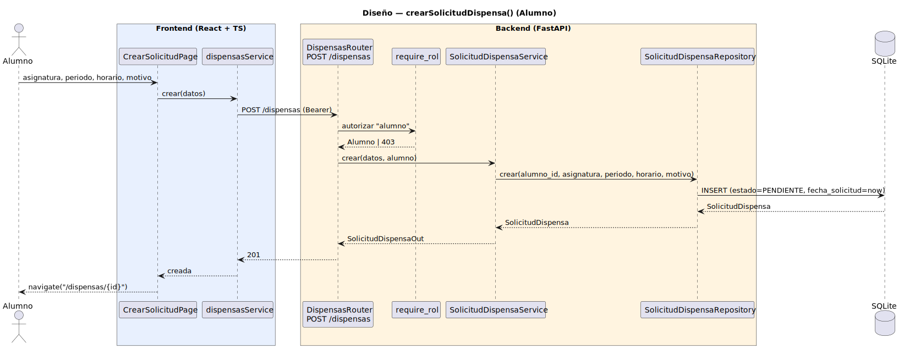

# CGU > crearSolicitudDispensa (Alumno) > Diseño

> | [🏠️](/README.md) | [Diseño](/RUP/02-diseño/README.md) | [Detalle](/RUP/00-requisitos/CasosDeUso/DetalladoCasosDeUso/Alumno/crearSolicitudDispensa.puml) | [Análisis](/RUP/01-analisis/casos-uso/crearSolicitudDispensa/README.md) | **Diseño** | Desarrollo |
> |-|-|-|-|-|-|

## información del artefacto

- **Proyecto**: Centro de Gestión Universitaria (CGU)
- **Fase RUP**: Elaboración
- **Disciplina**: Diseño
- **Caso de uso**: `crearSolicitudDispensa()` (Alumno)
- **Actor**: Alumno
- **Versión**: 1.0
- **Fecha**: 2026-05-30

## diagrama de secuencia

||
|-|
|**Disciplina**: Diseño RUP **Enfoque**: Diagrama de secuencia con tecnología concreta|

[Código PlantUML](secuencia.puml)

## participantes

| Participante | Rol |
|---|---|
| **CrearSolicitudPage** (React, ruta `/dispensas/nuevo`) | Form con asignatura + periodo + horario + motivo |
| **dispensasService** (axios) | Cliente HTTP, método `crear(datos)` |
| **DispensasRouter** (FastAPI) | Endpoint `POST /dispensas` |
| **require_rol** (dependency) | Autoriza exigiendo `tipo == "alumno"` (Director y Secretaria no crean aquí — la Secretaria creará en su propio CU del ramillete futuro) |
| **SolicitudDispensaService** | Inyecta `alumno_id` desde la sesión (resolución implícita del propietario) y delega al repositorio |
| **SolicitudDispensaRepository** (SQLAlchemy) | `crear(alumno_id, asignatura, periodo, horario, motivo)` con `estado=PENDIENTE` por defecto |
| **SQLite** | Tabla `solicitudes_dispensa` |

## materialización del análisis

| Mensaje del análisis | Materialización en diseño |
|---|---|
| `:Dispensas Abierto → CrearSolicitudDispensaView : crearSolicitudDispensa()` | Click "+ Nueva solicitud" en el listado del Alumno → navegación SPA a `/dispensas/nuevo` |
| Form con asignatura + periodo + horario | `CrearSolicitudPage` con `motivo` también (campo común del detallado) |
| `CrearSolicitudDispensaView → SolicitudDispensaController : validar(...) + crear(...)` | `POST /dispensas` con body `{ asignatura, periodo, horario, motivo }` |
| Resolución implícita del Alumno propietario | `alumno_id = current_user.id` dentro del Service (cliente no lo envía, no puede falsearlo) |
| `<<include>> editarSolicitudDispensa(solicitudNueva)` | Tras 201, `navigate("/dispensas/{id}")` a la ficha de consulta. El usuario puede pulsar "Editar" desde ahí si quiere refinar. Decisión inversa al patrón `crearUsuario → /usuarios/{id}/editar` porque aquí el form ya recoge todos los campos necesarios. |

## decisiones de diseño

- **`POST /dispensas` único endpoint para creación** — solo permite Alumno; cuando llegue la Secretaria en su ramillete tendrá un endpoint distinto (`POST /dispensas/en-nombre-de`) o se ampliará este con un campo opcional `alumno_id` y permisos para Secretaria. Hoy YAGNI.
- **`alumno_id` resuelto desde `Sesion.usuario.id`**, no en el body — patrón "propietario implícito" consolidado (mismo en `crearUsuario`). Evita suplantación si el cliente pudiera editar quién es el propietario.
- **`estado = PENDIENTE`** automático al crear — no es input del usuario. El default en el modelo SQLAlchemy se respeta.
- **`fecha_solicitud = now()`** automático — `server_default=func.now()` en el modelo, ya en uso.
- **Navegación a la consulta tras 201**, no a la edición — el form ya cubre los 4 campos editables del Alumno (`asignatura`, `periodo`, `horario`, `motivo`); no hay nada más que añadir. El usuario verá la solicitud creada con estado PENDIENTE y podrá pulsar "Editar" si quiere ajustar antes de que el Director la tome para revisión.
- **Form sin campo `tipo` ni `estado`** — coherencia con `crearUsuario` que tampoco expone el discriminador. El cliente solo envía datos del dominio; el Service rellena lo que toca.

## referencias

- [Análisis `crearSolicitudDispensa()` (Alumno)](/RUP/01-analisis/casos-uso/crearSolicitudDispensa/README.md)
- [Detallado `crearSolicitudDispensa.puml`](/RUP/00-requisitos/CasosDeUso/DetalladoCasosDeUso/Alumno/crearSolicitudDispensa.puml)
- [Diseño `crearUsuario()`](/RUP/02-diseño/casos-uso/crearUsuario/README.md) — patrón POST consolidado
- [conversation-log.md](/conversation-log.md)
