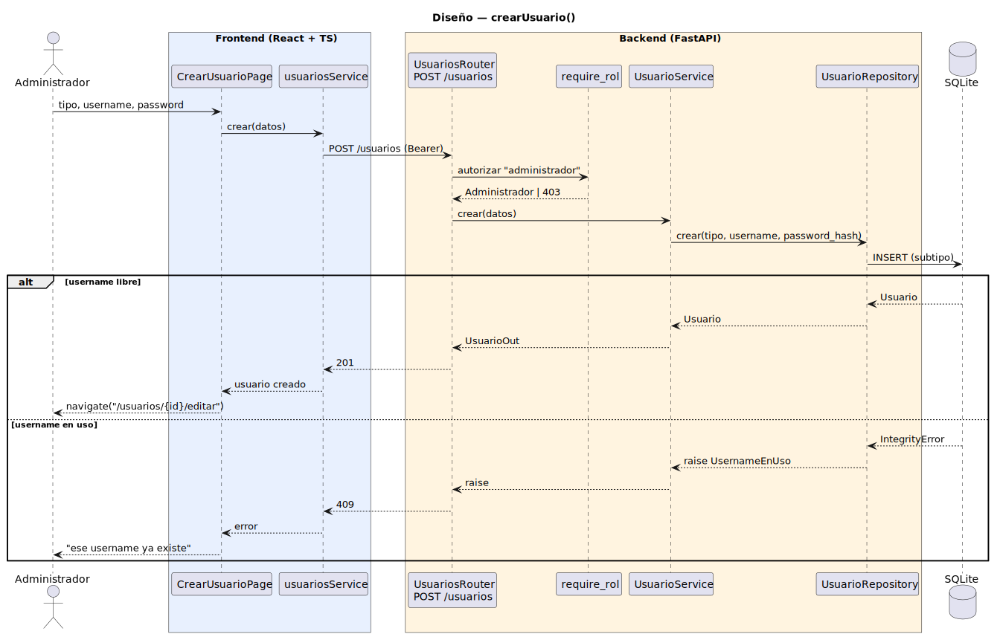

# CGU > crearUsuario > Diseño

> | [🏠️](/README.md) | [Diseño](/RUP/02-diseño/README.md) | [Detalle](/RUP/00-requisitos/CasosDeUso/DetalladoCasosDeUso/Administrador/crearUsuario.puml) | [Análisis](/RUP/01-analisis/casos-uso/crearUsuario/README.md) | **Diseño** | Desarrollo |
> |-|-|-|-|-|-|

## información del artefacto

- **Proyecto**: Centro de Gestión Universitaria (CGU)
- **Fase RUP**: Elaboración
- **Disciplina**: Diseño
- **Caso de uso**: `crearUsuario()`
- **Actor**: Administrador
- **Versión**: 1.0
- **Fecha**: 2026-05-30

## diagrama de secuencia

||
|-|
|**Disciplina**: Diseño RUP **Enfoque**: Diagrama de secuencia con tecnología concreta|

[Código PlantUML](secuencia.puml)

## participantes

| Participante | Rol |
|---|---|
| **CrearUsuarioPage** (React, ruta `/usuarios/nuevo`) | Form con selector de tipo + username + password |
| **usuariosService** (axios) | Cliente HTTP para `/usuarios` |
| **UsuariosRouter** (FastAPI) | Endpoint `POST /usuarios` |
| **require_rol** (dependency) | Autoriza el endpoint exigiendo `current_user.tipo == "administrador"` |
| **UsuarioService** | Hash de contraseña y delegación al repositorio |
| **UsuarioRepository** (SQLAlchemy) | `crear(tipo, username, password_hash)` con despacho polimórfico al subtipo concreto |
| **SQLite** | Tabla `usuarios` con `UNIQUE(username)` |

## materialización del análisis

| Mensaje del análisis | Materialización en diseño |
|---|---|
| `CrearUsuarioView → UsuarioController : validarUnicidad(login)` + `existeLogin(login)` | `UNIQUE` sobre `username` + captura `IntegrityError` → 409. Un único POST en lugar de pre-check separado. |
| `CrearUsuarioView → UsuarioController : crearUsuario(tipo, login, contraseña)` | `POST /usuarios` con body `{ tipo, username, password }` → 201 + `UsuarioOut` |
| `UsuarioController → UsuarioRepository : crear(tipo, login, contraseña)` | `UsuarioService.crear(datos)` (hash bcrypt) → `UsuarioRepository.crear(tipo, username, password_hash)` |
| Despacho polimórfico en Repository | Mapa explícito `{"alumno": Alumno, "profesor": Profesor, "director": DirectorDeGrado, "secretaria": SecretariaAcademica, "administrador": Administrador}` → instancia subtipo |
| `<<include>> editarUsuario(usuarioNuevo)` | Tras 201, `navigate("/usuarios/{id}/editar")` en el frontend. Transición de navegación, no inclusión de lógica. |
| Choice point "login en uso" | 409 → mensaje inline en el form |

## decisiones de diseño

- **Validación de unicidad sin pre-check** — el `UNIQUE(username)` de la BD ya es autoridad; un endpoint adicional `check-username` sería duplicar la verificación y añadir una race condition (libre al perder foco, en uso al enviar). Una sola llamada `POST` con captura de `IntegrityError` → 409 es más honesta y menos código.
- **`hash_password` en `core/security`, no en `AuthService`** — función pura sin estado, reutilizable desde el alta y desde un futuro cambio de contraseña. `AuthService` la importa para `verify_password`; el patrón se invierte para el alta. SRP estricto.
- **Despacho polimórfico con mapa explícito** — `{tipo: clase}` en `UsuarioRepository` en lugar de introspección de `Usuario.__mapper__.polymorphic_map`. SQLAlchemy hace lo mismo por debajo; el mapa explícito es greppeable, falla al añadir un subtipo sin actualizarlo (deseable) y deja la decisión de modelado visible en código.
- **`require_rol(["administrador"])` paramétrico desde el primer endpoint** — dependency genérica que recibe la lista de roles permitidos. Profesor, Secretaria y Director tendrán dependencies análogas (`require_rol(["profesor"])`, …) sin proliferación de funciones específicas. La jerarquía multi-rol del Administrador (es admin, profesor, alumno, …) se resuelve en el cuerpo del dependency si en algún futuro se necesita: hoy basta con `tipo == rol_permitido`.
- **Ruta `/usuarios/nuevo` en lugar de modal** — coherencia con `/usuarios/{id}/editar` del siguiente CU, evita el problema de "cierro el modal sin guardar". El estado `:Usuarios Abierto` del análisis se materializa como `UsuariosPage` (no representado en la secuencia para evitar ruido — la navegación entrante es UI, no diseño).
- **`UsuarioService` introducido entre Router y Repository** — el análisis tenía `UsuarioController` orquestando hash + persistencia. En diseño se parte: `UsuariosRouter` valida formato y autoriza, `UsuarioService` aplica reglas de negocio (hash, futuras validaciones), `UsuarioRepository` solo I/O. Mismo split que `AuthService` / `UsuarioRepository` en iniciarSesion.

## referencias

- [Análisis `crearUsuario()`](/RUP/01-analisis/casos-uso/crearUsuario/README.md)
- [Detallado `crearUsuario()`](/RUP/00-requisitos/CasosDeUso/DetalladoCasosDeUso/Administrador/crearUsuario.puml)
- [Diseño `iniciarSesion()`](/RUP/02-diseño/casos-uso/iniciarSesion/README.md)
- [conversation-log.md](/conversation-log.md)
