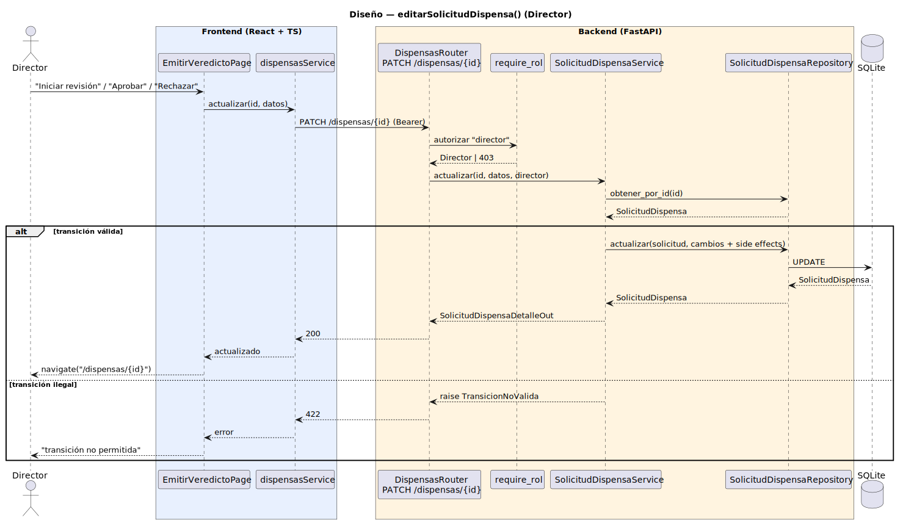

# CGU > editarSolicitudDispensa (Director) > Diseño

> | [🏠️](/README.md) | [Diseño](/RUP/02-diseño/README.md) | [Detalle](/RUP/00-requisitos/CasosDeUso/DetalladoCasosDeUso/DirectorDeGrado/EditarSolicitud.puml) | [Análisis](/RUP/01-analisis/casos-uso/editarSolicitudDispensaDirector/README.md) | **Diseño** | Desarrollo |
> |-|-|-|-|-|-|

## información del artefacto

- **Proyecto**: Centro de Gestión Universitaria (CGU)
- **Fase RUP**: Elaboración
- **Disciplina**: Diseño
- **Caso de uso**: `editarSolicitudDispensa()` (Director — emisión de veredicto)
- **Actor**: DirectorDeGrado
- **Versión**: 1.0
- **Fecha**: 2026-05-30

## diagrama de secuencia

<div align=center>

||
|-|
|**Disciplina**: Diseño RUP<br>**Enfoque**: Diagrama de secuencia con tecnología concreta|

</div>

[Código PlantUML](secuencia.puml)

> El diagrama muestra **solo la fase de PATCH**. La carga inicial (`GET /dispensas/{id}` al montar la página de veredicto) es idéntica a la fase de detalle de [`consultarSolicitudesDispensas`](/RUP/02-diseño/casos-uso/consultarSolicitudesDispensas/secuencia.svg) — el `EmitirVeredictoPage` reutiliza `dispensasService.obtener(id)`. No se duplica.

## state machine de `SolicitudDispensa`

Decisión central de este ramillete. Cinco estados, cinco transiciones legales:

```
                  Alumno (futuro)
PENDIENTE ─────────────────────────► ANULADA  (terminal)
    │
    │ Director: "Iniciar revisión"
    ▼
EN_REVISION
    │
    ├── Director: "Aprobar" ──► APROBADA  (terminal)
    └── Director: "Rechazar" ─► RECHAZADA (terminal)
```

| Transición | Quién la dispara | Side effects auto-poblados |
|---|---|---|
| `PENDIENTE → EN_REVISION` | Director (este CU) | `responsable_id = Sesion.usuario.id` |
| `EN_REVISION → APROBADA` | Director (este CU) | `fecha_resolucion = now()` |
| `EN_REVISION → RECHAZADA` | Director (este CU) | `fecha_resolucion = now()`; `observaciones` obligatorias |
| `PENDIENTE → ANULADA` | Alumno propietario (futuro ramillete) | — |
| Cualquier otra | — | **rechazada** con 422 `TransicionNoValida` |

`APROBADA`, `RECHAZADA` y `ANULADA` son terminales — no admiten ulteriores transiciones.

## participantes

| Participante | Rol |
|---|---|
| **EmitirVeredictoPage** (React, ruta `/dispensas/{id}/veredicto`) | Form mínimo. Botones según estado actual: "Iniciar revisión" si `PENDIENTE`; "Aprobar" / "Rechazar" + observaciones si `EN_REVISION` |
| **dispensasService** (axios) | Cliente HTTP, método `actualizar(id, datos)` |
| **DispensasRouter** (FastAPI) | Endpoint `PATCH /dispensas/{id}` |
| **require_rol** (dependency) | Autoriza exigiendo `tipo == "director"` |
| **SolicitudDispensaService** | Valida transición legal, auto-puebla side effects (`responsable_id`, `fecha_resolucion`), delega persistencia |
| **SolicitudDispensaRepository** (SQLAlchemy) | `obtener_por_id(id)` + `actualizar(solicitud, cambios)` |
| **SQLite** | Tabla `solicitudes_dispensa` |

## materialización del análisis

| Mensaje del análisis | Materialización en diseño |
|---|---|
| `:Collaboration ConsultarSolicitudesDispensas → EditarSolicitudDispensaDirectorView : editarSolicitudDispensa(solicitud)` | Navegación SPA desde la ficha a `/dispensas/{id}/veredicto` |
| Carga inicial (instancia pre-cargada según análisis) | No representada — `EmitirVeredictoPage` hace `GET /dispensas/{id}` fresco al montar (mismo patrón que `editarUsuario`) |
| `EditarSolicitudDispensaDirectorView → SolicitudDispensaController : modificarVeredicto(id, estado, observaciones)` | `PATCH /dispensas/{id}` con body `{ estado, observaciones? }` |
| `SolicitudDispensaController → SolicitudDispensaRepository : actualizar(solicitud)` | `SolicitudDispensaService.actualizar` valida transición → `SolicitudDispensaRepository.actualizar` aplica UPDATE |
| Side effects en prosa del análisis (`fechaResolucion`, `responsable`, notificación al alumno) | Auto-poblados por el Service. **Notificación deferida** (deuda registrada). |

## decisiones de diseño

- **`PATCH /dispensas/{id}` único endpoint para las tres transiciones** del Director (iniciar revisión / aprobar / rechazar). El body decide la transición; el Service valida que sea legal desde el estado actual. Alternativa rechazada: `POST /dispensas/{id}/iniciar-revisión` + `POST .../aprobar` + `POST .../rechazar` (más RPC-y, tres endpoints duplicados para algo que es lógicamente una transición de estado). Coherente con `PATCH /usuarios/{id}`.
- **State machine validada en el Service**, no en el Router ni en el cliente — el cliente puede ramificar UX (mostrar el botón correcto), pero el Service es la autoridad. Una transición ilegal devuelve 422 `TransicionNoValida`. El Router no conoce los estados; el cliente puede equivocarse, pero no puede saltarse la regla.
- **`observaciones` obligatorias al rechazar, opcionales al aprobar** — criterio de negocio razonable (rechazo necesita justificación explícita; aprobación tácita es legítima). Validado en el Service, no como constraint de BD (la column es nullable).
- **`responsable_id` se fija en la primera transición** (`PENDIENTE → EN_REVISION`) y **no cambia** en transiciones posteriores. Si un Director toma para revisión y otro emite el veredicto, prevalece el primero — gestiona el conflicto en la UI (el segundo verá la solicitud "ya en revisión por X"). Edge case poco relevante con un Director por grado, pero deja la regla explícita.
- **`fecha_resolucion` solo se rellena al alcanzar un estado terminal** (`APROBADA` / `RECHAZADA` / `ANULADA`). Nulo durante `PENDIENTE` y `EN_REVISION`.
- **Sin notificación al Alumno en este ramillete** — el detallado del análisis dice "notifica al alumno"; tres caminos posibles (evento de dominio + suscriptor, llamada directa, cola). Diferido como deuda. El Alumno verá el nuevo estado al consultar su propia solicitud (ramillete futuro). Buena adición a medio plazo (email/notificación in-app), no bloquea.
- **Polimorfismo del Controller diferido** — sin Strategy `PoliticaAcceso`, sin Controllers especializados, sin métodos por rol. Hoy solo el Director opera; mañana, cuando Alumno y Secretaria entren con sus propias políticas, se elegirá el patrón con los tres casos concretos delante. No premature abstraction.
- **Mismo `SolicitudDispensaService` reusable por roles futuros** — el método será `actualizar(id, datos, current_user)` y el state machine validará "esta transición está permitida para este rol". Cuando Alumno entre, añade `PENDIENTE → ANULADA` con regla "current_user.id == solicitud.alumno_id". Cero refactor del Director.

## referencias

- [Análisis `editarSolicitudDispensa()` (Director)](/RUP/01-analisis/casos-uso/editarSolicitudDispensaDirector/README.md)
- [Detallado `EditarSolicitud.puml`](/RUP/00-requisitos/CasosDeUso/DetalladoCasosDeUso/DirectorDeGrado/EditarSolicitud.puml)
- [Diseño `consultarSolicitudesDispensas()`](/RUP/02-diseño/casos-uso/consultarSolicitudesDispensas/README.md)
- [Diseño `editarUsuario()`](/RUP/02-diseño/casos-uso/editarUsuario/README.md) — patrón PATCH ya consolidado
- [conversation-log.md](/conversation-log.md)
