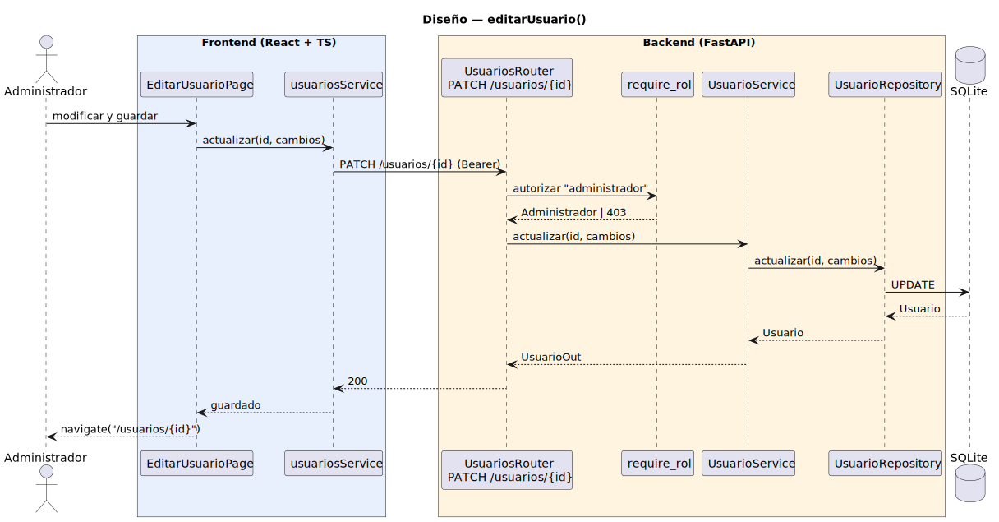

# CGU > editarUsuario > Diseño

> | [🏠️](/README.md) | [Diseño](/RUP/02-diseño/README.md) | [Detalle](/RUP/00-requisitos/CasosDeUso/DetalladoCasosDeUso/Administrador/editarUsuario.puml) | [Análisis](/RUP/01-analisis/casos-uso/editarUsuario/README.md) | **Diseño** | Desarrollo |
> |-|-|-|-|-|-|

## información del artefacto

- **Proyecto**: Centro de Gestión Universitaria (CGU)
- **Fase RUP**: Elaboración
- **Disciplina**: Diseño
- **Caso de uso**: `editarUsuario()`
- **Actor**: Administrador
- **Versión**: 1.0
- **Fecha**: 2026-05-30

## diagrama de secuencia

<div align=center>

||
|-|
|**Disciplina**: Diseño RUP<br>**Enfoque**: Diagrama de secuencia con tecnología concreta|

</div>

[Código PlantUML](secuencia.puml)

> El diagrama muestra **solo la fase de guardado** (`PATCH /usuarios/{id}`). La fase de carga inicial (`GET /usuarios/{id}` al montar la página) es idéntica a la secuencia de [`consultarUsuario`](/RUP/02-diseño/casos-uso/consultarUsuario/secuencia.svg) — el `EditarUsuarioPage` reutiliza el mismo `usuariosService.obtener(id)` y la misma cadena hasta la BD. No se duplica para que el diagrama refleje lo específico del CU.

## participantes

| Participante | Rol |
|---|---|
| **EditarUsuarioPage** (React, ruta `/usuarios/{id}/editar`) | Form de edición; siempre arranca con `GET` fresco para tener un único code path |
| **usuariosService** (axios) | Cliente HTTP, métodos `obtener(id)` (reutilizado) y `actualizar(id, cambios)` |
| **UsuariosRouter** (FastAPI) | Endpoints `GET /usuarios/{id}` (carga) y `PATCH /usuarios/{id}` (guardado) |
| **require_rol** (dependency) | Autoriza ambos endpoints exigiendo `tipo == "administrador"` |
| **UsuarioService** | Reglas de negocio del PATCH: hash opcional de contraseña, invariante de `tipo` no editable |
| **UsuarioRepository** (SQLAlchemy) | `obtener_por_id(id)` + `actualizar(id, cambios)` (UPDATE parcial) |
| **SQLite** | Tabla `usuarios` (STI) |

## materialización del análisis

| Mensaje del análisis | Materialización en diseño |
|---|---|
| Triple entrada (`:Usuarios Abierto` / `:Collaboration ConsultarUsuario` / `:Collaboration CrearUsuario`) | Tres orígenes de navegación SPA a `/usuarios/{id}/editar`; misma página, mismo flujo |
| `cargarUsuarioParaEdicion(usuarioId)` + `obtenerPorId(usuarioId)` | No representada en el diagrama — reutiliza la secuencia de [`consultarUsuario`](/RUP/02-diseño/casos-uso/consultarUsuario/README.md) (mismo `GET /usuarios/{id}` y mismo `obtener_por_id`) |
| Caso `usuarioNuevo` (sin necesidad de cargar) | **Se simplifica a "siempre GET fresco"** — un único code path; coste: un GET extra tras crear |
| `modificarCampos(usuarioId, cambios)` + `actualizar(usuario)` | Lo que sí modela el diagrama — `PATCH /usuarios/{id}` con body parcial → `UsuarioService.actualizar` → `UsuarioRepository.actualizar` |
| Invariante "el `tipo` no cambia post-alta" | El schema `EditarUsuarioRequest` **no declara `tipo`** — imposible enviarlo por contrato |
| Polimorfismo de lectura (subtipo invariante) | `obtener_por_id` ya devuelve el subtipo concreto; el form puede renderizar campos específicos cuando existan |

## decisiones de diseño

- **`PATCH /usuarios/{id}` con body parcial** — la semántica del análisis es "modificar campos", no "reemplazar el usuario". `PATCH` mapea directamente; `PUT` exigiría enviar el objeto completo y abriría la puerta a sobreescribir sin querer. El body es un `EditarUsuarioRequest` con todos los campos opcionales — `None` significa "no tocar".
- **Cambio de contraseña como campo opcional del mismo PATCH** — si el body trae `password`, `UsuarioService` lo rehash con `core/security.hash_password` antes de pasarlo al repositorio. Sin endpoint aparte. Si en algún momento aparece "cambiar mi propia contraseña" como CU del Usuario autenticado, sí se partirá en otro endpoint (semántica distinta: el sujeto se identifica vía Bearer, no por id).
- **`tipo` no editable por contrato** — el campo simplemente no existe en `EditarUsuarioRequest`. Si llega en el JSON, Pydantic lo descarta (`extra="ignore"` por defecto). Materialización honesta de la invariante del análisis sin checks adicionales en el handler.
- **`EditarUsuarioPage` siempre hace `GET` fresco** — incluso cuando el origen es `crearUsuario` (mensaje 6 del análisis), la página no recibe la instancia por estado: hace su propio `GET /usuarios/{id}` al montar. Coste: un round-trip extra tras crear. Beneficio: un único code path, sin necesidad de propagar estado entre rutas. El flujo alternativo del análisis ("entrada desde crearUsuario sin mensajes 2-3") se simplifica deliberadamente.
- **`UsuarioService` en escritura, no en lectura** — la fase de carga reutiliza el `Router → Repository` directo de `consultarUsuario`. La fase de guardado sí pasa por `UsuarioService` porque hay reglas de negocio reales (hash condicional, en el futuro validaciones de unicidad sobre cambios de `username`, etc.).
- **`require_rol(["administrador"])` en ambos endpoints** — un Admin que no llegue a guardar igualmente carga datos sensibles. La autorización va en el endpoint, no en la operación.
- **Sin control de concurrencia explícito** — el análisis registra como deuda "qué pasa si dos Admins editan el mismo usuario simultáneamente". Se difiere: el flujo last-writer-wins basta para los volúmenes esperados; si emergen incidencias se introducirá un `ETag` / `If-Match` sin romper contrato.

## evolución post-base — autorización per-target (2026-06-14)

`require_rol(["administrador"])` original se sustituye por un check **per-target** dentro de los handlers `GET /usuarios/{id}` y `PATCH /usuarios/{id}`:

```python
def _autorizar_acceso_a(target: Usuario, actor: Usuario) -> None:
    rol_requerido = "secretaria" if target.tipo == "alumno" else "administrador"
    if actor.tipo != rol_requerido:
        raise HTTPException(403, "No autorizado para esta operación")
```

`GET /usuarios` (listado) y `POST /usuarios` (alta) siguen `require_rol(["administrador"])` a nivel del handler, no del router. El cambio de scope es mínimo: solo el detalle y la edición se vuelven multi-actor, y el reparto está cerrado per-target.

**Cambios en el frontend:**
- `Route /usuarios/:id/editar`: pasa de `adminOnly` a `gate(['administrador','secretaria'])`. La autorización efectiva sigue siendo del backend.
- `EditarUsuarioPage`: la vuelta tras guardar/cancelar va a `/alumnos/:id` cuando el target es `tipo=alumno`, a `/usuarios/:id` en otro caso. Pequeña función `rutaFicha(u)` decide.
- `DetalleAlumnoPage`: botón "Editar" visible solo para Secretaria, enlaza a `/usuarios/:id/editar`.

## referencias

- [Análisis `editarUsuario()`](/RUP/01-analisis/casos-uso/editarUsuario/README.md)
- [Detallado `editarUsuario()`](/RUP/00-requisitos/CasosDeUso/DetalladoCasosDeUso/Administrador/editarUsuario.puml)
- [Prototipo SALT `editarUsuario.png`](/RUP/00-requisitos/CasosDeUso/Prototipos/Administrador/editarUsuario.png)
- [Diseño `crearUsuario()`](/RUP/02-diseño/casos-uso/crearUsuario/README.md)
- [Diseño `consultarUsuario()`](/RUP/02-diseño/casos-uso/consultarUsuario/README.md)
- [conversation-log.md](/conversation-log.md)
