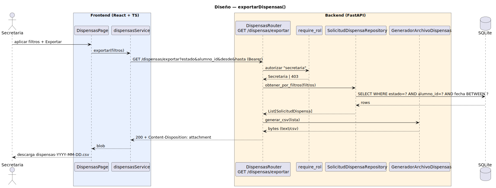

# CGU > exportarDispensas > Diseño

> | [🏠️](/README.md) | [Diseño](/RUP/02-diseño/README.md) | [Detalle](/RUP/00-requisitos/CasosDeUso/DetalladoCasosDeUso/Secretaria/exportarDispensas.puml) | [Análisis](/RUP/01-analisis/casos-uso/exportarDispensas/README.md) | **Diseño** | Desarrollo |
> |-|-|-|-|-|-|

## información del artefacto

- **Proyecto**: Centro de Gestión Universitaria (CGU)
- **Fase RUP**: Elaboración
- **Disciplina**: Diseño
- **Caso de uso**: `exportarDispensas()`
- **Actor**: Secretaria
- **Versión**: 1.0
- **Fecha**: 2026-06-01

## diagrama de secuencia

||
|-|
|**Disciplina**: Diseño RUP **Enfoque**: Diagrama de secuencia con tecnología concreta|

[Código PlantUML](secuencia.puml)

## participantes

| Participante | Rol |
|---|---|
| **DispensasPage** (React, `/dispensas`) | La página existente gana un botón "Exportar" en la cabecera (visible solo si rol Secretaria); aplica los filtros activos al export |
| **dispensasService** (axios) | Método `exportar(filtros)` que pide al backend el archivo como `responseType: 'blob'` y dispara `<a download>` |
| **DispensasRouter** (FastAPI) | Endpoint **nuevo** `GET /dispensas/exportar?estado=&alumno_id=&desde=&hasta=` |
| **require_rol** (dependency) | Autoriza exigiendo `tipo == "secretaria"` |
| **SolicitudDispensaRepository** | `obtener_por_filtros(filtros)` — estrena soporte de filtros opcionales (`estado`, `alumno_id`, rango `fecha_solicitud` BETWEEN) |
| **GeneradorArchivoDispensas** (nuevo) | **Servicio de aplicación**: recibe `List[SolicitudDispensa]`, retorna `bytes` con el CSV serializado |
| **SQLite** | Tabla `solicitudes_dispensa` con joins a `usuarios` (alumno, responsable), `asignaturas_matriculadas`, `asignaturas` |

## materialización del análisis

| Mensaje del análisis | Materialización en diseño |
|---|---|
| `:Dispensas Abierto → ExportarDispensasView : exportarDispensas()` | Click "Exportar" en `DispensasPage` (no abre vista nueva — modal in-situ con los filtros ya aplicados) |
| `obtenerPorFiltros(filtros) : List<SolicitudDispensa>` | `SolicitudDispensaRepository.obtener_por_filtros(filtros)` — query params del endpoint |
| `generarArchivo(lista) : Archivo` | `GeneradorArchivoDispensas.generar_csv(lista) → bytes` |
| Tipos opacos `Filtros`, `Archivo` del análisis | Materializados como query params (Filtros) y `bytes` + `Content-Type: text/csv` + `Content-Disposition: attachment; filename="dispensas-YYYY-MM-DD.csv"` (Archivo) |
| Drill-down opcional a una solicitud específica | Navegación en prosa desde la tabla — no modelado como mensaje (consistente con el resto del proyecto) |

## decisiones de diseño

- **`GET /dispensas/exportar`** como endpoint nuevo dedicado (no `GET /dispensas?formato=csv`). Razones:
  1. El listado JSON y el export CSV tienen semánticas distintas (paginación vs archivo completo, `200 + JSON` vs `200 + attachment`).
  2. El endpoint de export puede no respetar paginación (devuelve **todo** lo que matchee los filtros).
  3. Cache, logging y rate limits pueden ser distintos para una operación que mueve archivo.
- **Método HTTP `GET`** (no `POST`) — es operación de lectura, los filtros caben holgadamente en query params. `GET` permite que el navegador maneje la descarga de forma estándar (`<a href download>`) sin instrumentación adicional.
- **CSV como único formato del día 1**. Razones: stdlib `csv` cubre el caso, sin dependencias nuevas; el prototipo del SDR dropdown muestra solo "CSV"; XLSX y PDF son **deuda blanda** (el detallado los menciona pero el cliente no los pidió en el prototipo). Si se introducen, el endpoint gana `?formato=` y `GeneradorArchivoDispensas` gana métodos `generar_xlsx`, `generar_pdf` — la arquitectura del Strategy ya está preparada.
- **`GeneradorArchivoDispensas` como servicio de aplicación** — tercer servicio del proyecto tras `GeneradorArchivoAsistencias` (Profesor, futuro) y los dos `ValidadorArchivo*` (Secretaria). Confirma el patrón "Controller orquesta + Servicio especializa":
  - El **Router** orquesta (recuperar + delegar a generador + responder).
  - El **Generador** transforma (lista → bytes).
  - El **Repository** lee (SQL).
  
  Sin abstracción `Generador<T>` todavía — YAGNI hasta tener un segundo generador implementado (cuando entre el ramillete Profesor).
- **Filtros como query params simples**, sin Parameter Object (`FiltrosDispensa`). La deuda blanda del análisis ("introducir `FiltrosDispensa`") se mantiene blanda hasta que aparezca un tercer endpoint que use los mismos filtros. Hoy solo `obtener_por_filtros` los consume.
- **Filtros soportados en v1.0**: `estado`, `alumno_id`, `desde`, `hasta` (rango de `fecha_solicitud`). El prototipo menciona "curso, asignatura, nombre, identificador" — `curso/asignatura` se resolverán cuando aparezcan filtros sobre la matrícula del alumno (deuda); `nombre/identificador` son del alumno (cubiertos por `alumno_id`).
- **Nombre de archivo con fecha** (`dispensas-YYYY-MM-DD.csv`) generado por el Router. Si la Secretaria filtra `?estado=APROBADA`, el filename podría enriquecerse (`dispensas-aprobadas-YYYY-MM-DD.csv`) — deuda blanda.
- **Sin paginación / streaming** — para un volumen realista (cientos de dispensas máx. por curso académico), generar el CSV en memoria es aceptable. Si se llega a decenas de miles, se introduce `StreamingResponse` + generador iterativo. YAGNI.
- **Cabeceras del CSV** alineadas con el detallado: `id, alumno (nombre completo), grado, asignatura (codigo + nombre), curso_academico, motivo, estado, observaciones, fecha_solicitud, fecha_resolucion, responsable`. Una línea por solicitud; sin agregados ni totales (es un export crudo, no un informe).
- **Solo la Secretaria** puede exportar — `require_rol(["secretaria"])`. El Director no exporta hoy (su flujo es de aprobación, no extracción de datos). Si en el futuro lo necesita, se amplía require_rol.

## prerrequisito de implementación

Mismo que los otros 3 CUs del bloque dispensa Secretaria: migración del modelo `SolicitudDispensa` para que el CSV pueda mostrar `asignatura.codigo + asignatura.nombre + matricula.curso_academico` derivados del FK `asignatura_matriculada_id`. Sin la migración, el export mostraría los strings libres de la versión actual.

## ¿por qué no abstracción `Generador<T>` ahora?

Con dos exports en el horizonte cercano (`exportarDispensas` aquí + `exportarHistorialAsistencias` del Profesor — ya analizado pero no diseñado/implementado), la tentación de un `Generador<T>` o jerarquía polimórfica es real. Decisión: **diferir** hasta que el segundo entre en código y veamos la forma concreta. Razones:
- Solo conocemos un caso implementado (este); el segundo es hipotético hasta que entre el ramillete Profesor.
- Los formatos de export son distintos (estructura de columnas, eager-loads diferentes) — la abstracción podría no aportar tanto como parece.
- Misma lección del `PoliticaAcceso` (diferido en el ramillete Director, introducido cuando entró el Alumno con dos casos concretos).

Deuda registrada en este README. Reconsidera cuando `GeneradorArchivoAsistencias` entre.

## referencias

- [Análisis `exportarDispensas()`](/RUP/01-analisis/casos-uso/exportarDispensas/README.md)
- [Análisis `exportarHistorialAsistencias()` — segundo CU de export del proyecto (futuro Profesor)](/RUP/01-analisis/casos-uso/exportarHistorialAsistencias/README.md)
- [Diseño `importarMatriculas()` — patrón "Controller + Servicio" inverso](/RUP/02-diseño/casos-uso/importarMatriculas/README.md)
- [conversation-log.md](/conversation-log.md)
