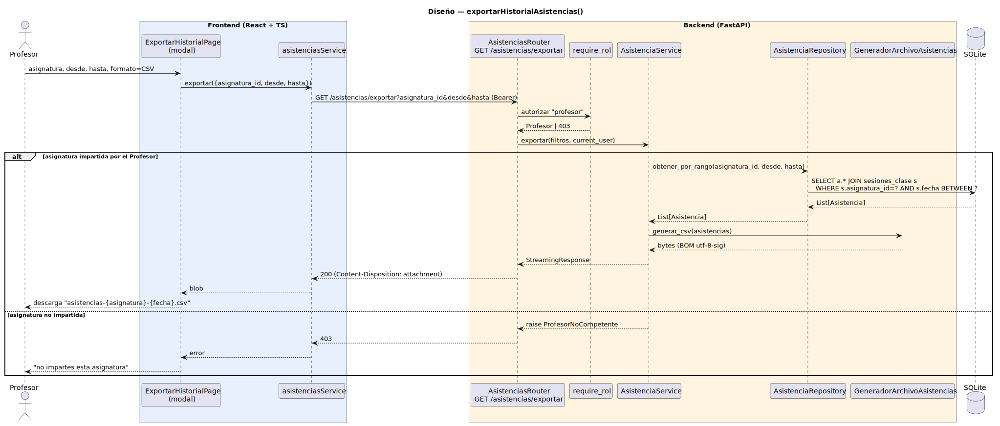

# CGU > exportarHistorialAsistencias > Diseño

> | [🏠️](/README.md) | [Diseño](/RUP/02-diseño/README.md) | [Detalle](/RUP/00-requisitos/CasosDeUso/DetalladoCasosDeUso/Profesor/exportarHistorialAsistencias.puml) | [Análisis](/RUP/01-analisis/casos-uso/exportarHistorialAsistencias/README.md) | **Diseño** | Desarrollo |
> |-|-|-|-|-|-|

## información del artefacto

- **Proyecto**: Centro de Gestión Universitaria (CGU)
- **Fase RUP**: Elaboración
- **Disciplina**: Diseño
- **Caso de uso**: `exportarHistorialAsistencias()`
- **Actor**: Profesor
- **Versión**: 1.0
- **Fecha**: 2026-06-02

## diagrama de secuencia

||
|-|
|**Disciplina**: Diseño RUP **Enfoque**: Diagrama de secuencia con tecnología concreta|

[Código PlantUML](secuencia.puml)

## participantes

| Participante | Rol |
|---|---|
| **ExportarHistorialPage** (React, modal en `/asistencias/exportar`) | Modal con `Inicio`, `Fin`, `Formato` (CSV único en v1.0); botones Cancelar / Exportar |
| **asistenciasService** (axios) | Método `exportar(filtros)` con `responseType: 'blob'` (descarga binaria) |
| **AsistenciasRouter** (FastAPI) | Endpoint `GET /asistencias/exportar?asignatura_id&desde&hasta` |
| **require_rol** (dependency) | Autoriza `"profesor"` |
| **AsistenciaService** | Valida "Profesor competente"; orquesta (recuperar + delegar al generador) |
| **AsistenciaRepository** | Método `obtener_por_rango(asignatura_id, desde, hasta)` con join `asistencias JOIN sesiones_clase` |
| **GeneradorArchivoAsistencias** | Servicio nuevo `app/services/generador_archivo_asistencias.py` — convierte `List[Asistencia]` a CSV bytes |
| **SQLite** | Tablas `asistencias`, `sesiones_clase` |

## materialización del análisis

| Mensaje del análisis | Materialización en diseño |
|---|---|
| `:Asistencias Abierto → ExportarHistorialView : exportarHistorialAsistencias()` | Click "Exportar CSV" en el listado de sesiones del Profesor abre el modal |
| `exportar(asignatura, fechaInicio, fechaFin, formato) : Archivo` | `GET /asistencias/exportar?asignatura_id&desde&hasta` (formato implícito CSV en v1.0) |
| `obtenerPorRango(asignatura, fechaInicio, fechaFin)` | `AsistenciaRepository.obtener_por_rango(asignatura_id, desde, hasta)` con join a `sesiones_clase` para filtrar por asignatura |
| `generar(asistencias, formato) : Archivo` | `GeneradorArchivoAsistencias.generar_csv(asistencias) → bytes` con `csv.writer` stdlib + BOM `utf-8-sig` para Excel — mismo patrón que `GeneradorArchivoDispensas` |
| Verificación "Profesor competente" | Service valida `asignatura_id ∈ current_user.asignaturas_impartidas` antes del Repository; 403 si no |

## decisiones de diseño

- **`GeneradorArchivoAsistencias` materializa el servicio del análisis** — segundo servicio de aplicación del proyecto (tras `GeneradorArchivoDispensas`). Estructura idéntica al patrón ya consolidado en [exportarDispensas](/RUP/02-diseño/casos-uso/exportarDispensas/README.md): orquestación en el Service, transformación en el Servicio especializado, sin Controllers de exportación.
- **CSV único en v1.0** — el modal del prototipo solo muestra "CSV" en el dropdown (la discrepancia con el detallado "Excel, PDF" se resuelve adoptando lo del prototipo). Razones: `csv` stdlib cubre el caso sin dependencias; abstracción de formato es prematura con un solo caso. XLSX/PDF como deuda blanda.
- **Sin abstracción `Generador<T>` todavía** — la hipótesis del análisis ("Strategy / jerarquía de generadores polimórficos") se mantiene **diferida**. Con dos generadores concretos delante (`GeneradorArchivoDispensas` y `GeneradorArchivoAsistencias`), comparten patrón pero **no contrato formal**: `generar_csv(List[SolicitudDispensa]) → bytes` vs `generar_csv(List[Asistencia]) → bytes`. Introducir un ABC `Generador<T>` con un único método `generar_csv` agruparía sintácticamente sin ganar polimorfismo real (no se invocan intercambiablemente). Misma lección del polimorfismo del Controller diferido en `Director`: la abstracción se introduce cuando hay un caso polimórfico real, no por estética.
- **Endpoint dedicado `GET /asistencias/exportar`** (no `GET /sesiones-clase/{id}/asistencias?formato=csv`) — coherencia con `GET /dispensas/exportar` ya existente. Razones del análisis paralelo: semánticas distintas (listado paginado JSON vs archivo completo attachment); el export no respeta paginación; cache/logging/rate-limits divergen.
- **Filtros como query params simples** (`asignatura_id`, `desde`, `hasta`) — sin Parameter Object. Misma decisión que en `exportarDispensas`. Si emerge un tercer endpoint con filtros similares, se introduce `FiltrosAsistencia` como refactor "Introduce Parameter Object".
- **Asignatura del contexto, no del modal** — el modal del prototipo no muestra selector de asignatura porque el Profesor accede al export **desde dentro de una pestaña de asignatura específica**. El frontend pasa `asignatura_id` del contexto al modal. Resuelve la deuda blanda del análisis ("decisión sobre cómo viene asignatura": adoptamos "del contexto de la pestaña activa").
- **`Archivo` opaco del análisis → `StreamingResponse` de FastAPI** con `Content-Disposition: attachment; filename="asistencias-{asignatura}-{fecha}.csv"`. Sin almacenamiento del archivo (efímero, regenerable). Deuda del análisis "política de retención" resuelta: no se almacena.
- **Validación de parámetros mínima** — `desde ≤ hasta` (422 si no), rango razonable no exigido (deuda del análisis). Si vacío, retorna CSV con cabecera + 0 filas (no 404 — un export vacío es un export válido).
- **`Asistencia ↔ SolicitudDispensa`** en el export: el CSV incluye una columna `dispensa` con valor `APROBADA`/`PENDIENTE`/`-` derivada cruzando con `SolicitudDispensa` aprobada del alumno+asignatura+fecha. Coherente con la decisión del registrar (opción A: independientes, vista combina). El cruce se hace en el Service antes de pasar al generador.

## simetría con `exportarDispensas` (Secretaria)

| Característica | `exportarDispensas` (Secretaria) | `exportarHistorialAsistencias` (Profesor) |
|---|---|---|
| Endpoint | `GET /dispensas/exportar` | `GET /asistencias/exportar` |
| Filtros | `estado, alumno_id, desde, hasta` | `asignatura_id (requerido), desde, hasta` |
| Servicio generador | `GeneradorArchivoDispensas` | `GeneradorArchivoAsistencias` |
| Formato v1.0 | CSV | CSV |
| Política de acceso | `PoliticaSecretaria` (sin filtro) | "Profesor competente" en el Service directo |
| Retención | Efímero | Efímero |

Estructura idéntica → patrón "exportar = Service orquesta + Generador transforma" sólidamente consolidado.

## referencias

- [Análisis `exportarHistorialAsistencias()`](/RUP/01-analisis/casos-uso/exportarHistorialAsistencias/README.md)
- [Diseño `exportarDispensas()` (Secretaria) — primer export del proyecto](/RUP/02-diseño/casos-uso/exportarDispensas/README.md)
- [Diseño `registrarTomaAsistencia()` — origen de la entidad exportada](/RUP/02-diseño/casos-uso/registrarTomaAsistencia/README.md)
- [conversation-log.md](/conversation-log.md)
