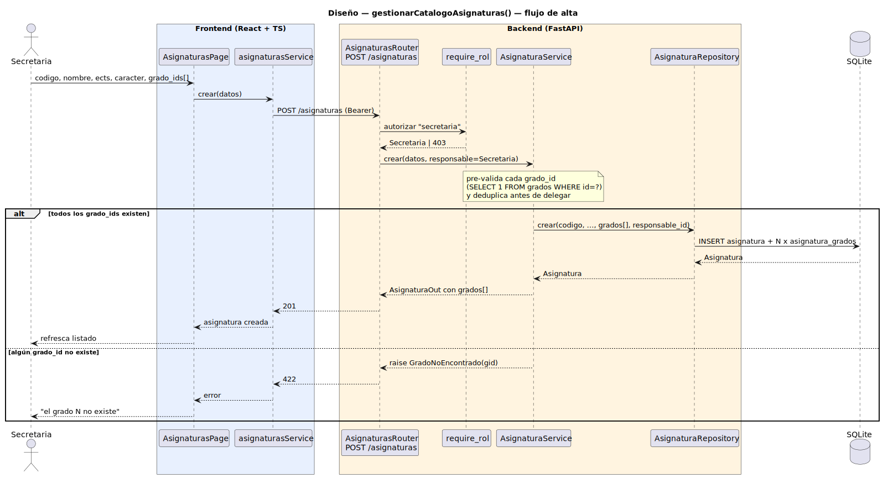

# CGU > gestionarCatalogoAsignaturas > Diseño

> | [🏠️](/README.md) | [Diseño](/RUP/02-diseño/README.md) | Detalle | [Análisis](/RUP/01-analisis/casos-uso/gestionarCatalogoAsignaturas/README.md) | **Diseño** | Desarrollo |
> |-|-|-|-|-|-|

## información del artefacto

- **Proyecto**: Centro de Gestión Universitaria (CGU)
- **Fase RUP**: Construction
- **Disciplina**: Diseño
- **Caso de uso**: `gestionarCatalogoAsignaturas()`
- **Actor**: Secretaria
- **Versión**: 1.0
- **Fecha**: 2026-06-11

## diagrama de secuencia

||
|-|
|**Disciplina**: Diseño RUP **Enfoque**: Diagrama de secuencia con tecnología concreta — flujo de alta. Se muestran solo las dos ramas distintivas del CU (creación nueva con cardinalidad N:M y validación iterativa de `grado_ids`). El choice point "código en uso" (`UNIQUE`+409) sigue el patrón ya documentado en [[gestionarCatalogoGrados]] / [[crearUsuario]].|

[Código PlantUML](secuencia.puml)

## participantes

| Participante | Rol |
|---|---|
| **AsignaturasPage** (React, ruta `/asignaturas`) | Pantalla única: tabla del catálogo + sub-vistas para alta, edición y detalle. Modal o panel lateral; cierre vuelve al listado. |
| **asignaturasService** (axios) | Cliente HTTP para `/asignaturas` (`listar`, `crear`, `actualizar`, `eliminar`). El `listar` ya existe; se añaden los tres verbos de escritura. |
| **AsignaturasRouter** (FastAPI) | Endpoints REST sobre `/asignaturas` |
| **require_rol** (dependency) | Autoriza los verbos de escritura con `current_user.tipo == "secretaria"`. El `GET` queda abierto a cualquier autenticado (los profesores leen el catálogo). |
| **AsignaturaService** | Reglas de negocio: validación de `ects > 0`, `caracter ∈ {FB,OB,OP}` (enum), existencia de **cada** `grado_id` en la lista (deduplicando), `tieneReferencias` antes de eliminar, resolución del `responsable_id` desde la sesión |
| **AsignaturaRepository** (SQLAlchemy) | I/O sobre tabla `asignaturas` + N:M `asignatura_grados` (escritura del conjunto vía `asignatura.grados = …`) |
| **SQLite** | Tabla `asignaturas` con `UNIQUE(codigo)` + tabla N:M `asignatura_grados(asignatura_id, grado_id)` con FKs RESTRICT a `grados` |

## materialización del análisis

El CU del análisis tiene cuatro operaciones (listar, crear, actualizar, eliminar). El diagrama muestra **alta** por ser la más representativa (doble validación: unicidad de `codigo` + existencia de cada `grado_id` de la lista). Las otras tres se materializan análogas, sobre los mismos participantes:

| Operación del análisis | Endpoint | Comentarios |
|-|-|-|
| `AsignaturasView → AsignaturaController : listar() : list<Asignatura>` | `GET /asignaturas` → 200 + `list[AsignaturaOut]` con `grados[]` (ya existía como singular; pasa a `list[GradoOut]` por la N:M) | Lectura abierta a cualquier autenticado, no exige rol Secretaria. |
| `AsignaturasView → AsignaturaController : crear(codigo, nombre, ects, caracter, grado_ids) : Asignatura` | `POST /asignaturas` → 201 + `AsignaturaOut` con `grados[]` (o 409 si `codigo` en uso, 422 si algún `grado_id` no existe o si `grado_ids` viene vacío) | Diagrama de arriba. `responsable_id` auto-poblado por el service desde `current_user.id`. |
| `AsignaturasView → AsignaturaController : actualizar(id, cambios) : Asignatura` | `PATCH /asignaturas/{id}` → 200 + `AsignaturaOut` (o 404, o 422 si algún `grado_id` de la lista nueva no existe) | `grado_ids` reemplaza el conjunto entero. `codigo` y `responsable_id` no editables (`extra="ignore"`). |
| `AsignaturasView → AsignaturaController : eliminar(id)` | `DELETE /asignaturas/{id}` → 204 (o 409 si tiene referencias, 404 si no existe) | Validación en service antes del DELETE; el cuerpo del 409 indica qué tipo de referencia bloquea (matrículas / sesiones de clase / dispensas / profesores que la imparten). Las filas de `asignatura_grados` caen con la asignatura — no son "referencia" que impida borrar. |
| Choice point "código en uso" | `IntegrityError` (UNIQUE) → `CodigoEnUso` → 409 | Mismo patrón que `crearUsuario`/`gestionarCatalogoGrados`. |
| Choice point "algún grado de la lista no existe" | Service itera la lista con `grado_repo.obtener_por_id(gid)` antes del INSERT → `GradoNoEncontrado(gid)` → 422 con mensaje "El grado N no existe" | Pre-validación en service (mensaje claro), no captura de `IntegrityError` por FK (opaco con N IDs). |
| Choice point "grado_ids vacío" | Pydantic `Field(min_length=1)` → 422 | El validador del schema lo rechaza antes de entrar al service. |
| Choice point "borrado con referencias" | `AsignaturaService.eliminar` consulta `tieneReferencias` y aborta con `AsignaturaConReferencias` → 409 | Mismo patrón que `GradoConReferencias`. |

## decisiones de diseño

- **CRUD agregado en un único endpoint base `/asignaturas`** — coherente con `/grados` y `/usuarios`. El `GET` preexistente no cambia comportamiento; se le suman los tres verbos de escritura.

- **`AsignaturaService` aunque la lógica sea fina** — coherencia con `GradoService` y `UsuarioService`. Hoy hace tres cosas no triviales: pre-validar e iterar `grado_ids` (con deduplicación), comprobar referencias antes de borrar y resolver `responsable_id` desde la sesión. Suficiente para justificar su existencia.

- **Pre-validación de cada `grado_id` en service vs captura del `IntegrityError`** — para `codigo` confiamos en el `UNIQUE` de la BD (un round-trip, mensaje 409 claro). Para `grado_ids` **pre-validamos en service**, iterando la lista: el `IntegrityError` por FK en SQLite produce mensajes opacos y, con N IDs, no sabríamos cuál es el inválido. El service resuelve cada `grado_id` con `SELECT 1 FROM grados WHERE id=?`, deduplica la lista para no inflar la N:M, y devuelve un 422 con mensaje útil al primer fallo ("el grado N no existe").

- **Cardinalidad `Asignatura ↔ Grado` materializada como tabla N:M `asignatura_grados`** — sin atributos propios (no hace falta metadata por par; el `responsable_id` ya vive en `Asignatura`). Sigue siendo `Table` desnudo (no `Association Object`) porque no hay candidatura a auditar la asignación grado↔asignatura por separado. Si en el futuro se quisiera (p. ej. "carácter distinto por grado"), se reificaría — mismo movimiento que hizo [[asignarAsignaturasAProfesor]].

- **PATCH `grado_ids` reemplaza el conjunto entero** — semántica "PUT-de-set, no PATCH-incremental". Razones: (a) la API resultante es ortogonal con el resto del PATCH (`nombre`, `ects`, etc. también son reemplazo); (b) coherente con cómo se renderiza el form (checkboxes con el conjunto completo, no "añade/quita"); (c) implementación trivial via SQLAlchemy (`asignatura.grados = nuevos`, el ORM resuelve el diff en la N:M).

- **`caracter` como enum cerrado** — `CaracterAsignatura` ya existe en `models/asignatura.py:10` como `Enum`. El schema Pydantic lo declara como `Literal["FB","OB","OP"]` o reusa el enum. Pydantic rechaza valores fuera del dominio con 422; sin necesidad de validador a mano.

- **`responsable_id` auto-poblado por el service, no por el cliente** — el cliente no envía `responsable_id` en el body; el service lo resuelve desde `current_user.id`. Mismo patrón que las operaciones de auditoría en imports masivos. Defensa anti-falseo: el cliente no puede atribuir la auditoría a otra Secretaria.

- **`codigo` y `responsable_id` no editables post-creación** — análogos a `username` en usuarios y `codigo` en grados. El `EditarAsignaturaRequest` no los declara; `extra="ignore"` los descarta si llegan.

- **`require_rol(["secretaria"])` para los verbos de escritura, lectura libre** — los profesores deben poder leer `/asignaturas` para selectores en `crearSesionClase` y similares. Patrón existente en `/asignaturas` GET con `get_current_user`. La granularidad por verbo se aplica decorando solo `POST`/`PATCH`/`DELETE` con `require_rol`.

- **`AsignaturasPage` única con sub-vistas inline** — copiando el patrón consolidado en `GradosPage` (modal/panel para alta y edición, eliminación con confirm). Catálogo de cardinalidad baja-media (decenas), no merece sub-rutas.

- **`AsignaturaOut.grados: list[GradoOut]` (anidado)** — coherente con el patrón establecido en M7. El listado muestra `codigo · nombre · ECTS · carácter · curso · grados[codigo].join(', ')`. En la UI, el caso mono-grado renderiza simplemente `INF`; el multi-grado renderiza `INF, ADE`.

- **Formulario de alta/edición: checkboxes para grados, no `<select multiple>`** — el `<select multiple>` nativo es opaco para usuarios poco técnicos (no es evidente que se puede elegir más de uno; el ctrl+click no es descubrible). Los checkboxes son visualmente explícitos y no penalizan el caso común (mono-grado): el usuario marca una sola caja y sigue.

## referencias

- [Análisis `gestionarCatalogoAsignaturas()`](/RUP/01-analisis/casos-uso/gestionarCatalogoAsignaturas/README.md)
- [Diseño `gestionarCatalogoGrados()`](/RUP/02-diseño/casos-uso/gestionarCatalogoGrados/README.md) — patrón espejado
- [Diseño `crearUsuario()`](/RUP/02-diseño/casos-uso/crearUsuario/README.md) — patrón `UNIQUE` + 409 + service fino
- [Modelo del dominio (SDR)](/RUP/00-requisitos/ModeloDelDominio/DiagramasDeClase/ModeloCompleto.puml)
- [conversation-log.md](/conversation-log.md)
