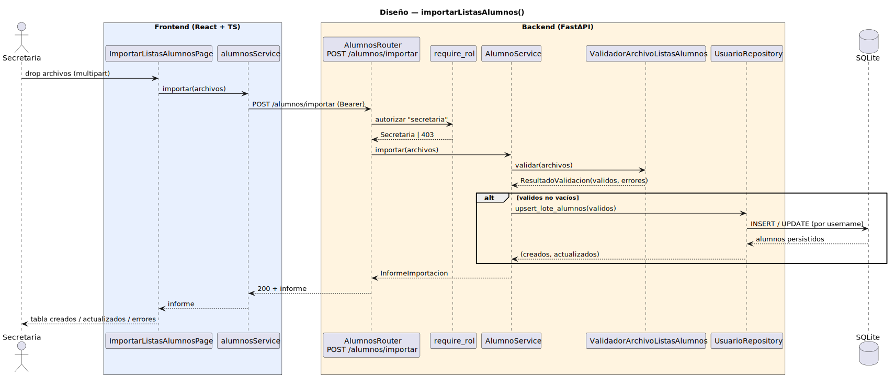

# CGU > importarListasAlumnos > Diseño

> | [🏠️](/README.md) | [Diseño](/RUP/02-diseño/README.md) | [Detalle](/RUP/00-requisitos/CasosDeUso/DetalladoCasosDeUso/Secretaria/importarListasAlumnos.puml) | [Análisis](/RUP/01-analisis/casos-uso/importarListasAlumnos/README.md) | **Diseño** | Desarrollo |
> |-|-|-|-|-|-|

## información del artefacto

- **Proyecto**: Centro de Gestión Universitaria (CGU)
- **Fase RUP**: Elaboración
- **Disciplina**: Diseño
- **Caso de uso**: `importarListasAlumnos()`
- **Actor**: Secretaria
- **Versión**: 1.0
- **Fecha**: 2026-06-01

## diagrama de secuencia

<div align=center>

||
|-|
|**Disciplina**: Diseño RUP<br>**Enfoque**: Diagrama de secuencia con tecnología concreta|

</div>

[Código PlantUML](secuencia.puml)

## participantes

| Participante | Rol |
|---|---|
| **ImportarListasAlumnosPage** (React, ruta `/alumnos/importar`) | Modal-page con dropzone (`<input type=file multiple accept=".csv">`), lista de archivos cargados, botón "Importar"; tras éxito renderiza tabla con creados / actualizados / errores |
| **alumnosService** (axios) | Cliente HTTP, método `importar(archivos)` que construye `FormData` con `archivos[]` y `POST` multipart |
| **AlumnosRouter** (FastAPI) | Endpoint `POST /alumnos/importar`, recibe `archivos: List[UploadFile]` |
| **require_rol** (dependency) | Autoriza exigiendo `tipo == "secretaria"` |
| **AlumnoService** (nuevo) | Orquestador: invoca al validador, decide best-effort y dispara la persistencia en lote |
| **ValidadorArchivoListasAlumnos** (nuevo, módulo de servicios) | Parsea CSV, valida cabecera + tipos + email + obligatorios; produce `ResultadoValidacion` con tuplas `RegistroAlumnoCrudo` válidas y `ErrorImportacion(archivo, fila, mensaje)` para las inválidas |
| **UsuarioRepository** (extendido) | Estrena `upsert_lote_alumnos(registros) → (creados, actualizados)` con dispatch al subtipo `Alumno` del STI |
| **SQLite** | Tabla `usuarios` (STI con discriminador `tipo`) |

## materialización del análisis

| Mensaje del análisis | Materialización en diseño |
|---|---|
| `:Listas Abierto → ImportarListasAlumnosView : importarListasAlumnos()` | Click "Importar listas" en la `AlumnosPage` de Secretaria (introducida en el ramillete) → navegación SPA a `/alumnos/importar` |
| `ImportarListasAlumnosView → AlumnoController : importar(archivos) : InformeImportacion` | `POST /alumnos/importar` multipart con `archivos: List[UploadFile]` |
| `AlumnoController → ValidadorArchivoListasAlumnos : validar(archivos) : ResultadoValidacion` | `ValidadorArchivoListasAlumnos.validar(archivos)` — parsing CSV + chequeos sintácticos |
| `AlumnoController → AlumnoRepository : guardarLote(registros) : List<Alumno>` | `UsuarioRepository.upsert_lote_alumnos(validos)` — un único `flush` por archivo, transacción única para todo el lote |
| Auto-poblado de `fecha_importacion = ahora` | El modelo `Usuario` ya tiene `created_at`/`updated_at` con `server_default=func.now()`; no se persiste fecha de import como atributo separado del alumno |

## decisiones de diseño

- **`AlumnoController` (análisis) → `AlumnoService` + `UsuarioRepository` (diseño)**. No creamos un `AlumnoRepository` separado porque la STI hace que toda la persistencia viva en `usuarios`; un repositorio paralelo sería un wrapper trivial. El nombre `AlumnoService` mantiene la cohesión por entidad del análisis (lógica específica de Alumno: importar, listar matriculados, etc.).
- **Formato CSV con cabecera obligatoria** `username,password,nombre,apellidos,email,telefono?` (`telefono` opcional). El prototipo no especifica formato; CSV es el mínimo común denominador y ya está en uso implícito en la Secretaria (otros prototipos lo muestran). Otros formatos (XLSX, JSON) son deuda.
- **Upsert por `username` sin tocar password** — si el alumno ya existe (`username` coincide), se actualizan `nombre`, `apellidos`, `email`, `telefono` con los del CSV pero **no `password_hash`**. Permite re-importar el listado de la facultad cada curso académico sin destruir credenciales que el alumno ya usa. Si nunca existió, se crea con la `password` del CSV (hasheada con `core.security.hash_password`).
- **Best-effort**: el `AlumnoService` persiste los válidos aunque haya errores en otros registros. El informe agrupa `creados`, `actualizados` y `errores`. Si **ningún** registro es válido → 200 + informe con solo errores (no 4xx — el archivo en sí estaba bien formateado, solo que su contenido no cumplía).
- **Header malformado / archivo no parseable → 422** con `detail` describiendo el archivo problemático. Distinción "archivo roto" vs "contenido roto".
- **Múltiples archivos en una sola request** (`List[UploadFile]`) — el `Validador` agrega errores con `(archivo, fila, mensaje)` para que el usuario sepa qué corregir y dónde. Coherente con el prototipo 2 que muestra hasta 3 archivos cargados simultáneamente.
- **Sin tamaño máximo configurado por ahora** — uvicorn por defecto acepta hasta 1 MB. Deuda blanda (subir el límite cuando aparezca un caso real).
- **Sin `responsable_id` en `Usuario`** — a diferencia de `Matricula` (donde sí lo introducimos por coherencia con `SolicitudDispensa`), el `Usuario` puede ser dado de alta por dos rutas (Admin vía `crearUsuario`, Secretaria vía importación) sin que el campo aporte semántica clara — la auditoría de quién creó qué se difiere a logs externos. Coherencia local: ni `crearUsuario` ni este CU añaden campo de autoría al modelo.
- **`POST /alumnos/importar`** como endpoint específico, no `POST /alumnos` con body batch. Razones: el verbo es `multipart` (no JSON), el resultado es un informe (no un recurso creado), y el comportamiento es upsert (no `crear`). Endpoint claro vs reutilizar el genérico ambiguo.

## entidad introducida — ninguna (reutilización)

Este CU no introduce entidad nueva: reutiliza `Usuario` (subtipo `Alumno` del STI ya existente desde el ramillete Usuario). La novedad es **operacional**: una nueva ruta de alta en lote para el subtipo Alumno, distinta del `crearUsuario` del Admin.

## informe de importación — schema de salida

`InformeImportacionOut` Pydantic:

```
{
  "creados": int,
  "actualizados": int,
  "errores": [
    { "archivo": str, "fila": int, "mensaje": str }
  ]
}
```

Sin clase formal en el análisis (era tipo opaco); aquí se materializa como schema concreto que el frontend renderiza como tabla.

## referencias

- [Análisis `importarListasAlumnos()`](/RUP/01-analisis/casos-uso/importarListasAlumnos/README.md)
- [Análisis `importarMatriculas()` — patrón gemelo](/RUP/01-analisis/casos-uso/importarMatriculas/README.md)
- [Diseño `importarMatriculas()` — siguiente CU del ramillete](/RUP/02-diseño/casos-uso/importarMatriculas/README.md)
- [Diseño `crearUsuario()` — alta unitaria del Admin](/RUP/02-diseño/casos-uso/crearUsuario/README.md)
- [conversation-log.md](/conversation-log.md)
