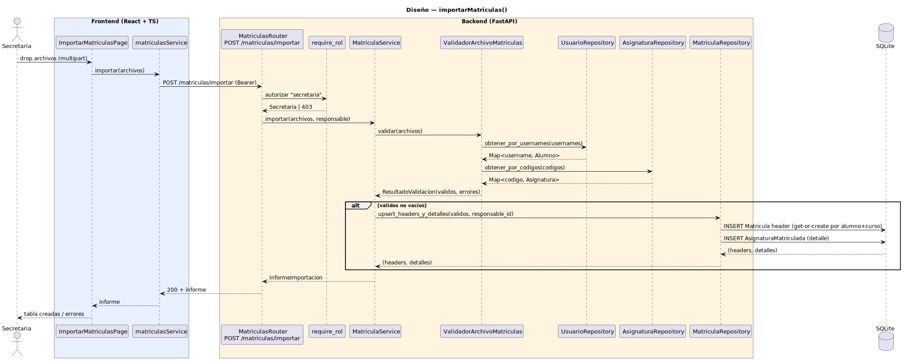

# CGU > importarMatriculas > Diseño

> | [🏠️](/README.md) | [Diseño](/RUP/02-diseño/README.md) | [Detalle](/RUP/00-requisitos/CasosDeUso/DetalladoCasosDeUso/Secretaria/importarMatricula.puml) | [Análisis](/RUP/01-analisis/casos-uso/importarMatriculas/README.md) | **Diseño** | Desarrollo |
> |-|-|-|-|-|-|

## información del artefacto

- **Proyecto**: Centro de Gestión Universitaria (CGU)
- **Fase RUP**: Elaboración
- **Disciplina**: Diseño
- **Caso de uso**: `importarMatriculas()`
- **Actor**: Secretaria
- **Versión**: 1.1
- **Fecha**: 2026-06-01 (v1.0); refactor del modelo a `Matricula` agregada el 2026-06-01 tras encarar el análisis de [[consultarDetalleMatricula]]

## diagrama de secuencia

<div align=center>

||
|-|
|**Disciplina**: Diseño RUP<br>**Enfoque**: Diagrama de secuencia con tecnología concreta|

</div>

[Código PlantUML](secuencia.puml)

## participantes

| Participante | Rol |
|---|---|
| **ImportarMatriculasPage** (React, ruta `/matriculas/importar`) | Modal-page con dropzone multi-archivo (`accept=".csv"`), lista de archivos cargados, botón "Importar"; render del informe tras éxito |
| **matriculasService** (axios) | Cliente HTTP, método `importar(archivos)` con `FormData` multipart |
| **MatriculasRouter** (FastAPI) | Endpoint `POST /matriculas/importar`, `archivos: List[UploadFile]` |
| **require_rol** (dependency) | Autoriza exigiendo `tipo == "secretaria"` |
| **MatriculaService** (nuevo) | Orquestador: valida, resuelve FKs vía Validador, dispara persistencia en lote |
| **ValidadorArchivoMatriculas** (nuevo) | Parsea CSV + valida cabecera/tipos/obligatorios; consulta `UsuarioRepository` y `AsignaturaRepository` para resolver FKs `alumno_username → alumno_id` y `asignatura_codigo → asignatura_id`; produce `ResultadoValidacion` |
| **UsuarioRepository** (extendido) | Estrena `obtener_por_usernames(usernames) → Map[username, Alumno]` — lookup masivo para el validador |
| **AsignaturaRepository** (nuevo) | `obtener_por_codigos(codigos) → Map[codigo, Asignatura]` — lookup masivo del catálogo |
| **MatriculaRepository** (nuevo) | `upsert_headers_y_detalles(validos, responsable_id) → (headers_creados, detalles_creados)` — gestiona el agregado completo (ver "modelo" abajo) |
| **SQLite** | Tablas nuevas `asignaturas`, `matriculas`, `asignaturas_matriculadas` |

## materialización del análisis

| Mensaje del análisis | Materialización en diseño |
|---|---|
| `:Matriculas Abierto → ImportarMatriculasView : importarMatriculas()` | Click "Importar matrículas" en la `MatriculasPage` de Secretaria → navegación SPA a `/matriculas/importar` |
| `ImportarMatriculasView → MatriculaController : importar(archivos) : InformeImportacion` | `POST /matriculas/importar` multipart |
| `MatriculaController → ValidadorArchivoMatriculas : validar(archivos) : ResultadoValidacion` | `ValidadorArchivoMatriculas.validar(archivos)` — incluye consulta a `UsuarioRepository` + `AsignaturaRepository` para resolver FKs (decisión de diseño explicada abajo) |
| `MatriculaController → MatriculaRepository : guardarLote(registros) : List<Matricula>` | `MatriculaRepository.upsert_headers_y_detalles(validos, responsable_id)` con transacción única — crea/reutiliza el header `Matricula` por `(alumno_id, curso_academico)` e inserta los detalles `AsignaturaMatriculada` |
| Auto-poblado `fechaImportacion = ahora`, `responsable = Sesion.usuario` | `fecha_importacion` y `responsable_id` viven en el header `Matricula` — el Service los fija al crear (sirven al lote entero del header); los detalles `AsignaturaMatriculada` no llevan campos de auditoría propios |

## decisiones de diseño

- **`MatriculaController` (análisis) → `MatriculaService` + `MatriculaRepository`** (diseño). Patrón "Controller por entidad" del análisis se materializa partido en Service (orquestación + reglas) + Repository (I/O puro), consistente con `crearUsuario` y `crearSolicitudDispensa`.
- **El `Validador` resuelve FKs, no solo formato**. Tres pasos de validación en una sola pasada:
  1. **Sintáctico**: cabecera presente, columnas correctas, tipos parseables.
  2. **Semántico**: `alumno_username` existe en `usuarios` (con `tipo='alumno'`), `asignatura_codigo` existe en `asignaturas`.
  3. **Coherencia**: `Asignatura.grado` referenciada está en oferta (siempre cierto si el catálogo está bien — sin chequeo extra hoy).

   Alternativa rechazada: dejar que el Service haga la resolución de FKs después del Validador. Más mensajes, dos pasadas sobre el mismo conjunto. La opción elegida hace **una sola lectura batch** por archivo (`obtener_por_usernames(set_de_usernames)` + `obtener_por_codigos(set_de_codigos)`), no N+1 lookups.
- **Política FK estricta + best-effort por registro**: si una fila referencia un `alumno_username` o `asignatura_codigo` inexistente, esa fila va al informe de errores con `mensaje: "alumno desconocido: <username>"`; las filas válidas se persisten igualmente. **No** se crean alumnos implícitamente — refuerza la dependencia documentada ("`importarListasAlumnos` debe ejecutarse antes").
- **`responsable_id` en el header `Matricula`** persistido por coherencia con `SolicitudDispensa.responsable_id` — auditoría visible desde la propia BD de quién registró la matrícula. Es la **misma decisión** que en el ramillete Director sobre `SolicitudDispensa`. Vive en el header, no en cada detalle (el lote de asignaturas matriculadas se importa de una sola sentada).
- **`Asignatura` como catálogo sin CU de gestión**, sembrado por `scripts/seed.py` con 4-5 asignaturas reales. Estructura `{id, codigo, nombre, ects, caracter, curso_plan, plan_estudios, facultad}` — fields enriquecidos por el detallado de [[consultarDetalleMatricula]] (ECTS, carácter OB/OP/FB, curso del plan). La gestión administrativa de asignaturas es deuda futura.
- **`Matricula` como agregado** `(alumno_id, curso_academico)` con colección 1:N de `AsignaturaMatriculada` `(matricula_id, asignatura_id, n_matricula)`. Refactor frente a v1.0 — el primer diseño la había modelado granular (1 matrícula = 1 asignatura). Razones del refactor:
  1. El detallado y el prototipo de [[consultarDetalleMatricula]] presentan **una ficha por (alumno, curso académico)** con tabla embebida de asignaturas — incompatible con el modelo granular sin agregación virtual sucia.
  2. `n_matricula` (1ª/2ª/3ª convocatoria) es atributo del **detalle**, no del header — vivir en `AsignaturaMatriculada` lo modela honestamente.
  3. Cuando entre la migración de `SolicitudDispensa` (paso 4 del orden interno del ramillete), apuntará a `AsignaturaMatriculada.id` — referencia precisa a "el alumno X intenta dispensar la asignatura Y en su matrícula del curso Z".
- **`UNIQUE(alumno_id, curso_academico)` en `Matricula`**, **`UNIQUE(matricula_id, asignatura_id)` en `AsignaturaMatriculada`**. Re-importar el mismo CSV produce `IntegrityError` en el detalle → registro al informe como "asignatura ya matriculada en este curso" (no upsert). La matrícula es acto administrativo único; corrección será CU futuro.
- **Formato CSV con cabecera obligatoria** `alumno_username,curso_academico,asignatura_codigo,n_matricula` (4 columnas). Cada fila es un `AsignaturaMatriculada`; el Service hace **get-or-create del header** `Matricula` por `(alumno_username, curso_academico)` la primera vez que aparece esa combinación en el lote, y reutiliza el id en las filas siguientes.
- **Best-effort con informe enriquecido**: el `InformeImportacion` distingue `creadas`, `errores`. Si **ninguno** es válido → 200 + informe vacío de creadas. Header malformado → 422.
- **`POST /matriculas/importar`** específico — paralelo a `POST /alumnos/importar`, no `POST /matriculas` batch genérico.

## entidades introducidas en este ramillete

### `Matricula` (nueva — header del agregado)

| Atributo | Tipo | Notas |
|---|---|---|
| `id` | `int` PK | |
| `alumno_id` | `int` FK → `usuarios.id` | filtro `tipo='alumno'` por convención |
| `curso_academico` | `str` | formato `"YYYY/YYYY"` (ej. `"2025/2026"`) |
| `responsable_id` | `int` FK → `usuarios.id` | quien ejecutó la importación |
| `fecha_importacion` | `datetime` | `server_default=func.now()` |

Constraint: `UNIQUE(alumno_id, curso_academico)`.

Relaciones (`lazy="joined"`): `alumno`, `responsable`. Detalle: `asignaturas_matriculadas` (1:N, lazy="selectin" para evitar el "JOIN cartesiano" si el agregado fuera grande).

### `AsignaturaMatriculada` (nueva — detalle del agregado)

| Atributo | Tipo | Notas |
|---|---|---|
| `id` | `int` PK | |
| `matricula_id` | `int` FK → `matriculas.id` | header al que pertenece |
| `asignatura_id` | `int` FK → `asignaturas.id` | qué asignatura del catálogo se cursa |
| `n_matricula` | `int` | 1ª/2ª/3ª convocatoria (semántica del SDR) |

Constraint: `UNIQUE(matricula_id, asignatura_id)` — la misma asignatura no puede aparecer dos veces en el mismo header.

Relación (`lazy="joined"`): `asignatura`.

### `Asignatura` (nueva, catálogo)

| Atributo | Tipo | Notas |
|---|---|---|
| `id` | `int` PK | |
| `codigo` | `str` UNIQUE | ej. `"IYA038"` (identificador institucional) |
| `nombre` | `str` | ej. `"Ingeniería de Software I"` |
| `ects` | `float` | créditos ECTS (ej. `6.00`) |
| `caracter` | `enum` | `OB` (Obligatoria) / `OP` (Optativa) / `FB` (Formación Básica) |
| `curso_plan` | `int` | curso del plan de estudios en que se imparte (ej. `3`) |
| `plan_estudios` | `str` | ej. `"Ingeniería Informática"` |
| `facultad` | `str` | ej. `"Escuela Politécnica Superior"` |

Sin CU de gestión — sembrado por `scripts/seed.py`. `plan_estudios` y `facultad` se modelan como strings, no entidades — su promoción es deuda blanda (YAGNI: no hay CU que opere sobre ellas como entidades).

## informe de importación — schema de salida

`InformeImportacionMatriculasOut` Pydantic:

```
{
  "matriculas_creadas": int,          // headers nuevos (alumno, curso) que no existían antes
  "asignaturas_matriculadas_creadas": int,  // filas de detalle insertadas
  "errores": [
    { "archivo": str, "fila": int, "mensaje": str }
  ]
}
```

Distinción útil para la Secretaria: una sola `Matricula` (header) puede haber acumulado N filas de `AsignaturaMatriculada`. El informe separa los dos contadores para que se vea cuántos alumnos nuevos se matricularon vs cuántas matriculaciones a asignatura se registraron.

## referencias

- [Análisis `importarMatriculas()`](/RUP/01-analisis/casos-uso/importarMatriculas/README.md)
- [Diseño `importarListasAlumnos()` — gemelo, debe ejecutarse antes](/RUP/02-diseño/casos-uso/importarListasAlumnos/README.md)
- [Diseño `crearSolicitudDispensa()` (Alumno) — futuro consumidor de `Matricula`](/RUP/02-diseño/casos-uso/crearSolicitudDispensa/README.md)
- [Detallado `importarMatricula.puml`](/RUP/00-requisitos/CasosDeUso/DetalladoCasosDeUso/Secretaria/importarMatricula.puml)
- [conversation-log.md](/conversation-log.md)
